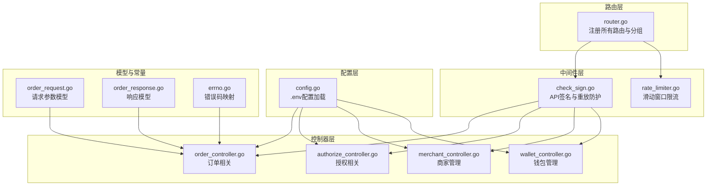
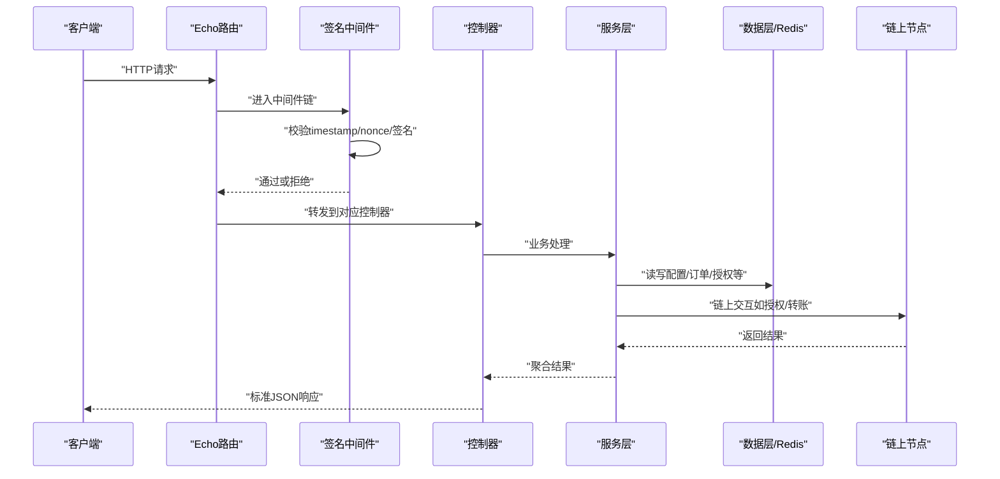
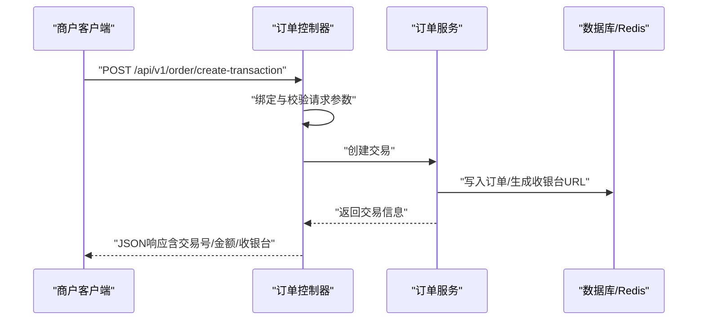
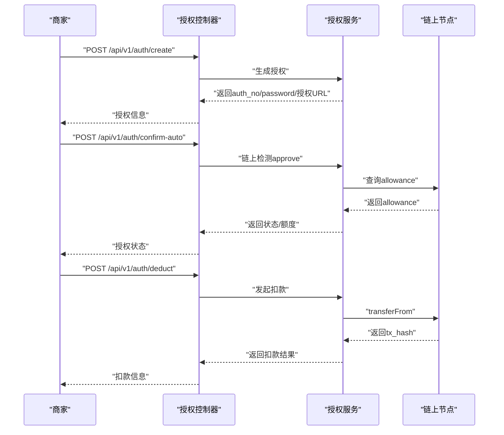
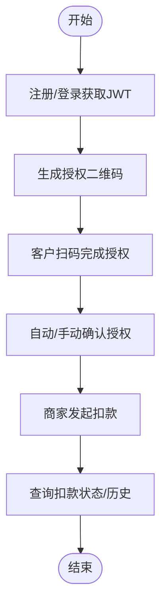
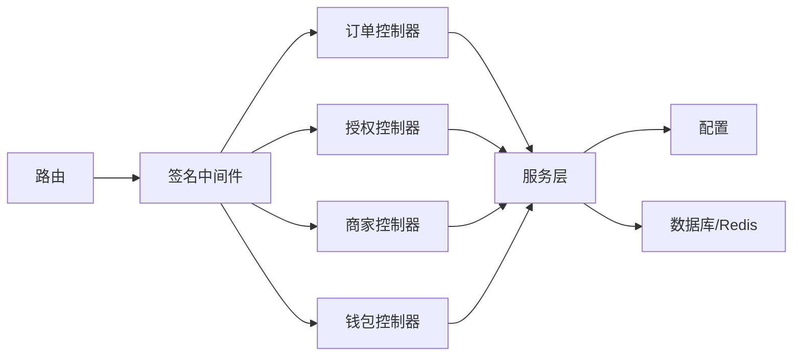

# API接口文档

<cite>
**本文引用的文件**
- [router.go](file://EPUSDT/src/route/router.go)
- [API_DOCUMENTATION.md](file://EPUSDT/API_DOCUMENTATION.md)
- [API_EXAMPLES.md](file://EPUSDT/API_EXAMPLES.md)
- [wiki/API.md](file://EPUSDT/wiki/API.md)
- [MERCHANT_API_DOCUMENTATION.md](file://EPUSDT/MERCHANT_API_DOCUMENTATION.md)
- [order_controller.go](file://EPUSDT/src/controller/comm/order_controller.go)
- [authorize_controller.go](file://EPUSDT/src/controller/comm/authorize_controller.go)
- [merchant_controller.go](file://EPUSDT/src/controller/comm/merchant_controller.go)
- [wallet_controller.go](file://EPUSDT/src/controller/comm/wallet_controller.go)
- [check_sign.go](file://EPUSDT/src/middleware/check_sign.go)
- [rate_limiter.go](file://EPUSDT/src/middleware/rate_limiter.go)
- [config.go](file://EPUSDT/src/config/config.go)
- [order_request.go](file://EPUSDT/src/model/request/order_request.go)
- [order_response.go](file://EPUSDT/src/model/response/order_response.go)
- [errno.go](file://EPUSDT/src/util/constant/errno.go)
</cite>

## 目录
1. [简介](#简介)
2. [项目结构](#项目结构)
3. [核心组件](#核心组件)
4. [架构总览](#架构总览)
5. [详细组件分析](#详细组件分析)
6. [依赖关系分析](#依赖关系分析)
7. [性能考量](#性能考量)
8. [故障排查指南](#故障排查指南)
9. [结论](#结论)
10. [附录](#附录)

## 简介
本文件为EPUSDT系统的全面API接口文档，覆盖订单支付、钱包授权扣款、商家管理、钱包管理、管理后台等模块。文档提供RESTful接口规范、认证方法、请求/响应格式、错误码、示例与最佳实践，并包含版本控制、速率限制、安全考虑、调试与监控方法以及废弃功能迁移指引。

## 项目结构
EPUSDT采用Go语言与Echo框架构建，路由集中注册在路由层，控制器负责请求绑定与参数校验，服务层处理业务逻辑，中间件提供签名验证、速率限制、审计日志等横切能力。配置通过环境变量加载，支持多链（TRON、BSC、ETH、Polygon）与多种回调与监控特性。

**图示来源**
- [router.go](file://EPUSDT/src/route/router.go#L12-L115)
- [check_sign.go](file://EPUSDT/src/middleware/check_sign.go#L24-L107)
- [rate_limiter.go](file://EPUSDT/src/middleware/rate_limiter.go#L22-L123)
- [order_controller.go](file://EPUSDT/src/controller/comm/order_controller.go#L10-L24)
- [authorize_controller.go](file://EPUSDT/src/controller/comm/authorize_controller.go#L16-L143)
- [merchant_controller.go](file://EPUSDT/src/controller/comm/merchant_controller.go#L13-L350)
- [wallet_controller.go](file://EPUSDT/src/controller/comm/wallet_controller.go#L14-L104)
- [config.go](file://EPUSDT/src/config/config.go#L45-L134)
- [order_request.go](file://EPUSDT/src/model/request/order_request.go#L16-L26)
- [order_response.go](file://EPUSDT/src/model/response/order_response.go#L3-L26)
- [errno.go](file://EPUSDT/src/util/constant/errno.go#L3-L51)

**章节来源**
- [router.go](file://EPUSDT/src/route/router.go#L12-L115)
- [config.go](file://EPUSDT/src/config/config.go#L45-L134)

## 核心组件
- 路由注册：集中注册公开与受保护接口，按模块分组（/pay、/api/v1/order、/api/v1/auth、/api/v1/wallet、/api/v1/merchant、/admin/api）。
- 中间件：
  - API签名与重放防护：CheckApiSign，支持MD5与HMAC-SHA256双版本签名，时间戳±5分钟容差，nonce 5分钟内唯一。
  - 速率限制：基于Redis的滑动窗口算法，支持IP、用户、端点级限流。
  - 审计日志：可选启用，记录请求上下文。
- 控制器：负责请求绑定、参数校验、调用服务层并返回标准JSON响应。
- 配置：从.env加载API令牌、链RPC、合约、汇率、监控开关等。
- 错误码：统一错误码映射，便于客户端一致化处理。

**章节来源**
- [check_sign.go](file://EPUSDT/src/middleware/check_sign.go#L24-L107)
- [rate_limiter.go](file://EPUSDT/src/middleware/rate_limiter.go#L22-L123)
- [config.go](file://EPUSDT/src/config/config.go#L152-L154)

## 架构总览
下图展示API调用链路与关键组件交互：

**图示来源**
- [router.go](file://EPUSDT/src/route/router.go#L32-L114)
- [check_sign.go](file://EPUSDT/src/middleware/check_sign.go#L24-L107)
- [order_controller.go](file://EPUSDT/src/controller/comm/order_controller.go#L10-L24)
- [authorize_controller.go](file://EPUSDT/src/controller/comm/authorize_controller.go#L16-L143)
- [merchant_controller.go](file://EPUSDT/src/controller/comm/merchant_controller.go#L13-L350)
- [wallet_controller.go](file://EPUSDT/src/controller/comm/wallet_controller.go#L14-L104)

## 详细组件分析

### 1. 订单支付API
- 基础路径：/api/v1/order
- 认证：除公开接口外，均需API签名中间件校验
- 主要接口：
  - POST /create-transaction：创建支付订单
  - GET /check-status/:trade_id：查询订单状态
  - GET /order-detail/:trade_id：订单详情页面（公开）

- 请求与响应要点
  - 请求参数模型包含订单号、金额、回调/跳转地址、签名、链、时间戳、随机串等。
  - 响应包含交易号、订单号、金额、实际需支付USDT、链、过期时间、收银台URL等。
  - 回调通知携带签名，商户需验证签名一致性。

- 示例与用法
  - 创建订单、轮询状态、处理回调均有完整示例与SDK参考。

- 错误码
  - 200：成功；400：系统错误/参数错误；401：签名认证错误；403：权限不足；404：资源不存在；500：服务器内部错误。

**章节来源**
- [router.go](file://EPUSDT/src/route/router.go#L32-L36)
- [order_controller.go](file://EPUSDT/src/controller/comm/order_controller.go#L10-L24)
- [order_request.go](file://EPUSDT/src/model/request/order_request.go#L16-L26)
- [order_response.go](file://EPUSDT/src/model/response/order_response.go#L3-L26)
- [API_DOCUMENTATION.md](file://EPUSDT/API_DOCUMENTATION.md#L105-L206)
- [API_EXAMPLES.md](file://EPUSDT/API_EXAMPLES.md#L7-L197)
- [wiki/API.md](file://EPUSDT/wiki/API.md#L70-L142)

#### 订单创建流程

**图示来源**
- [order_controller.go](file://EPUSDT/src/controller/comm/order_controller.go#L10-L24)
- [order_request.go](file://EPUSDT/src/model/request/order_request.go#L16-L26)
- [order_response.go](file://EPUSDT/src/model/response/order_response.go#L3-L13)

### 2. 钱包授权扣款API
- 基础路径：/api/v1/auth
- 主要接口：
  - POST /create：创建授权请求（生成auth_no/password）
  - POST /confirm：确认授权（手动）
  - POST /confirm-auto：自动确认授权（链上approve检测）
  - POST /deduct：从授权中扣款
  - GET /info/:password：查询授权信息
  - GET /history/:password：查询扣款历史
  - GET /list：查询所有有效授权

- H5页面
  - /auth/:auth_no：客户授权页面
  - /auth-manager：授权管理页面

- 参数与响应
  - 授权创建包含授权额度、桌号、客户名、备注、链等；返回授权编号、密码、到期时间、授权URL等。
  - 扣款包含扣款单号、金额（CNY/USDT）、剩余授权额度、状态、客户钱包等。
  - 自动确认返回状态与已授权/允许额度。

- 安全与链配置
  - 不同链的合约地址、精度、RPC、浏览器等通过配置注入，H5页面动态渲染。

**章节来源**
- [router.go](file://EPUSDT/src/route/router.go#L54-L62)
- [authorize_controller.go](file://EPUSDT/src/controller/comm/authorize_controller.go#L16-L143)
- [config.go](file://EPUSDT/src/config/config.go#L238-L312)
- [API_DOCUMENTATION.md](file://EPUSDT/API_DOCUMENTATION.md#L217-L467)

#### 授权扣款序列

**图示来源**
- [authorize_controller.go](file://EPUSDT/src/controller/comm/authorize_controller.go#L16-L99)
- [config.go](file://EPUSDT/src/config/config.go#L238-L312)

### 3. 商家管理API
- 基础路径：/api/v1/merchant
- 认证：JWT Token（独立于管理后台）
- 主要接口：
  - 商家认证：POST /register、POST /login、GET /profile
  - 授权二维码：POST /qrcode（生成授权链接与密码）
  - 授权管理：GET /authorizations、GET /authorizations/:id、DELETE /authorizations/:id
  - 扣款记录：GET /deductions、POST /deductions、GET /deductions/:id
  - 统计数据：GET /stats/summary、GET /stats/chart

- 参数与响应
  - 注册/登录返回商家信息与JWT Token；授权二维码返回授权编号、密码、到期时间、授权URL等。
  - 扣款记录包含扣款单号、金额（CNY/USDT）、状态、产品信息、操作员等。
  - 统计接口返回时间段内的交易总额、笔数、成功率等。

**章节来源**
- [router.go](file://EPUSDT/src/route/router.go#L88-L114)
- [merchant_controller.go](file://EPUSDT/src/controller/comm/merchant_controller.go#L13-L350)
- [MERCHANT_API_DOCUMENTATION.md](file://EPUSDT/MERCHANT_API_DOCUMENTATION.md#L1-L757)

#### 商家授权与扣款流程

**图示来源**
- [merchant_controller.go](file://EPUSDT/src/controller/comm/merchant_controller.go#L101-L132)
- [authorize_controller.go](file://EPUSDT/src/controller/comm/authorize_controller.go#L79-L99)

### 4. 钱包管理API
- 基础路径：/api/v1/wallet
- 主要接口：
  - POST /add：添加钱包地址（校验链与地址合法性）
  - POST /list：列出钱包地址（分页）
  - POST /update-status：更新钱包状态（启用/禁用）
  - POST /delete：删除钱包地址

- 参数与响应
  - 添加钱包时返回钱包ID、状态与二维码流URL；列表返回分页数据与总数。

**章节来源**
- [router.go](file://EPUSDT/src/route/router.go#L38-L44)
- [wallet_controller.go](file://EPUSDT/src/controller/comm/wallet_controller.go#L14-L104)
- [API_DOCUMENTATION.md](file://EPUSDT/API_DOCUMENTATION.md#L471-L583)

### 5. 管理后台API
- 基础路径：/admin/api
- 认证：JWT Token（管理后台）
- 主要接口：
  - POST /login：管理员登录
  - GET /me：获取当前管理员信息
  - GET /users、POST /users、PUT /users：用户管理
  - GET /roles：角色管理
  - GET /orders、GET /order/:trade_id：订单管理
  - GET /authorizations、GET /deductions、GET /callbacks：授权与回调日志

**章节来源**
- [router.go](file://EPUSDT/src/route/router.go#L64-L81)
- [API_DOCUMENTATION.md](file://EPUSDT/API_DOCUMENTATION.md#L585-L697)

## 依赖关系分析
- 路由到中间件：/api/v1/*（除公开接口）均经过API签名中间件。
- 控制器到服务层：控制器仅做参数绑定与校验，具体业务逻辑由服务层实现。
- 配置到链：不同链的RPC、合约、精度通过配置注入，H5页面动态渲染链相关信息。
- 错误码：统一映射便于客户端一致化处理。

**图示来源**
- [router.go](file://EPUSDT/src/route/router.go#L32-L114)
- [check_sign.go](file://EPUSDT/src/middleware/check_sign.go#L24-L107)
- [order_controller.go](file://EPUSDT/src/controller/comm/order_controller.go#L10-L24)
- [authorize_controller.go](file://EPUSDT/src/controller/comm/authorize_controller.go#L16-L143)
- [merchant_controller.go](file://EPUSDT/src/controller/comm/merchant_controller.go#L13-L350)
- [wallet_controller.go](file://EPUSDT/src/controller/comm/wallet_controller.go#L14-L104)

**章节来源**
- [router.go](file://EPUSDT/src/route/router.go#L12-L115)
- [check_sign.go](file://EPUSDT/src/middleware/check_sign.go#L24-L107)
- [config.go](file://EPUSDT/src/config/config.go#L45-L134)

## 性能考量
- 速率限制：基于Redis的滑动窗口算法，支持IP、用户、端点级限流，响应头包含限流状态，便于客户端自适应。
- 签名与重放防护：时间戳容差与nonce去重，降低重放风险同时保证可用性。
- 链交互：支持多链RPC与合约配置，结合Gas优化与Approval监控，提升链上交互稳定性。
- 轮询与回调：建议合理轮询间隔（5-10秒），回调需幂等并尽快返回“ok”。

**章节来源**
- [rate_limiter.go](file://EPUSDT/src/middleware/rate_limiter.go#L22-L123)
- [check_sign.go](file://EPUSDT/src/middleware/check_sign.go#L18-L22)
- [config.go](file://EPUSDT/src/config/config.go#L114-L130)

## 故障排查指南
- 认证失败
  - 检查签名算法与token是否正确；确认timestamp在±5分钟范围内；nonce未重复使用。
- 参数错误
  - 核对请求参数类型与必填项；金额小数位不超过2位；链标识合法。
- 回调验证
  - 回调签名需按约定规则生成并与请求签名一致；处理完成后返回“ok”。
- 错误码对照
  - 200：成功；400：系统错误；401：签名认证错误；403：权限不足；404：资源不存在；500：服务器内部错误。
- 常见错误提示
  - 订单已存在、无可用钱包地址、授权余额不足、订单不存在、参数解析失败等。

**章节来源**
- [check_sign.go](file://EPUSDT/src/middleware/check_sign.go#L38-L102)
- [order_request.go](file://EPUSDT/src/model/request/order_request.go#L38-L51)
- [errno.go](file://EPUSDT/src/util/constant/errno.go#L3-L51)
- [API_DOCUMENTATION.md](file://EPUSDT/API_DOCUMENTATION.md#L734-L773)

## 结论
EPUSDT提供完善的多链USDT支付与授权扣款能力，接口设计遵循REST规范，配合签名与限流保障安全与稳定性。通过标准化的响应与错误码、详尽的示例与SDK，便于快速集成。建议在生产环境中启用审计日志与监控，合理设置限流与轮询策略，确保高并发下的可靠性与可维护性。

## 附录

### A. API清单与认证
- 订单支付
  - POST /api/v1/order/create-transaction（签名）
  - GET /pay/check-status/:trade_id（公开）
  - GET /pay/order-detail/:trade_id（公开）
- 钱包授权
  - POST /api/v1/auth/create（签名）
  - POST /api/v1/auth/confirm（签名）
  - POST /api/v1/auth/confirm-auto（签名）
  - POST /api/v1/auth/deduct（签名）
  - GET /api/v1/auth/info/:password（签名）
  - GET /api/v1/auth/history/:password（签名）
  - GET /api/v1/auth/list（签名）
- 商家管理
  - POST /api/v1/merchant/register（公开）
  - POST /api/v1/merchant/login（公开）
  - GET /api/v1/merchant/profile（JWT）
  - POST /api/v1/merchant/qrcode（JWT）
  - GET /api/v1/merchant/authorizations（JWT）
  - GET /api/v1/merchant/authorizations/:id（JWT）
  - DELETE /api/v1/merchant/authorizations/:id（JWT）
  - GET /api/v1/merchant/deductions（JWT）
  - POST /api/v1/merchant/deductions（JWT）
  - GET /api/v1/merchant/deductions/:id（JWT）
  - GET /api/v1/merchant/stats/summary（JWT）
  - GET /api/v1/merchant/stats/chart（JWT）
- 钱包管理
  - POST /api/v1/wallet/add（签名）
  - POST /api/v1/wallet/list（签名）
  - POST /api/v1/wallet/update-status（签名）
  - POST /api/v1/wallet/delete（签名）
- 管理后台
  - POST /admin/api/login（公开）
  - GET /admin/api/me（JWT）
  - GET /admin/api/users（JWT）
  - POST /admin/api/users（JWT）
  - PUT /admin/api/users（JWT）
  - GET /admin/api/roles（JWT）
  - GET /admin/api/orders（JWT）
  - GET /admin/api/order/:trade_id（JWT）
  - GET /admin/api/authorizations（JWT）
  - GET /admin/api/deductions（JWT）
  - GET /admin/api/callbacks（JWT）

**章节来源**
- [router.go](file://EPUSDT/src/route/router.go#L22-L114)
- [API_DOCUMENTATION.md](file://EPUSDT/API_DOCUMENTATION.md#L105-L731)
- [MERCHANT_API_DOCUMENTATION.md](file://EPUSDT/MERCHANT_API_DOCUMENTATION.md#L1-L757)

### B. 认证与安全
- API签名
  - 规则：参数按字典序拼接，末尾追加token，计算MD5；支持HMAC-SHA256（v2）与MD5（兼容）。
  - 重放防护：timestamp±5分钟，nonce 5分钟内唯一。
- JWT认证
  - 管理后台与商家管理分别使用独立JWT，有效期与签发密钥可配置。
- 速率限制
  - 支持IP、用户、端点级限流，响应头包含限流状态，便于客户端自适应。

**章节来源**
- [API_DOCUMENTATION.md](file://EPUSDT/API_DOCUMENTATION.md#L17-L101)
- [check_sign.go](file://EPUSDT/src/middleware/check_sign.go#L24-L107)
- [rate_limiter.go](file://EPUSDT/src/middleware/rate_limiter.go#L22-L123)
- [config.go](file://EPUSDT/src/config/config.go#L185-L190)

### C. 版本控制与迁移
- 签名版本
  - 支持sign_version=v2（HMAC-SHA256）与默认v1（MD5），建议尽快升级至v2。
- 废弃与兼容
  - 文档未发现明确废弃接口；MD5签名将在未来移除，建议尽快切换至HMAC-SHA256。
- 向后兼容
  - 保持响应结构稳定，错误码映射统一，便于客户端平滑过渡。

**章节来源**
- [check_sign.go](file://EPUSDT/src/middleware/check_sign.go#L84-L95)
- [API_DOCUMENTATION.md](file://EPUSDT/API_DOCUMENTATION.md#L734-L773)

### D. 常见使用场景与最佳实践
- KTV预授权与多次扣款：创建授权→客户授权→多次扣款→查询授权与扣款历史。
- 商户侧集成：注册/登录→生成授权二维码→扫码授权→发起扣款→查看统计。
- 回调处理：严格验证签名→幂等处理→返回“ok”→记录日志与重试策略。
- 客户端实现：统一封装签名生成与请求发送；对429/5xx进行指数退避重试；合理轮询状态。

**章节来源**
- [API_EXAMPLES.md](file://EPUSDT/API_EXAMPLES.md#L200-L720)
- [MERCHANT_API_DOCUMENTATION.md](file://EPUSDT/MERCHANT_API_DOCUMENTATION.md#L628-L757)