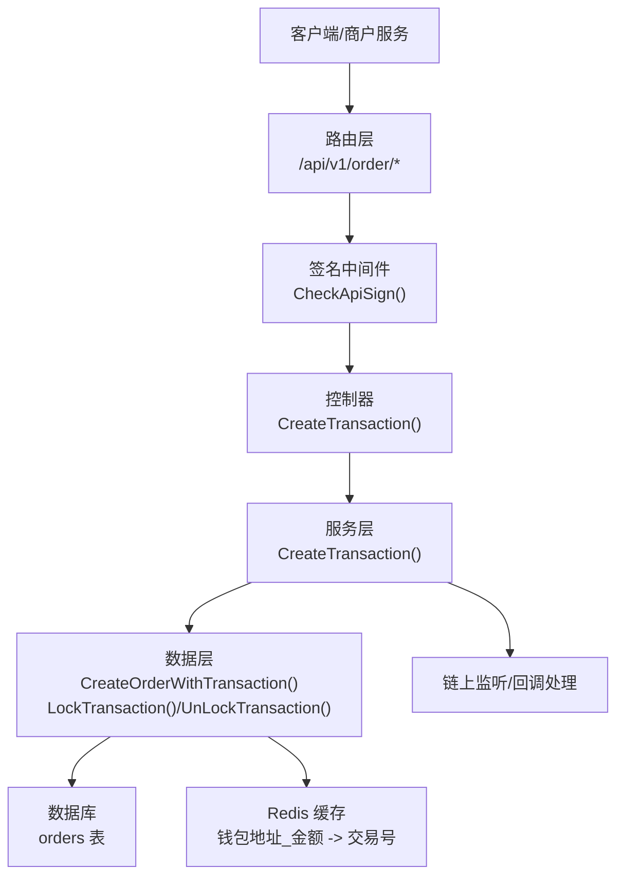
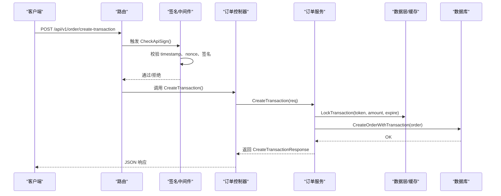
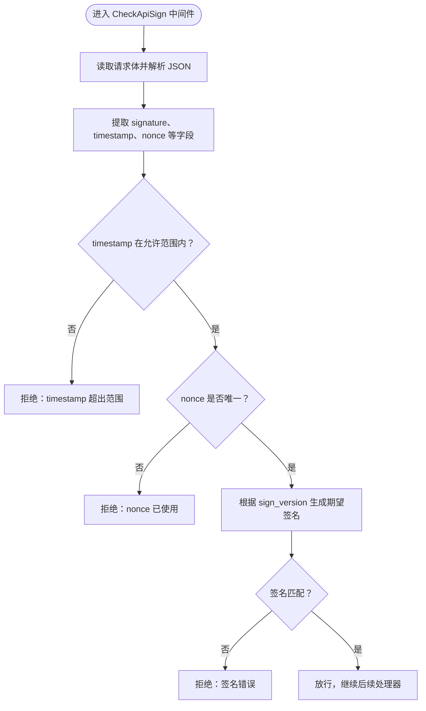
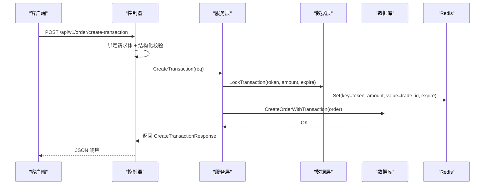
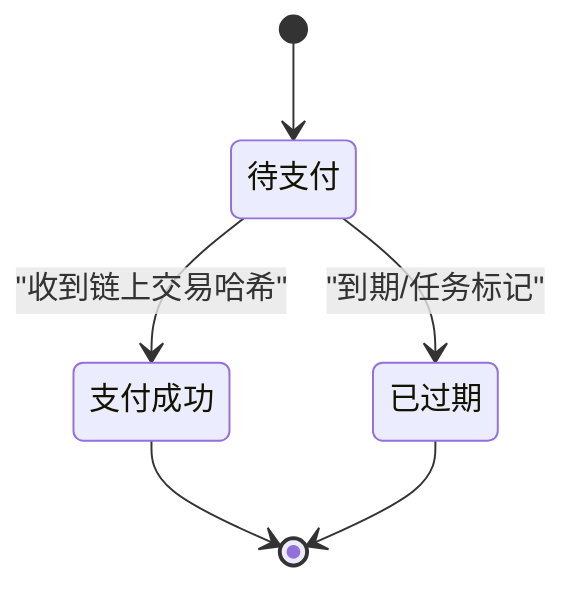
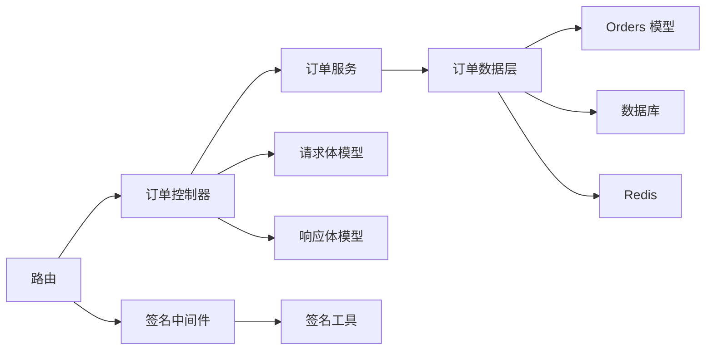

# 订单接口

<cite>
**本文引用的文件**
- [router.go](file://EPUSDT/src/route/router.go)
- [order_controller.go](file://EPUSDT/src/controller/comm/order_controller.go)
- [order_service.go](file://EPUSDT/src/model/service/order_service.go)
- [order_data.go](file://EPUSDT/src/model/data/order_data.go)
- [orders_mdb.go](file://EPUSDT/src/model/mdb/orders_mdb.go)
- [order_request.go](file://EPUSDT/src/model/request/order_request.go)
- [order_response.go](file://EPUSDT/src/model/response/order_response.go)
- [check_sign.go](file://EPUSDT/src/middleware/check_sign.go)
- [sign.go](file://EPUSDT/src/util/sign/sign.go)
- [input_validator.go](file://EPUSDT/src/util/validator/input_validator.go)
- [API_EXAMPLES.md](file://EPUSDT/API_EXAMPLES.md)
</cite>

## 目录
1. [简介](#简介)
2. [项目结构](#项目结构)
3. [核心组件](#核心组件)
4. [架构总览](#架构总览)
5. [详细组件分析](#详细组件分析)
6. [依赖关系分析](#依赖关系分析)
7. [性能与安全考量](#性能与安全考量)
8. [故障排查指南](#故障排查指南)
9. [结论](#结论)
10. [附录](#附录)

## 简介
本文件为 EPUSDT 订单接口的权威技术文档，覆盖创建交易、订单状态查询、订单列表查询等核心能力。文档详细说明每个接口的 HTTP 方法、URL 路径、请求参数、响应格式与错误码；阐述订单创建的完整流程（从参数校验到交易生成）、签名验证机制、参数校验规则与业务约束；并提供正常与异常场景的请求/响应示例、状态流转机制说明以及常见问题与最佳实践。

## 项目结构
围绕订单接口的关键模块分布如下：
- 路由层：定义 /api/v1/order 下的订单相关路由，并挂载签名中间件
- 控制器层：封装对外接口，负责参数绑定、校验与返回统一格式
- 服务层：编排业务逻辑，协调数据层与外部链上监听
- 数据层：封装订单持久化、查询与状态变更
- 模型与请求/响应：定义请求体、响应体与订单实体结构
- 中间件与签名：实现签名验证、重放防护与兼容多版本签名算法
- 校验工具：提供输入清洗与格式校验

**图示来源**
- [router.go](file://EPUSDT/src/route/router.go#L32-L36)
- [check_sign.go](file://EPUSDT/src/middleware/check_sign.go#L24-L106)
- [order_controller.go](file://EPUSDT/src/controller/comm/order_controller.go#L10-L24)
- [order_service.go](file://EPUSDT/src/model/service/order_service.go)
- [order_data.go](file://EPUSDT/src/model/data/order_data.go#L32-L109)
- [orders_mdb.go](file://EPUSDT/src/model/mdb/orders_mdb.go#L11-L25)

**章节来源**
- [router.go](file://EPUSDT/src/route/router.go#L32-L36)

## 核心组件
- 路由与签名中间件
  - /api/v1/order 下的所有订单接口均受 CheckApiSign 中间件保护，强制校验签名、时间戳与 nonce 的有效性
- 订单控制器
  - 提供创建交易接口，负责参数绑定、结构化校验与统一返回
- 订单服务
  - 实现订单创建的业务编排，包括金额安全校验、订单持久化、Redis 锁定交易号、回调准备等
- 订单数据层
  - 提供订单查询、事务内创建、状态更新、过期标记、回调重试控制等能力
- 订单模型与请求/响应
  - 定义订单实体字段、请求体结构与回调响应结构
- 签名与校验
  - 支持 HMAC-SHA256 与兼容 MD5 两种签名算法；提供重放防护（时间戳偏差与 nonce 唯一性）

**章节来源**
- [order_controller.go](file://EPUSDT/src/controller/comm/order_controller.go#L10-L24)
- [order_service.go](file://EPUSDT/src/model/service/order_service.go)
- [order_data.go](file://EPUSDT/src/model/data/order_data.go#L18-L109)
- [orders_mdb.go](file://EPUSDT/src/model/mdb/orders_mdb.go#L3-L25)
- [order_request.go](file://EPUSDT/src/model/request/order_request.go#L16-L51)
- [order_response.go](file://EPUSDT/src/model/response/order_response.go#L3-L26)
- [check_sign.go](file://EPUSDT/src/middleware/check_sign.go#L24-L106)
- [sign.go](file://EPUSDT/src/util/sign/sign.go#L15-L67)

## 架构总览
订单接口采用“路由 -> 中间件 -> 控制器 -> 服务 -> 数据层”的分层架构，结合 Redis 缓存与数据库实现高并发下的交易锁定与状态一致性。

**图示来源**
- [router.go](file://EPUSDT/src/route/router.go#L32-L36)
- [check_sign.go](file://EPUSDT/src/middleware/check_sign.go#L24-L106)
- [order_controller.go](file://EPUSDT/src/controller/comm/order_controller.go#L10-L24)
- [order_service.go](file://EPUSDT/src/model/service/order_service.go)
- [order_data.go](file://EPUSDT/src/model/data/order_data.go#L32-L101)
- [orders_mdb.go](file://EPUSDT/src/model/mdb/orders_mdb.go#L11-L25)

## 详细组件分析

### 接口清单与规范

- 创建交易接口
  - 方法与路径
    - POST /api/v1/order/create-transaction
  - 请求参数
    - order_id: string，必填，长度限制
    - amount: float，必填，需大于阈值且不超过上限，小数位不超过限定
    - notify_url: string，必填
    - redirect_url: string，选填
    - chain: string，选填
    - timestamp: int64，必填，允许的时间偏差范围内
    - nonce: string，必填，全局唯一，Redis 原子去重
    - signature: string，必填，签名结果
  - 响应字段
    - trade_id: 订单号
    - order_id: 商户订单号
    - amount: 订单金额（保留4位小数）
    - actual_amount: 实际支付金额（保留4位小数）
    - token: 收款钱包地址
    - chain: 链类型
    - expiration_time: 过期时间戳
    - payment_url: 收银台地址
  - 错误码
    - 通用错误码参考：200 成功；400 参数错误；401 签名错误；403 权限不足；404 资源不存在；500 服务器内部错误
  - 请求示例与响应示例
    - 参考示例文档中的“创建支付订单”部分，包含多种语言的调用示例与签名生成逻辑

- 订单状态查询接口
  - 方法与路径
    - GET /pay/check-status/:trade_id
  - 响应字段
    - status: 订单状态（1 待支付，2 支付成功，3 已过期）
    - block_transaction_id: 区块链交易哈希（支付成功时返回）
  - 说明
    - 该接口为公开接口，用于轮询检测订单状态

- 订单详情页面
  - 方法与路径
    - GET /pay/order-detail/:trade_id
  - 说明
    - 公开访问的订单详情页，便于用户查看订单信息

**章节来源**
- [router.go](file://EPUSDT/src/route/router.go#L24-L30)
- [order_response.go](file://EPUSDT/src/model/response/order_response.go#L3-L26)
- [API_EXAMPLES.md](file://EPUSDT/API_EXAMPLES.md#L7-L104)

### 参数校验与业务约束

- 请求体参数校验
  - 使用结构体标签与翻译映射进行基础校验与字段命名本地化
  - 金额安全校验：最大金额上限、小数位限制
- 输入清洗与格式校验
  - 提供输入清洗、字符白名单、钱包地址格式校验等工具函数
- 金额安全策略
  - 金额上限与小数位限制，避免精度与溢出风险

**章节来源**
- [order_request.go](file://EPUSDT/src/model/request/order_request.go#L16-L51)
- [input_validator.go](file://EPUSDT/src/util/validator/input_validator.go#L22-L52)

### 签名验证机制与重放防护

- 签名算法
  - 支持 HMAC-SHA256（推荐）与兼容 MD5（向后兼容）
  - 签名参数构建：排除 signature 字段，对剩余键值对进行排序拼接
- 重放防护
  - timestamp 与当前时间差需在允许范围内
  - nonce 全局唯一，基于 Redis SETNX 原子操作保证幂等
- 中间件行为
  - 读取请求体、解析 JSON、提取必要字段、执行校验与回写请求体

**图示来源**
- [check_sign.go](file://EPUSDT/src/middleware/check_sign.go#L24-L106)
- [sign.go](file://EPUSDT/src/util/sign/sign.go#L15-L67)

**章节来源**
- [check_sign.go](file://EPUSDT/src/middleware/check_sign.go#L24-L106)
- [sign.go](file://EPUSDT/src/util/sign/sign.go#L15-L67)

### 订单创建流程（从参数验证到交易生成）

**图示来源**
- [order_controller.go](file://EPUSDT/src/controller/comm/order_controller.go#L10-L24)
- [order_service.go](file://EPUSDT/src/model/service/order_service.go)
- [order_data.go](file://EPUSDT/src/model/data/order_data.go#L32-L101)
- [orders_mdb.go](file://EPUSDT/src/model/mdb/orders_mdb.go#L11-L25)

**章节来源**
- [order_controller.go](file://EPUSDT/src/controller/comm/order_controller.go#L10-L24)
- [order_service.go](file://EPUSDT/src/model/service/order_service.go)
- [order_data.go](file://EPUSDT/src/model/data/order_data.go#L32-L101)

### 订单状态流转机制

- 状态定义
  - 1：待支付
  - 2：支付成功
  - 3：已过期
- 转换条件
  - 待支付 -> 支付成功：链上监听到对应区块交易哈希，服务层更新状态
  - 待支付 -> 已过期：任务调度或到期逻辑将订单标记为过期
- 回调与幂等
  - 支付成功后触发异步回调，系统会进行回调重试，回调处理需幂等

**图示来源**
- [orders_mdb.go](file://EPUSDT/src/model/mdb/orders_mdb.go#L3-L9)
- [order_data.go](file://EPUSDT/src/model/data/order_data.go#L45-L79)

**章节来源**
- [orders_mdb.go](file://EPUSDT/src/model/mdb/orders_mdb.go#L3-L9)
- [order_data.go](file://EPUSDT/src/model/data/order_data.go#L45-L79)

### 订单查询与列表（概念说明）
- 订单状态查询
  - 公开接口：GET /pay/check-status/:trade_id
  - 返回状态与链上交易哈希（成功时）
- 订单详情页面
  - 公开接口：GET /pay/order-detail/:trade_id
- 订单列表查询
  - 当前仓库未提供 /api/v1/order/list 接口；如需列表查询，请在业务扩展中增加相应路由与控制器方法，并遵循现有签名与鉴权模式

**章节来源**
- [router.go](file://EPUSDT/src/route/router.go#L24-L30)

## 依赖关系分析

**图示来源**
- [router.go](file://EPUSDT/src/route/router.go#L32-L36)
- [order_controller.go](file://EPUSDT/src/controller/comm/order_controller.go#L10-L24)
- [order_service.go](file://EPUSDT/src/model/service/order_service.go)
- [order_data.go](file://EPUSDT/src/model/data/order_data.go#L18-L109)
- [orders_mdb.go](file://EPUSDT/src/model/mdb/orders_mdb.go#L11-L25)
- [check_sign.go](file://EPUSDT/src/middleware/check_sign.go#L24-L106)
- [sign.go](file://EPUSDT/src/util/sign/sign.go#L15-L67)
- [order_request.go](file://EPUSDT/src/model/request/order_request.go#L16-L51)
- [order_response.go](file://EPUSDT/src/model/response/order_response.go#L3-L26)

**章节来源**
- [router.go](file://EPUSDT/src/route/router.go#L32-L36)
- [order_controller.go](file://EPUSDT/src/controller/comm/order_controller.go#L10-L24)
- [order_service.go](file://EPUSDT/src/model/service/order_service.go)
- [order_data.go](file://EPUSDT/src/model/data/order_data.go#L18-L109)
- [orders_mdb.go](file://EPUSDT/src/model/mdb/orders_mdb.go#L11-L25)
- [check_sign.go](file://EPUSDT/src/middleware/check_sign.go#L24-L106)
- [sign.go](file://EPUSDT/src/util/sign/sign.go#L15-L67)
- [order_request.go](file://EPUSDT/src/model/request/order_request.go#L16-L51)
- [order_response.go](file://EPUSDT/src/model/response/order_response.go#L3-L26)

## 性能与安全考量
- 性能
  - Redis 原子锁与过期时间控制交易号锁定窗口，降低并发冲突
  - 数据库事务内创建订单，确保一致性
- 安全
  - 强制签名与重放防护，timestamp 容差与 nonce 唯一性双重保障
  - 推荐使用 HMAC-SHA256 签名算法，逐步淘汰 MD5
- 可靠性
  - 回调重试与确认机制，确保支付结果可靠通知
  - 订单过期处理，避免长时间占用资源

[本节为通用指导，无需特定文件来源]

## 故障排查指南
- 签名相关错误
  - 现象：返回签名错误或签名版本不匹配
  - 排查：确认签名算法版本、参数排序与签名串拼接规则一致
- 重放防护错误
  - 现象：timestamp 超出范围或 nonce 已使用
  - 排查：检查本地时间同步、nonce 唯一性与 Redis 可用性
- 参数校验错误
  - 现象：参数缺失、格式错误或金额超出限制
  - 排查：核对必填项、金额精度与链类型
- 回调处理异常
  - 现象：回调被系统重试或失败
  - 排查：确保回调接口幂等、签名验证通过、返回“ok”

**章节来源**
- [check_sign.go](file://EPUSDT/src/middleware/check_sign.go#L24-L106)
- [sign.go](file://EPUSDT/src/util/sign/sign.go#L15-L67)
- [order_request.go](file://EPUSDT/src/model/request/order_request.go#L16-L51)

## 结论
EPUSDT 订单接口以清晰的分层架构、严格的参数与签名校验、完善的重放防护与状态流转机制，提供了稳定可靠的支付订单能力。建议在生产环境中优先使用 HMAC-SHA256 签名、合理设置轮询与回调策略，并结合 Redis 与数据库的原子操作保障高并发下的数据一致性。

[本节为总结性内容，无需特定文件来源]

## 附录

### 接口定义速查

- 创建交易
  - 方法：POST
  - 路径：/api/v1/order/create-transaction
  - 请求参数：order_id、amount、notify_url、redirect_url、chain、timestamp、nonce、signature
  - 响应字段：trade_id、order_id、amount、actual_amount、token、chain、expiration_time、payment_url
  - 错误码：200/400/401/403/404/500

- 订单状态查询
  - 方法：GET
  - 路径：/pay/check-status/:trade_id
  - 响应字段：status、block_transaction_id

- 订单详情页面
  - 方法：GET
  - 路径：/pay/order-detail/:trade_id

**章节来源**
- [router.go](file://EPUSDT/src/route/router.go#L24-L30)
- [order_response.go](file://EPUSDT/src/model/response/order_response.go#L3-L26)

### 请求与响应示例（参考）
- 创建订单示例与签名生成
  - 参考示例文档中的“创建支付订单”章节，包含多语言示例与 cURL 调用
- 回调处理示例
  - 参考示例文档中的“处理支付回调”章节，包含服务端与客户端签名验证逻辑

**章节来源**
- [API_EXAMPLES.md](file://EPUSDT/API_EXAMPLES.md#L7-L104)
- [API_EXAMPLES.md](file://EPUSDT/API_EXAMPLES.md#L448-L608)