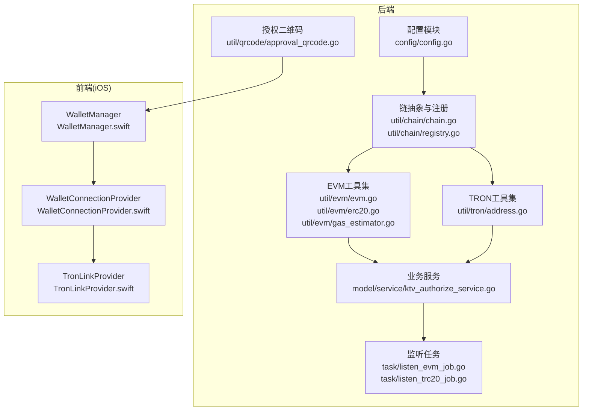
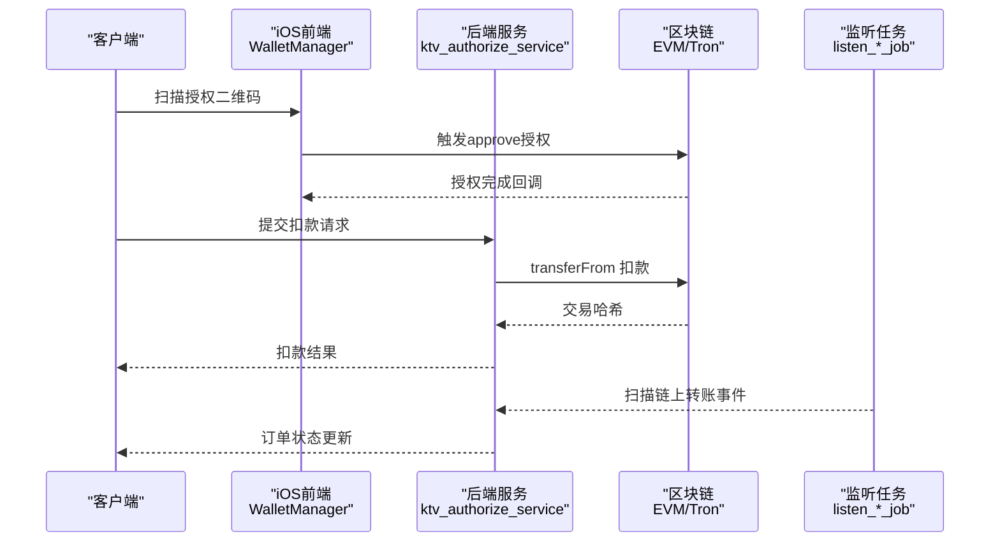
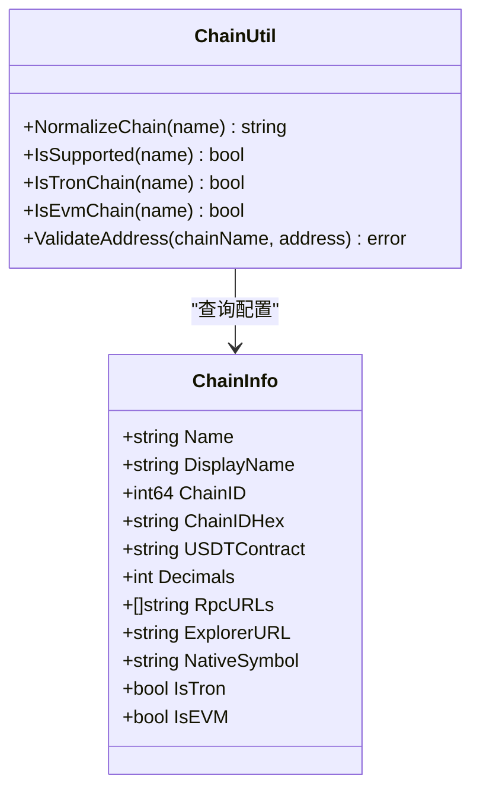
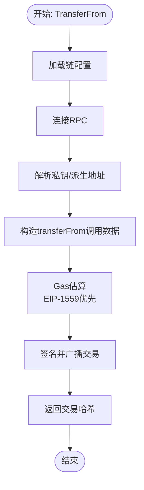
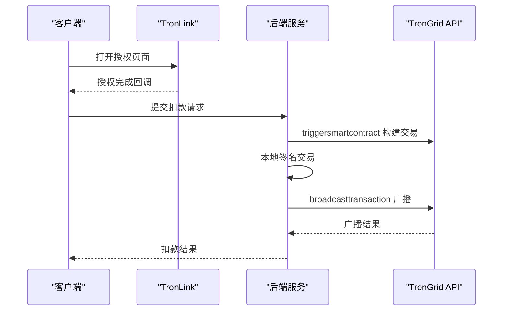
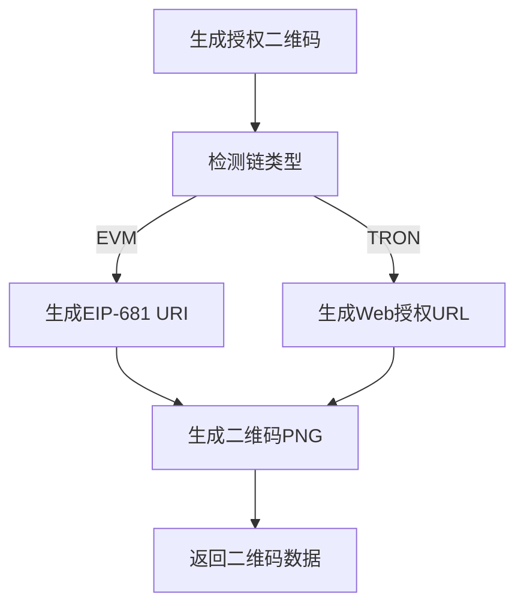
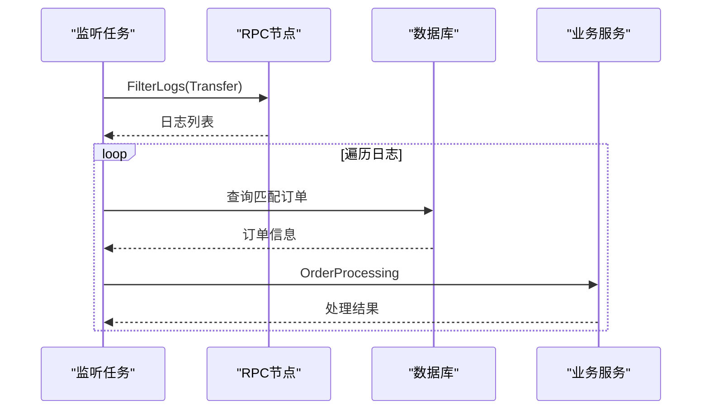
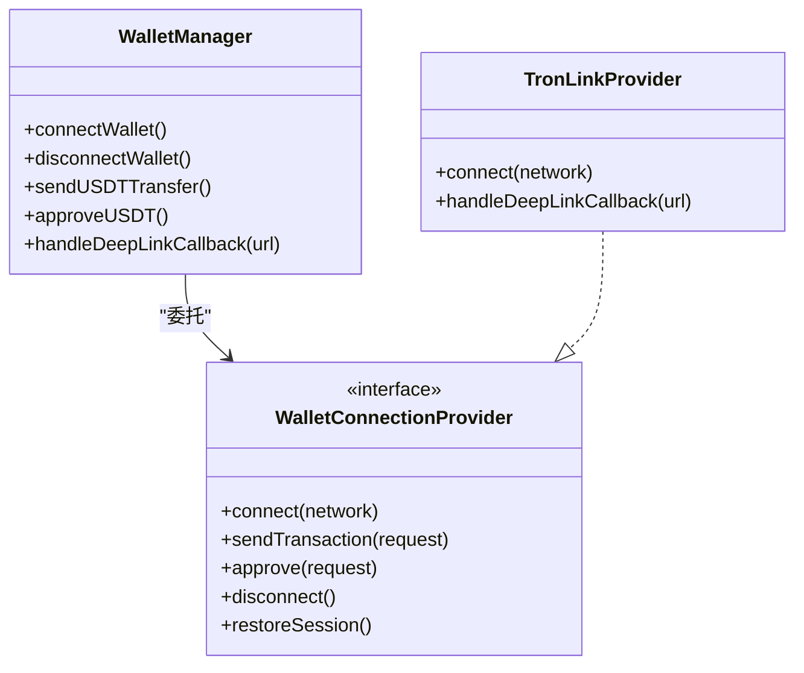
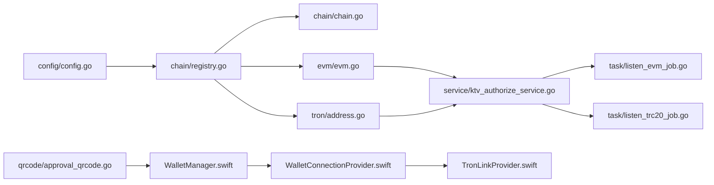

# 区块链集成

<cite>
**本文引用的文件**
- [evm.go](file://EPUSDT/src/util/evm/evm.go)
- [erc20.go](file://EPUSDT/src/util/evm/erc20.go)
- [gas_estimator.go](file://EPUSDT/src/util/evm/gas_estimator.go)
- [chain.go](file://EPUSDT/src/util/chain/chain.go)
- [registry.go](file://EPUSDT/src/util/chain/registry.go)
- [address.go](file://EPUSDT/src/util/tron/address.go)
- [config.go](file://EPUSDT/src/config/config.go)
- [approval_qrcode.go](file://EPUSDT/src/util/qrcode/approval_qrcode.go)
- [listen_evm_job.go](file://EPUSDT/src/task/listen_evm_job.go)
- [listen_trc20_job.go](file://EPUSDT/src/task/listen_trc20_job.go)
- [ktv_authorize_service.go](file://EPUSDT/src/model/service/ktv_authorize_service.go)
- [pay_service.go](file://EPUSDT/src/model/service/pay_service.go)
- [pay_controller.go](file://EPUSDT/src/controller/comm/pay_controller.go)
- [WalletManager.swift](file://EPUSDT/ios手机系统/EpusdtPay/Wallet/WalletManager.swift)
- [WalletConnectionProvider.swift](file://EPUSDT/ios手机系统/EpusdtPay/Wallet/WalletConnectionProvider.swift)
- [TronLinkProvider.swift](file://EPUSDT/ios手机系统/EpusdtPay/Wallet/TronLinkProvider.swift)
- [区块链功能集成指南.md](file://EPUSDT/docs/区块链功能集成指南.md)
</cite>

## 目录
1. [简介](#简介)
2. [项目结构](#项目结构)
3. [核心组件](#核心组件)
4. [架构总览](#架构总览)
5. [详细组件分析](#详细组件分析)
6. [依赖关系分析](#依赖关系分析)
7. [性能考量](#性能考量)
8. [故障排除指南](#故障排除指南)
9. [结论](#结论)
10. [附录](#附录)

## 简介
本技术文档面向EPUSDT系统的区块链集成功能，聚焦于多链支持机制、钱包授权实现与交易执行流程。文档覆盖EVM兼容链（以太坊、BSC、Polygon）与TRON链的集成方案，解释USDT在不同链上的转账机制、Gas费用估算与交易确认过程；详述钱包授权的approve操作、授权有效期管理与安全考虑；并提供节点配置、RPC调用与错误处理策略，以及性能优化建议与故障排除指导。

## 项目结构
EPUSDT采用前后端分离的Go后端与iOS前端架构，区块链相关能力主要集中在后端util与model/service层，以及iOS侧的钱包连接与交易发起模块。

**图表来源**
- [config.go](file://EPUSDT/src/config/config.go#L45-L134)
- [chain.go](file://EPUSDT/src/util/chain/chain.go#L11-L74)
- [registry.go](file://EPUSDT/src/util/chain/registry.go#L22-L81)
- [evm.go](file://EPUSDT/src/util/evm/evm.go#L32-L223)
- [erc20.go](file://EPUSDT/src/util/evm/erc20.go#L9-L39)
- [gas_estimator.go](file://EPUSDT/src/util/evm/gas_estimator.go#L14-L66)
- [address.go](file://EPUSDT/src/util/tron/address.go#L11-L58)
- [ktv_authorize_service.go](file://EPUSDT/src/model/service/ktv_authorize_service.go#L33-L92)
- [listen_evm_job.go](file://EPUSDT/src/task/listen_evm_job.go#L32-L107)
- [listen_trc20_job.go](file://EPUSDT/src/task/listen_trc20_job.go#L10-L33)
- [approval_qrcode.go](file://EPUSDT/src/util/qrcode/approval_qrcode.go#L22-L53)
- [WalletManager.swift](file://EPUSDT/ios手机系统/EpusdtPay/Wallet/WalletManager.swift#L18-L77)
- [WalletConnectionProvider.swift](file://EPUSDT/ios手机系统/EpusdtPay/Wallet/WalletConnectionProvider.swift#L14-L118)
- [TronLinkProvider.swift](file://EPUSDT/ios手机系统/EpusdtPay/Wallet/TronLinkProvider.swift#L95-L134)

**章节来源**
- [config.go](file://EPUSDT/src/config/config.go#L45-L134)
- [chain.go](file://EPUSDT/src/util/chain/chain.go#L11-L74)
- [registry.go](file://EPUSDT/src/util/chain/registry.go#L22-L81)

## 核心组件
- 链抽象与注册：统一管理EVM与TRON链的配置、校验与映射，提供链信息查询与支持性判断。
- EVM工具集：封装USDT转账、approve查询、Gas估算与RPC轮询等核心能力。
- TRON工具集：提供地址校验与TRC20 approve/transferFrom的本地签名与广播流程。
- 业务服务：授权创建、自动确认、扣款执行与异步链上处理。
- 监听任务：周期扫描各链的USDT转账事件，驱动订单处理与通知。
- 授权二维码：生成EIP-681与TronLink Web授权链接，兼容主流钱包。
- iOS钱包管理：统一连接、授权与交易入口，适配WalletConnect与TronLink。

**章节来源**
- [registry.go](file://EPUSDT/src/util/chain/registry.go#L83-L150)
- [evm.go](file://EPUSDT/src/util/evm/evm.go#L38-L191)
- [address.go](file://EPUSDT/src/util/tron/address.go#L11-L58)
- [ktv_authorize_service.go](file://EPUSDT/src/model/service/ktv_authorize_service.go#L132-L235)
- [listen_evm_job.go](file://EPUSDT/src/task/listen_evm_job.go#L40-L107)
- [listen_trc20_job.go](file://EPUSDT/src/task/listen_trc20_job.go#L15-L33)
- [approval_qrcode.go](file://EPUSDT/src/util/qrcode/approval_qrcode.go#L22-L95)
- [WalletManager.swift](file://EPUSDT/ios手机系统/EpusdtPay/Wallet/WalletManager.swift#L18-L77)
- [WalletConnectionProvider.swift](file://EPUSDT/ios手机系统/EpusdtPay/Wallet/WalletConnectionProvider.swift#L268-L300)

## 架构总览
下图展示了从授权到扣款的端到端流程，包括前端授权二维码生成、钱包授权、后端自动确认与链上扣款。

**图表来源**
- [approval_qrcode.go](file://EPUSDT/src/util/qrcode/approval_qrcode.go#L22-L95)
- [WalletManager.swift](file://EPUSDT/ios手机系统/EpusdtPay/Wallet/WalletManager.swift#L330-L376)
- [ktv_authorize_service.go](file://EPUSDT/src/model/service/ktv_authorize_service.go#L237-L420)
- [listen_evm_job.go](file://EPUSDT/src/task/listen_evm_job.go#L109-L159)
- [listen_trc20_job.go](file://EPUSDT/src/task/listen_trc20_job.go#L15-L33)

## 详细组件分析

### 多链支持机制与链注册
- 链抽象：通过常量与正则表达式统一识别EVM、BSC、Polygon、TRON，并提供地址校验。
- 注册表：集中维护链ID、合约地址、精度、RPC列表、浏览器链接与是否EVM/TRON标记。
- 配置加载：从环境变量读取各链的RPC与合约地址，支持默认值与回退策略。

**图表来源**
- [registry.go](file://EPUSDT/src/util/chain/registry.go#L7-L20)
- [registry.go](file://EPUSDT/src/util/chain/registry.go#L83-L150)
- [chain.go](file://EPUSDT/src/util/chain/chain.go#L20-L73)

**章节来源**
- [chain.go](file://EPUSDT/src/util/chain/chain.go#L11-L74)
- [registry.go](file://EPUSDT/src/util/chain/registry.go#L22-L81)
- [config.go](file://EPUSDT/src/config/config.go#L238-L312)

### EVM兼容链（ETH/BSC/Polygon）集成
- USDT转账：通过transferFrom执行，需要先approve授权；支持EIP-1559与传统Gas Price两种模式。
- Gas估算：优先尝试EIP-1559，否则使用区块平均价格与建议价格的较小值并加5%缓冲。
- RPC轮询：按链配置的RPC列表轮询，提升可用性；对区块范围分段扫描以降低压力。
- 数额转换：根据链精度进行精确换算，避免浮点误差。

**图表来源**
- [evm.go](file://EPUSDT/src/util/evm/evm.go#L83-L191)
- [gas_estimator.go](file://EPUSDT/src/util/evm/gas_estimator.go#L28-L99)

**章节来源**
- [evm.go](file://EPUSDT/src/util/evm/evm.go#L38-L191)
- [erc20.go](file://EPUSDT/src/util/evm/erc20.go#L9-L39)
- [gas_estimator.go](file://EPUSDT/src/util/evm/gas_estimator.go#L14-L99)
- [listen_evm_job.go](file://EPUSDT/src/task/listen_evm_job.go#L40-L107)

### TRON链集成
- 地址校验：Base58Check校验与校验和验证，确保主网地址格式。
- 授权与扣款：通过TronLink授权approve；扣款时本地构建交易、签名并广播，私钥不离开本地。
- 允许额度查询：调用TronGrid API查询allowance，支持自动确认授权。

**图表来源**
- [address.go](file://EPUSDT/src/util/tron/address.go#L11-L58)
- [ktv_authorize_service.go](file://EPUSDT/src/model/service/ktv_authorize_service.go#L439-L527)
- [ktv_authorize_service.go](file://EPUSDT/src/model/service/ktv_authorize_service.go#L588-L641)

**章节来源**
- [address.go](file://EPUSDT/src/util/tron/address.go#L11-L58)
- [ktv_authorize_service.go](file://EPUSDT/src/model/service/ktv_authorize_service.go#L439-L527)
- [ktv_authorize_service.go](file://EPUSDT/src/model/service/ktv_authorize_service.go#L588-L641)

### 钱包授权与二维码
- EIP-681二维码：EVM链使用ethereum URI格式，包含合约地址、链ID、授权地址与金额。
- TronLink二维码：TRON链使用Web授权页面URL，引导用户在TronLink内置浏览器中完成授权。
- 金额换算：使用big.Int精确计算，避免浮点误差。

**图表来源**
- [approval_qrcode.go](file://EPUSDT/src/util/qrcode/approval_qrcode.go#L22-L95)

**章节来源**
- [approval_qrcode.go](file://EPUSDT/src/util/qrcode/approval_qrcode.go#L22-L135)
- [WalletConnectionProvider.swift](file://EPUSDT/ios手机系统/EpusdtPay/Wallet/WalletConnectionProvider.swift#L146-L181)
- [WalletConnectionProvider.swift](file://EPUSDT/ios手机系统/EpusdtPay/Wallet/WalletConnectionProvider.swift#L183-L228)

### 交易执行与监听
- EVM监听：按区块范围扫描Transfer事件，匹配收款地址与金额，触发订单处理与通知。
- TRON监听：并发扫描各钱包地址的TRC20事件，异步回调处理。

**图表来源**
- [listen_evm_job.go](file://EPUSDT/src/task/listen_evm_job.go#L77-L159)
- [ktv_authorize_service.go](file://EPUSDT/src/model/service/ktv_authorize_service.go#L294-L420)

**章节来源**
- [listen_evm_job.go](file://EPUSDT/src/task/listen_evm_job.go#L32-L190)
- [listen_trc20_job.go](file://EPUSDT/src/task/listen_trc20_job.go#L10-L33)

### iOS钱包连接与交易发起
- 统一管理：WalletManager根据网络自动路由到WalletConnectProvider或TronLinkProvider。
- 交易请求：封装transfer与approve的ABI编码数据，支持EVM链的无限授权。
- Deep Link：处理来自钱包App的回调，恢复会话与状态。

**图表来源**
- [WalletManager.swift](file://EPUSDT/ios手机系统/EpusdtPay/Wallet/WalletManager.swift#L18-L77)
- [WalletConnectionProvider.swift](file://EPUSDT/ios手机系统/EpusdtPay/Wallet/WalletConnectionProvider.swift#L268-L300)
- [TronLinkProvider.swift](file://EPUSDT/ios手机系统/EpusdtPay/Wallet/TronLinkProvider.swift#L95-L134)

**章节来源**
- [WalletManager.swift](file://EPUSDT/ios手机系统/EpusdtPay/Wallet/WalletManager.swift#L194-L376)
- [WalletConnectionProvider.swift](file://EPUSDT/ios手机系统/EpusdtPay/Wallet/WalletConnectionProvider.swift#L14-L118)
- [TronLinkProvider.swift](file://EPUSDT/ios手机系统/EpusdtPay/Wallet/TronLinkProvider.swift#L95-L134)

## 依赖关系分析
- 配置依赖：链配置与RPC列表由config模块集中管理，供链抽象与EVM/Tron工具使用。
- 服务依赖：业务服务依赖链工具与监听任务，负责授权生命周期与链上执行。
- 前端依赖：iOS钱包管理依赖协议与Provider，实现跨链统一接入。

**图表来源**
- [config.go](file://EPUSDT/src/config/config.go#L45-L134)
- [registry.go](file://EPUSDT/src/util/chain/registry.go#L22-L81)
- [chain.go](file://EPUSDT/src/util/chain/chain.go#L11-L74)
- [evm.go](file://EPUSDT/src/util/evm/evm.go#L32-L223)
- [address.go](file://EPUSDT/src/util/tron/address.go#L11-L58)
- [ktv_authorize_service.go](file://EPUSDT/src/model/service/ktv_authorize_service.go#L294-L420)
- [listen_evm_job.go](file://EPUSDT/src/task/listen_evm_job.go#L32-L107)
- [listen_trc20_job.go](file://EPUSDT/src/task/listen_trc20_job.go#L10-L33)
- [approval_qrcode.go](file://EPUSDT/src/util/qrcode/approval_qrcode.go#L22-L95)
- [WalletManager.swift](file://EPUSDT/ios手机系统/EpusdtPay/Wallet/WalletManager.swift#L18-L77)
- [WalletConnectionProvider.swift](file://EPUSDT/ios手机系统/EpusdtPay/Wallet/WalletConnectionProvider.swift#L268-L300)
- [TronLinkProvider.swift](file://EPUSDT/ios手机系统/EpusdtPay/Wallet/TronLinkProvider.swift#L95-L134)

**章节来源**
- [config.go](file://EPUSDT/src/config/config.go#L45-L134)
- [registry.go](file://EPUSDT/src/util/chain/registry.go#L22-L81)
- [ktv_authorize_service.go](file://EPUSDT/src/model/service/ktv_authorize_service.go#L294-L420)

## 性能考量
- Gas优化：EIP-1559优先，否则取建议价格与区块平均价格较小值并加5%缓冲，显著降低Gas成本。
- RPC轮询：链配置支持多RPC节点轮询，提高可用性；监听任务按固定范围扫描，避免一次性拉取过大区块。
- 估算开销：Gas估算增加约200ms RPC调用开销，建议结合缓存策略（如5分钟TTL）进一步优化。
- 传输精度：使用big.Int精确换算，避免浮点误差导致的金额偏差。

**章节来源**
- [gas_estimator.go](file://EPUSDT/src/util/evm/gas_estimator.go#L28-L99)
- [listen_evm_job.go](file://EPUSDT/src/task/listen_evm_job.go#L77-L104)
- [approval_qrcode.go](file://EPUSDT/src/util/qrcode/approval_qrcode.go#L97-L122)

## 故障排除指南
- “链不支持”：检查链名称标准化与支持性判断，确认链配置是否正确。
- “RPC未配置”：核对.env中的RPC列表，确保至少有一个可用节点。
- “私钥格式错误”：确认私钥为十六进制且不含0x前缀，地址与私钥匹配。
- “授权未生效”：检查allowance是否达到授权金额，或等待链上确认。
- “交易失败”：查看Gas估算与网络拥堵情况，适当提高Gas价格或稍后再试。
- “监听不到转账”：确认过滤条件（合约地址、主题、收款地址）与区块范围设置。

**章节来源**
- [chain.go](file://EPUSDT/src/util/chain/chain.go#L35-L73)
- [evm.go](file://EPUSDT/src/util/evm/evm.go#L225-L244)
- [evm.go](file://EPUSDT/src/util/evm/evm.go#L94-L97)
- [ktv_authorize_service.go](file://EPUSDT/src/model/service/ktv_authorize_service.go#L198-L235)
- [listen_evm_job.go](file://EPUSDT/src/task/listen_evm_job.go#L91-L104)

## 结论
EPUSDT的区块链集成功能通过统一的链抽象与注册、完善的EVM与TRON工具集、严谨的授权与扣款流程，以及高效的监听与通知机制，实现了跨链USDT支付的稳定运行。配合iOS端统一的钱包接入与二维码授权，为商户与消费者提供了流畅的支付体验。建议持续优化Gas缓存与监听范围，加强安全与合规建设，以应对高并发与监管要求。

## 附录
- 配置项参考：在.env中配置各链RPC、合约地址、精度与商家私钥映射。
- 测试与验证：参考集成指南中的测试步骤与日志输出，定位问题并验证功能。

**章节来源**
- [区块链功能集成指南.md](file://EPUSDT/docs/区块链功能集成指南.md#L56-L473)
- [config.go](file://EPUSDT/src/config/config.go#L45-L134)