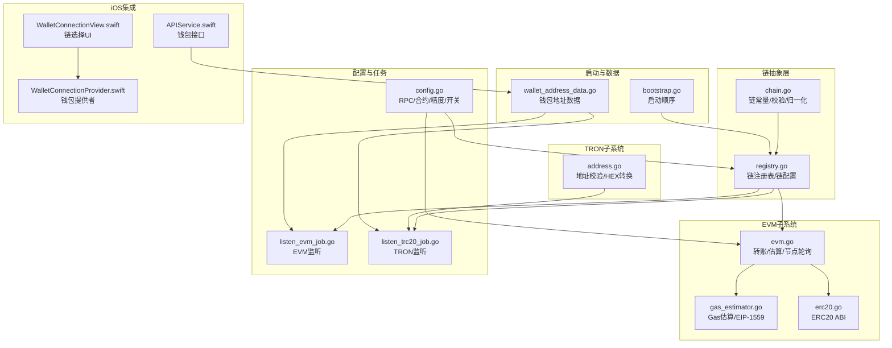
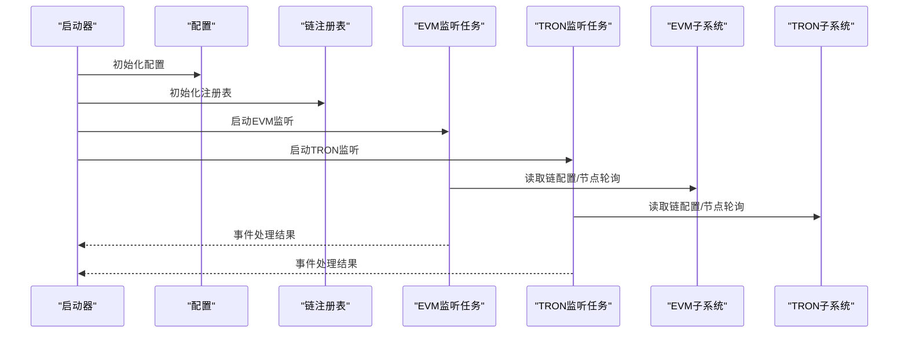
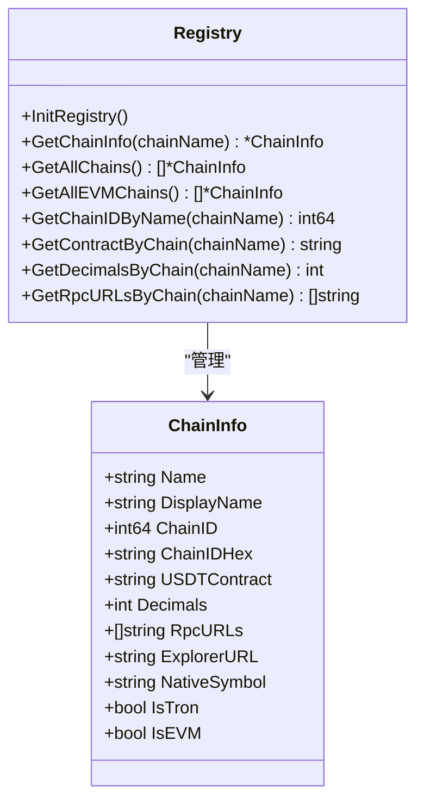
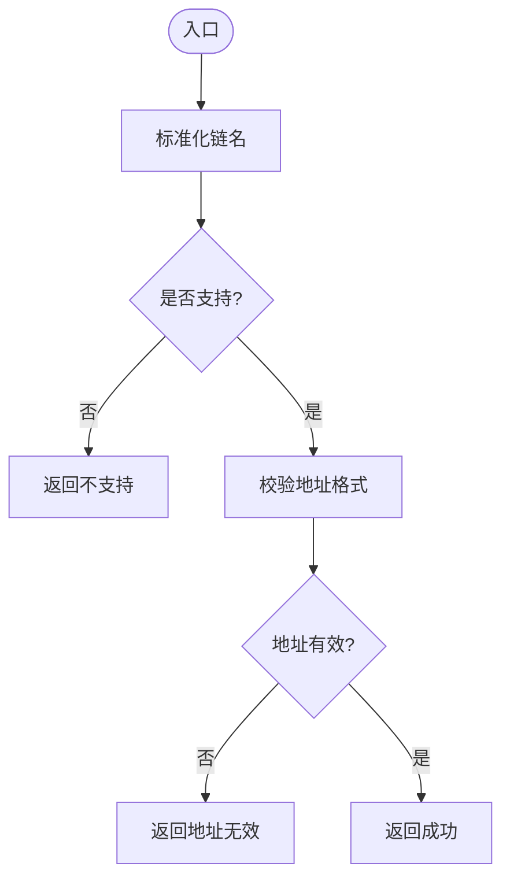
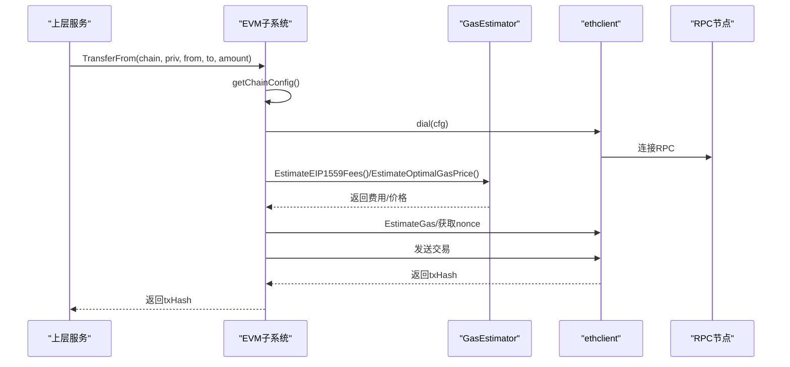
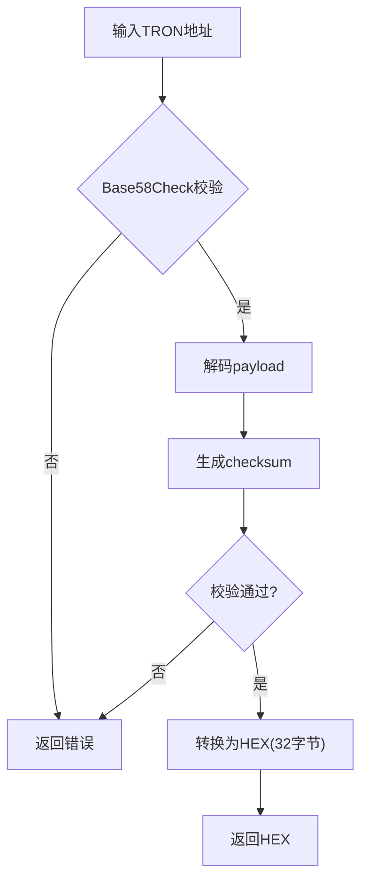
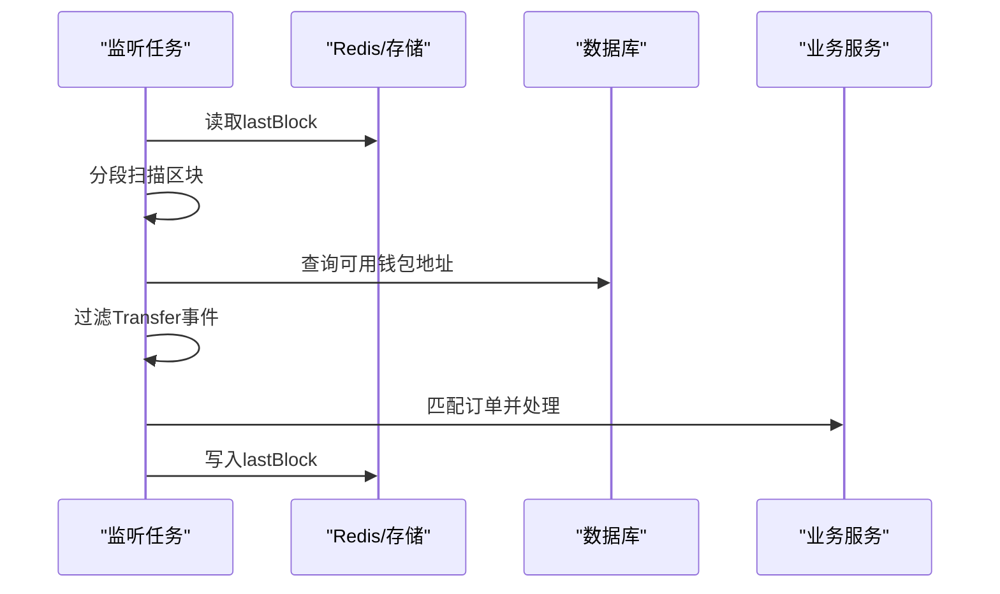
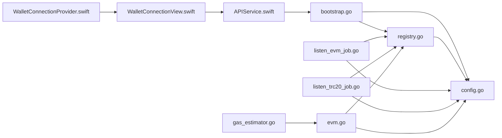

# 多链支持机制

<cite>
**本文引用的文件**
- [chain.go](file://EPUSDT/src/util/chain/chain.go)
- [registry.go](file://EPUSDT/src/util/chain/registry.go)
- [evm.go](file://EPUSDT/src/util/evm/evm.go)
- [gas_estimator.go](file://EPUSDT/src/util/evm/gas_estimator.go)
- [erc20.go](file://EPUSDT/src/util/evm/erc20.go)
- [address.go](file://EPUSDT/src/util/tron/address.go)
- [config.go](file://EPUSDT/src/config/config.go)
- [listen_evm_job.go](file://EPUSDT/src/task/listen_evm_job.go)
- [listen_trc20_job.go](file://EPUSDT/src/task/listen_trc20_job.go)
- [bootstrap.go](file://EPUSDT/src/bootstrap/bootstrap.go)
- [wallet_address_data.go](file://EPUSDT/src/model/data/wallet_address_data.go)
- [APIService.swift](file://EPUSDT/ios手机系统/EpusdtPay/EpusdtPay/EpusdtPay/Services/APIService.swift)
- [WalletConnectionView.swift](file://EPUSDT/ios手机系统/EpusdtPay/Wallet/WalletConnectionView.swift)
- [WalletConnectionProvider.swift](file://EPUSDT/ios手机系统/EpusdtPay/Wallet/WalletConnectionProvider.swift)
</cite>

## 目录
1. [简介](#简介)
2. [项目结构](#项目结构)
3. [核心组件](#核心组件)
4. [架构总览](#架构总览)
5. [组件详解](#组件详解)
6. [依赖关系分析](#依赖关系分析)
7. [性能考量](#性能考量)
8. [故障排查指南](#故障排查指南)
9. [结论](#结论)
10. [附录](#附录)

## 简介
本技术文档围绕 EPUSDT 的多链支持机制展开，重点阐述如何统一支持 EVM 兼容链（以太坊、BSC、Polygon）与 TRON 链。文档覆盖链注册机制、链配置管理、跨链通信协议、链切换逻辑、网络配置与节点选择策略，并提供添加新链的实践步骤、最佳实践与性能优化建议，帮助区块链架构师与开发者高效落地与扩展。

## 项目结构
EPUSDT 的多链支持主要集中在以下模块：
- 链抽象与注册：util/chain
- EVM 子系统：util/evm
- TRON 子系统：util/tron
- 配置管理：config
- 任务监听：task
- 启动引导：bootstrap
- 数据访问：model/data
- iOS 钱包侧集成：ios手机系统/EpusdtPay

图表来源
- [chain.go](file://EPUSDT/src/util/chain/chain.go#L1-L74)
- [registry.go](file://EPUSDT/src/util/chain/registry.go#L1-L150)
- [evm.go](file://EPUSDT/src/util/evm/evm.go#L1-L261)
- [gas_estimator.go](file://EPUSDT/src/util/evm/gas_estimator.go#L1-L188)
- [erc20.go](file://EPUSDT/src/util/evm/erc20.go#L1-L40)
- [address.go](file://EPUSDT/src/util/tron/address.go#L1-L58)
- [config.go](file://EPUSDT/src/config/config.go#L1-L400)
- [listen_evm_job.go](file://EPUSDT/src/task/listen_evm_job.go#L1-L190)
- [listen_trc20_job.go](file://EPUSDT/src/task/listen_trc20_job.go#L1-L33)
- [bootstrap.go](file://EPUSDT/src/bootstrap/bootstrap.go#L1-L44)
- [wallet_address_data.go](file://EPUSDT/src/model/data/wallet_address_data.go#L1-L82)
- [APIService.swift](file://EPUSDT/ios手机系统/EpusdtPay/EpusdtPay/EpusdtPay/Services/APIService.swift#L101-L135)
- [WalletConnectionView.swift](file://EPUSDT/ios手机系统/EpusdtPay/Wallet/WalletConnectionView.swift#L225-L241)
- [WalletConnectionProvider.swift](file://EPUSDT/ios手机系统/EpusdtPay/Wallet/WalletConnectionProvider.swift#L402-L416)

章节来源
- [bootstrap.go](file://EPUSDT/src/bootstrap/bootstrap.go#L15-L44)
- [config.go](file://EPUSDT/src/config/config.go#L45-L134)

## 核心组件
- 链抽象与校验：提供链常量、标准化链名、地址校验、EVM/TRON识别等能力。
- 链注册表：集中管理各链的链ID、合约地址、精度、RPC、浏览器、原生代币等配置。
- EVM 子系统：封装 ERC20 交互、Gas 估算、EIP-1559 支持、节点轮询与交易发送。
- TRON 子系统：提供 TRX/USDT 地址校验与 HEX 转换。
- 配置管理：从环境读取 RPC、合约、精度、开关等配置。
- 任务监听：定时扫描各链事件，匹配订单并触发处理。
- iOS 集成：提供钱包接口、链选择 UI 与钱包提供者。

章节来源
- [chain.go](file://EPUSDT/src/util/chain/chain.go#L11-L74)
- [registry.go](file://EPUSDT/src/util/chain/registry.go#L7-L150)
- [evm.go](file://EPUSDT/src/util/evm/evm.go#L24-L261)
- [gas_estimator.go](file://EPUSDT/src/util/evm/gas_estimator.go#L14-L188)
- [erc20.go](file://EPUSDT/src/util/evm/erc20.go#L9-L40)
- [address.go](file://EPUSDT/src/util/tron/address.go#L11-L58)
- [config.go](file://EPUSDT/src/config/config.go#L23-L134)
- [listen_evm_job.go](file://EPUSDT/src/task/listen_evm_job.go#L32-L107)
- [listen_trc20_job.go](file://EPUSDT/src/task/listen_trc20_job.go#L10-L33)
- [APIService.swift](file://EPUSDT/ios手机系统/EpusdtPay/EpusdtPay/EpusdtPay/Services/APIService.swift#L101-L135)
- [WalletConnectionView.swift](file://EPUSDT/ios手机系统/EpusdtPay/Wallet/WalletConnectionView.swift#L225-L241)
- [WalletConnectionProvider.swift](file://EPUSDT/ios手机系统/EpusdtPay/Wallet/WalletConnectionProvider.swift#L402-L416)

## 架构总览
EPUSDT 的多链架构采用“配置驱动 + 任务监听 + 统一抽象”的模式：
- 启动阶段加载配置并初始化链注册表。
- 任务调度器按链维度启动监听作业，扫描转账事件并匹配订单。
- EVM 与 TRON 分别通过各自的客户端与协议进行交易处理。
- iOS 端通过钱包提供者与链选择界面与后端交互。

图表来源
- [bootstrap.go](file://EPUSDT/src/bootstrap/bootstrap.go#L16-L38)
- [config.go](file://EPUSDT/src/config/config.go#L45-L134)
- [registry.go](file://EPUSDT/src/util/chain/registry.go#L25-L81)
- [listen_evm_job.go](file://EPUSDT/src/task/listen_evm_job.go#L34-L38)
- [listen_trc20_job.go](file://EPUSDT/src/task/listen_trc20_job.go#L15-L32)

## 组件详解

### 链注册与配置管理
- 注册表集中定义链名、显示名、链ID、十六进制链ID、USDT 合约地址、精度、RPC 列表、浏览器链接、原生代币符号、是否 EVM/Tron 标记。
- 启动时由配置模块读取环境变量，填充注册表；随后通过工具函数查询链配置。
- 支持获取链ID、合约地址、精度、RPC 列表等。

图表来源
- [registry.go](file://EPUSDT/src/util/chain/registry.go#L7-L150)

章节来源
- [registry.go](file://EPUSDT/src/util/chain/registry.go#L25-L150)
- [config.go](file://EPUSDT/src/config/config.go#L238-L312)

### 链抽象与地址校验
- 提供链常量（TRON、EVM、BSC、POLYGON），并支持多种输入别名的标准化。
- 对 TRON 地址进行 Base58Check 校验，对 EVM 地址进行 0x 前缀与长度校验。
- 提供 IsTronChain、IsEvmChain、IsSupported 等便捷判断。

图表来源
- [chain.go](file://EPUSDT/src/util/chain/chain.go#L20-L74)

章节来源
- [chain.go](file://EPUSDT/src/util/chain/chain.go#L11-L74)

### EVM 子系统（以太坊、BSC、Polygon）
- 统一封装 ERC20 allowance/transferFrom 交互，支持 EIP-1559 与传统 Gas Price。
- 通过 GasEstimator 自适应选择最优费用策略，计算区块平均 Gas 价格并加缓冲。
- 节点轮询：基于链名维护 RR 索引，依次选择 RPC，提升可用性与稳定性。
- 金额转换：使用高精度 decimal 进行精度换算，避免浮点误差。

图表来源
- [evm.go](file://EPUSDT/src/util/evm/evm.go#L83-L191)
- [gas_estimator.go](file://EPUSDT/src/util/evm/gas_estimator.go#L28-L99)
- [erc20.go](file://EPUSDT/src/util/evm/erc20.go#L9-L40)

章节来源
- [evm.go](file://EPUSDT/src/util/evm/evm.go#L24-L261)
- [gas_estimator.go](file://EPUSDT/src/util/evm/gas_estimator.go#L14-L188)
- [erc20.go](file://EPUSDT/src/util/evm/erc20.go#L9-L40)

### TRON 子系统（TRON/USDT TRC20）
- 提供 TRX/USDT 地址校验与 Base58Check 解码。
- 将 TRON 地址转换为 32 字节参数 HEX，满足合约参数要求。
- 监听任务针对 TRON 钱包地址进行回调处理。

图表来源
- [address.go](file://EPUSDT/src/util/tron/address.go#L11-L58)

章节来源
- [address.go](file://EPUSDT/src/util/tron/address.go#L11-L58)
- [listen_trc20_job.go](file://EPUSDT/src/task/listen_trc20_job.go#L15-L33)

### 任务监听与链切换
- EVM 监听：按链维度启动监听，分段扫描区块，过滤 Transfer 事件，匹配订单并入队通知。
- TRON 监听：遍历可用钱包地址，异步回调处理。
- 链切换：iOS 端通过 WalletConnectionView 的链按钮与 WalletConnectionProvider 的钱包筛选实现链选择与钱包匹配。

图表来源
- [listen_evm_job.go](file://EPUSDT/src/task/listen_evm_job.go#L40-L107)
- [listen_trc20_job.go](file://EPUSDT/src/task/listen_trc20_job.go#L15-L33)

章节来源
- [listen_evm_job.go](file://EPUSDT/src/task/listen_evm_job.go#L32-L190)
- [listen_trc20_job.go](file://EPUSDT/src/task/listen_trc20_job.go#L10-L33)
- [WalletConnectionView.swift](file://EPUSDT/ios手机系统/EpusdtPay/Wallet/WalletConnectionView.swift#L225-L241)
- [WalletConnectionProvider.swift](file://EPUSDT/ios手机系统/EpusdtPay/Wallet/WalletConnectionProvider.swift#L402-L416)

### iOS 集成与链切换
- 钱包接口：提供添加钱包、更新状态、确认授权等接口，支持签名请求。
- 链选择 UI：展示可用链，支持点击切换当前网络。
- 钱包提供者：根据网络筛选可用钱包应用（如 WalletConnect、TronLink）。

章节来源
- [APIService.swift](file://EPUSDT/ios手机系统/EpusdtPay/EpusdtPay/EpusdtPay/Services/APIService.swift#L101-L135)
- [WalletConnectionView.swift](file://EPUSDT/ios手机系统/EpusdtPay/Wallet/WalletConnectionView.swift#L225-L241)
- [WalletConnectionProvider.swift](file://EPUSDT/ios手机系统/EpusdtPay/Wallet/WalletConnectionProvider.swift#L402-L416)

## 依赖关系分析
- 启动顺序：bootstrap 负责按序初始化配置、注册表、日志、数据库、消息队列、定时任务与命令行。
- 配置依赖：config 从 .env 读取 RPC、合约、精度、开关等；链注册表依赖配置填充。
- 监听任务依赖：EVM/Tron 监听任务依赖链配置、钱包地址数据与 RPC 客户端。
- iOS 依赖：APIService 依赖后端接口，WalletConnectionView/Provider 依赖链配置与钱包生态。

图表来源
- [bootstrap.go](file://EPUSDT/src/bootstrap/bootstrap.go#L16-L38)
- [config.go](file://EPUSDT/src/config/config.go#L45-L134)
- [registry.go](file://EPUSDT/src/util/chain/registry.go#L25-L81)
- [listen_evm_job.go](file://EPUSDT/src/task/listen_evm_job.go#L34-L38)
- [listen_trc20_job.go](file://EPUSDT/src/task/listen_trc20_job.go#L15-L32)
- [evm.go](file://EPUSDT/src/util/evm/evm.go#L193-L223)
- [gas_estimator.go](file://EPUSDT/src/util/evm/gas_estimator.go#L20-L26)
- [APIService.swift](file://EPUSDT/ios手机系统/EpusdtPay/EpusdtPay/EpusdtPay/Services/APIService.swift#L101-L135)
- [WalletConnectionView.swift](file://EPUSDT/ios手机系统/EpusdtPay/Wallet/WalletConnectionView.swift#L225-L241)
- [WalletConnectionProvider.swift](file://EPUSDT/ios手机系统/EpusdtPay/Wallet/WalletConnectionProvider.swift#L402-L416)

章节来源
- [bootstrap.go](file://EPUSDT/src/bootstrap/bootstrap.go#L16-L38)
- [config.go](file://EPUSDT/src/config/config.go#L45-L134)

## 性能考量
- Gas 优化
  - 自适应选择 EIP-1559 或传统 Gas Price，结合区块平均价格与建议价格，取较小值并加 5% 缓冲，平衡速度与成本。
  - 对于不支持 EIP-1559 的链（如 BSC），回退至最优 Gas Price 估算。
- 节点轮询
  - 基于链名维护 RR 索引，依次选择 RPC，提升可用性与稳定性，降低单点故障风险。
- 事件扫描
  - EVM 监听采用分段扫描（最大范围 500 区块），减少单次查询压力；缓存区块时间，避免重复查询。
- 金额精度
  - 使用高精度 decimal 进行换算，避免浮点误差导致的匹配失败。
- 并发与资源
  - TRON 监听使用 goroutine 并发处理多个钱包地址，注意控制并发度与重试策略。

章节来源
- [gas_estimator.go](file://EPUSDT/src/util/evm/gas_estimator.go#L28-L99)
- [evm.go](file://EPUSDT/src/util/evm/evm.go#L233-L244)
- [listen_evm_job.go](file://EPUSDT/src/task/listen_evm_job.go#L77-L104)

## 故障排查指南
- 地址校验失败
  - 检查链名标准化与地址格式是否符合规范（TRON Base58Check、EVM 0x 前缀）。
- RPC 不可用
  - 确认链配置中的 RPC 列表是否为空或不可达；观察节点轮询是否正常切换。
- Gas 估算异常
  - 检查链是否支持 EIP-1559；若不支持，确认传统 Gas Price 估算是否成功。
- 交易发送失败
  - 核对私钥地址与收款地址一致性；检查 nonce、Gas Limit 与费用设置。
- 监听不到转账
  - 确认钱包地址状态为启用；检查 lastBlock 是否正确更新；核对合约地址与精度配置。
- iOS 钱包无法切换
  - 检查链选择 UI 是否正确映射链配置；确认钱包提供者是否包含目标钱包应用。

章节来源
- [chain.go](file://EPUSDT/src/util/chain/chain.go#L57-L74)
- [evm.go](file://EPUSDT/src/util/evm/evm.go#L83-L191)
- [listen_evm_job.go](file://EPUSDT/src/task/listen_evm_job.go#L161-L175)
- [WalletConnectionView.swift](file://EPUSDT/ios手机系统/EpusdtPay/Wallet/WalletConnectionView.swift#L225-L241)

## 结论
EPUSDT 的多链支持通过“配置驱动 + 统一抽象 + 任务监听”实现了对 EVM 兼容链与 TRON 链的统一管理。链注册表集中管理配置，EVM/Tron 子系统分别提供适配的交互与监听能力，配合 Gas 优化、节点轮询与高精度金额处理，保障了跨链交易的稳定性与效率。iOS 端通过钱包接口与链选择 UI 实现良好的用户体验。该架构便于扩展新链，具备清晰的边界与可维护性。

## 附录

### 如何添加新的区块链支持
- 步骤一：在链常量与标准化逻辑中新增链标识与别名映射。
- 步骤二：在链注册表中添加新链配置（链ID、合约地址、精度、RPC、浏览器、原生代币等）。
- 步骤三：在配置模块中增加对应环境变量与读取函数。
- 步骤四：在 EVM 子系统中扩展链配置映射与节点轮询策略（如需）。
- 步骤五：在监听任务中新增该链的监听逻辑（如 TRON 需要回调处理）。
- 步骤六：在 iOS 端更新链选择 UI 与钱包提供者筛选逻辑。
- 步骤七：补充单元测试与集成测试，验证地址校验、转账流程与监听功能。

章节来源
- [chain.go](file://EPUSDT/src/util/chain/chain.go#L20-L33)
- [registry.go](file://EPUSDT/src/util/chain/registry.go#L25-L81)
- [config.go](file://EPUSDT/src/config/config.go#L238-L312)
- [evm.go](file://EPUSDT/src/util/evm/evm.go#L193-L223)
- [listen_trc20_job.go](file://EPUSDT/src/task/listen_trc20_job.go#L15-L32)
- [WalletConnectionProvider.swift](file://EPUSDT/ios手机系统/EpusdtPay/Wallet/WalletConnectionProvider.swift#L402-L416)

### 不同链的特性与差异
- 区块时间
  - 以太坊：约 12 秒/区块
  - BSC：约 3 秒/区块
  - Polygon：约 2 秒/区块
  - TRON：约 3 秒/区块
- 手续费机制
  - EVM：支持 EIP-1559（动态费用）与传统 Gas Price；通过估算器自动选择最优策略。
  - TRON：使用 TRX 作为原生手续费，调用智能合约时需要设置 fee_limit。
- 交易格式
  - EVM：使用 ETH/ERC20 ABI，构造交易并签名发送。
  - TRON：使用 TronLink/TronWeb 触发智能合约，参数为 HEX 编码。

章节来源
- [gas_estimator.go](file://EPUSDT/src/util/evm/gas_estimator.go#L68-L99)
- [address.go](file://EPUSDT/src/util/tron/address.go#L36-L58)