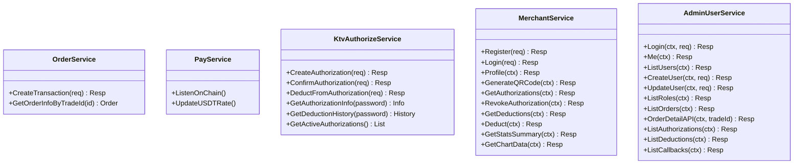

# 后端服务开发

<cite>
**本文引用的文件**
- [src/main.go](file://EPUSDT/src/main.go)
- [src/bootstrap/bootstrap.go](file://EPUSDT/src/bootstrap/bootstrap.go)
- [src/command/root.go](file://EPUSDT/src/command/root.go)
- [src/command/http_server.go](file://EPUSDT/src/command/http_server.go)
- [src/route/router.go](file://EPUSDT/src/route/router.go)
- [src/config/config.go](file://EPUSDT/src/config/config.go)
- [src/controller/base.go](file://EPUSDT/src/controller/base.go)
- [src/controller/comm/base.go](file://EPUSDT/src/controller/comm/base.go)
- [src/controller/comm/pay_controller.go](file://EPUSDT/src/controller/comm/pay_controller.go)
- [src/controller/comm/order_controller.go](file://EPUSDT/src/controller/comm/order_controller.go)
- [src/controller/comm/wallet_controller.go](file://EPUSDT/src/controller/comm/wallet_controller.go)
- [src/controller/comm/qrcode_controller.go](file://EPUSDT/src/controller/comm/qrcode_controller.go)
- [src/middleware/request_id.go](file://EPUSDT/src/middleware/request_id.go)
- [src/middleware/check_sign.go](file://EPUSDT/src/middleware/check_sign.go)
- [src/middleware/admin_auth.go](file://EPUSDT/src/middleware/admin_auth.go)
- [src/middleware/merchant_auth.go](file://EPUSDT/src/middleware/merchant_auth.go)
- [src/middleware/rate_limiter.go](file://EPUSDT/src/middleware/rate_limiter.go)
- [src/middleware/audit_logger.go](file://EPUSDT/src/middleware/audit_logger.go)
- [src/model/service/order_service.go](file://EPUSDT/src/model/service/order_service.go)
- [src/model/service/pay_service.go](file://EPUSDT/src/model/service/pay_service.go)
- [src/model/service/ktv_authorize_service.go](file://EPUSDT/src/model/service/ktv_authorize_service.go)
- [src/model/service/merchant_service.go](file://EPUSDT/src/model/service/merchant_service.go)
- [src/model/service/admin_user_service.go](file://EPUSDT/src/model/service/admin_user_service.go)
- [src/model/data/order_data.go](file://EPUSDT/src/model/data/order_data.go)
- [src/model/data/authorization_data.go](file://EPUSDT/src/model/data/authorization_data.go)
- [src/model/data/merchant_data.go](file://EPUSDT/src/model/data/merchant_data.go)
- [src/model/data/admin_user_data.go](file://EPUSDT/src/model/data/admin_user_data.go)
- [src/model/mdb/orders_mdb.go](file://EPUSDT/src/model/mdb/orders_mdb.go)
- [src/model/mdb/authorization_mdb.go](file://EPUSDT/src/model/mdb/authorization_mdb.go)
- [src/model/mdb/merchant_mdb.go](file://EPUSDT/src/model/mdb/merchant_mdb.go)
- [src/model/mdb/admin_user_mdb.go](file://EPUSDT/src/model/mdb/admin_user_mdb.go)
- [src/util/chain/chain.go](file://EPUSDT/src/util/chain/chain.go)
- [src/util/chain/registry.go](file://EPUSDT/src/util/chain/registry.go)
- [src/util/sign/sign.go](file://EPUSDT/src/util/sign/sign.go)
- [src/util/http/response.go](file://EPUSDT/src/util/http/response.go)
- [src/util/json/cjson.go](file://EPUSDT/src/util/json/cjson.go)
- [src/util/validator/input_validator.go](file://EPUSDT/src/util/validator/input_validator.go)
- [src/util/log/log.go](file://EPUSDT/src/util/log/log.go)
- [src/util/log/audit_log.go](file://EPUSDT/src/util/log/audit_log.go)
- [src/task/listen.go](file://EPUSDT/src/task/listen.go)
- [src/task/usdt_rate_job.go](file://EPUSDT/src/task/usdt_rate_job.go)
- [src/mq/queue.go](file://EPUSDT/src/mq/queue.go)
- [src/mq/handle/callback_queue.go](file://EPUSDT/src/mq/handle/callback_queue.go)
- [src/mq/handle/order_expiration_queue.go](file://EPUSDT/src/mq/handle/order_expiration_queue.go)
- [src/telegram/telegram.go](file://EPUSDT/src/telegram/telegram.go)
- [src/telegram/handle.go](file://EPUSDT/src/telegram/handle.go)
- [src/telegram/command.go](file://EPUSDT/src/telegram/command.go)
</cite>

## 目录
1. [简介](#简介)
2. [项目结构](#项目结构)
3. [核心组件](#核心组件)
4. [架构总览](#架构总览)
5. [详细组件分析](#详细组件分析)
6. [依赖关系分析](#依赖关系分析)
7. [性能考量](#性能考量)
8. [故障排查指南](#故障排查指南)
9. [结论](#结论)
10. [附录](#附录)

## 简介
本指南面向EPUSDT后端服务的开发与维护，系统性阐述Go语言实现的控制器层、服务层、数据访问层职责划分与协作关系；详解中间件体系、配置加载、工具函数库、链路集成与定时任务等模块；并提供常见问题排查与最佳实践建议。文档兼顾初学者易懂与资深工程师所需的技术深度。

## 项目结构
后端采用分层架构：入口程序负责启动引导，命令行子系统承载HTTP服务生命周期，Echo路由注册各业务模块，控制器承接请求、校验参数并调用服务层，服务层编排业务逻辑与DAO交互，工具库提供通用能力，中间件贯穿请求处理链路，定时任务与消息队列支撑异步处理。

图表来源
- [src/main.go](file://EPUSDT/src/main.go#L9-L18)
- [src/bootstrap/bootstrap.go](file://EPUSDT/src/bootstrap/bootstrap.go#L16-L43)
- [src/command/http_server.go](file://EPUSDT/src/command/http_server.go#L42-L69)
- [src/route/router.go](file://EPUSDT/src/route/router.go#L12-L114)
- [src/controller/comm/base.go](file://EPUSDT/src/controller/comm/base.go#L5-L9)

章节来源
- [src/main.go](file://EPUSDT/src/main.go#L1-L19)
- [src/bootstrap/bootstrap.go](file://EPUSDT/src/bootstrap/bootstrap.go#L1-L44)
- [src/command/root.go](file://EPUSDT/src/command/root.go#L1-L14)
- [src/command/http_server.go](file://EPUSDT/src/command/http_server.go#L1-L100)
- [src/route/router.go](file://EPUSDT/src/route/router.go#L1-L115)

## 核心组件
- 入口与引导
  - 入口程序负责打印版本信息并触发引导器启动。
  - 引导器负责加载配置、链注册表、日志、DAO、队列、Telegram机器人、默认管理员初始化以及定时任务启动，并交由命令行执行器接管。
- 命令行与HTTP服务
  - 通过Cobra命令组织HTTP子命令，启动Echo服务，注册中间件与路由，优雅关闭。
- 路由与控制器
  - 路由按业务域分组，统一挂载签名中间件或认证中间件；控制器负责参数绑定、校验、调用服务层并返回统一响应。
- 服务层
  - 编排业务流程，协调数据访问层与外部链上交互，封装幂等与事务边界。
- 数据访问层与模型存储
  - 提供DAO与MDB抽象，分别对接关系型数据库与内存/缓存场景，保证数据一致性与可测试性。
- 工具库
  - 包含链路抽象、签名、HTTP响应、JSON、输入校验、日志、审计日志、数学工具等。
- 中间件
  - 请求ID、签名校验、管理员认证、商户认证、限流、审计日志等贯穿全链路。
- 定时任务与消息队列
  - 监听链上事件、更新汇率、回调处理、订单过期清理等异步任务。
- Telegram机器人
  - 可选的运维告警与管理通道。

章节来源
- [src/bootstrap/bootstrap.go](file://EPUSDT/src/bootstrap/bootstrap.go#L15-L43)
- [src/command/http_server.go](file://EPUSDT/src/command/http_server.go#L42-L99)
- [src/route/router.go](file://EPUSDT/src/route/router.go#L12-L114)
- [src/controller/comm/base.go](file://EPUSDT/src/controller/comm/base.go#L5-L9)

## 架构总览
下图展示从请求进入HTTP服务到控制器、服务层、数据层的调用关系与职责边界。

图表来源
- [src/command/http_server.go](file://EPUSDT/src/command/http_server.go#L42-L69)
- [src/route/router.go](file://EPUSDT/src/route/router.go#L12-L114)
- [src/controller/comm/base.go](file://EPUSDT/src/controller/comm/base.go#L5-L9)
- [src/model/service/order_service.go](file://EPUSDT/src/model/service/order_service.go)
- [src/model/data/order_data.go](file://EPUSDT/src/model/data/order_data.go)
- [src/model/mdb/orders_mdb.go](file://EPUSDT/src/model/mdb/orders_mdb.go)
- [src/util/http/response.go](file://EPUSDT/src/util/http/response.go)

## 详细组件分析

### 控制器层
- 设计要点
  - 统一基类提供国际化校验、响应封装与语言环境设置。
  - 控制器方法负责参数绑定、入参校验、调用服务层并返回统一JSON响应。
  - 对外开放的静态页面与二维码接口直接渲染或输出二进制流。
- 关键控制器
  - 支付与订单：收银台、状态查询、创建交易。
  - 钱包管理：新增、列表、启停、删除。
  - 二维码：生成PNG与图片流。
- 使用模式
  - 参数绑定失败与校验失败统一返回错误响应。
  - 业务异常通过服务层抛出，控制器捕获并映射为标准响应。

图表来源
- [src/controller/base.go](file://EPUSDT/src/controller/base.go#L20-L51)
- [src/controller/comm/base.go](file://EPUSDT/src/controller/comm/base.go#L5-L9)
- [src/controller/comm/pay_controller.go](file://EPUSDT/src/controller/comm/pay_controller.go#L13-L39)
- [src/controller/comm/order_controller.go](file://EPUSDT/src/controller/comm/order_controller.go#L10-L24)
- [src/controller/comm/wallet_controller.go](file://EPUSDT/src/controller/comm/wallet_controller.go#L14-L104)
- [src/controller/comm/qrcode_controller.go](file://EPUSDT/src/controller/comm/qrcode_controller.go#L14-L84)

章节来源
- [src/controller/base.go](file://EPUSDT/src/controller/base.go#L1-L52)
- [src/controller/comm/base.go](file://EPUSDT/src/controller/comm/base.go#L1-L10)
- [src/controller/comm/pay_controller.go](file://EPUSDT/src/controller/comm/pay_controller.go#L1-L40)
- [src/controller/comm/order_controller.go](file://EPUSDT/src/controller/comm/order_controller.go#L1-L25)
- [src/controller/comm/wallet_controller.go](file://EPUSDT/src/controller/comm/wallet_controller.go#L1-L105)
- [src/controller/comm/qrcode_controller.go](file://EPUSDT/src/controller/comm/qrcode_controller.go#L1-L85)

### 服务层
- 设计要点
  - 服务层编排业务流程，协调DAO/MDB与外部链交互，确保幂等与一致性。
  - 按业务域拆分服务，如订单、支付、授权、商户、管理员等。
- 关键服务
  - 订单服务：创建交易、查询状态、统计。
  - 支付服务：链上监听、汇率计算、回调处理。
  - 授权服务：授权创建、确认、自动确认、扣款与历史查询。
  - 商户与管理员服务：认证、权限、统计与管理操作。
- 实现模式
  - 服务方法内进行前置校验与参数归一化，再调用数据层或外部链接口。
  - 错误向上抛出，由控制器统一转换为标准响应。

图表来源
- [src/model/service/order_service.go](file://EPUSDT/src/model/service/order_service.go)
- [src/model/service/pay_service.go](file://EPUSDT/src/model/service/pay_service.go)
- [src/model/service/ktv_authorize_service.go](file://EPUSDT/src/model/service/ktv_authorize_service.go)
- [src/model/service/merchant_service.go](file://EPUSDT/src/model/service/merchant_service.go)
- [src/model/service/admin_user_service.go](file://EPUSDT/src/model/service/admin_user_service.go)

章节来源
- [src/model/service/order_service.go](file://EPUSDT/src/model/service/order_service.go)
- [src/model/service/pay_service.go](file://EPUSDT/src/model/service/pay_service.go)
- [src/model/service/ktv_authorize_service.go](file://EPUSDT/src/model/service/ktv_authorize_service.go)
- [src/model/service/merchant_service.go](file://EPUSDT/src/model/service/merchant_service.go)
- [src/model/service/admin_user_service.go](file://EPUSDT/src/model/service/admin_user_service.go)

### 数据访问层与模型存储
- 设计要点
  - DAO提供数据库连接与基础CRUD抽象，支持多数据库适配。
  - MDB封装内存/缓存场景下的数据结构与操作，便于测试与加速。
  - DATA层聚焦业务数据聚合与持久化，屏蔽DAO/MDB差异。
- 关键实体
  - 订单、授权、商户、管理员、回调日志、钱包地址等。
- 复杂度与性能
  - 查询通常为O(1)至O(logN)，写入受索引与事务影响；批量操作建议使用事务与批处理。

图表来源
- [src/model/mdb/orders_mdb.go](file://EPUSDT/src/model/mdb/orders_mdb.go)
- [src/model/mdb/authorization_mdb.go](file://EPUSDT/src/model/mdb/authorization_mdb.go)
- [src/model/mdb/merchant_mdb.go](file://EPUSDT/src/model/mdb/merchant_mdb.go)
- [src/model/mdb/admin_user_mdb.go](file://EPUSDT/src/model/mdb/admin_user_mdb.go)
- [src/model/data/order_data.go](file://EPUSDT/src/model/data/order_data.go)
- [src/model/data/authorization_data.go](file://EPUSDT/src/model/data/authorization_data.go)
- [src/model/data/merchant_data.go](file://EPUSDT/src/model/data/merchant_data.go)
- [src/model/data/admin_user_data.go](file://EPUSDT/src/model/data/admin_user_data.go)

章节来源
- [src/model/mdb/orders_mdb.go](file://EPUSDT/src/model/mdb/orders_mdb.go)
- [src/model/mdb/authorization_mdb.go](file://EPUSDT/src/model/mdb/authorization_mdb.go)
- [src/model/mdb/merchant_mdb.go](file://EPUSDT/src/model/mdb/merchant_mdb.go)
- [src/model/mdb/admin_user_mdb.go](file://EPUSDT/src/model/mdb/admin_user_mdb.go)
- [src/model/data/order_data.go](file://EPUSDT/src/model/data/order_data.go)
- [src/model/data/authorization_data.go](file://EPUSDT/src/model/data/authorization_data.go)
- [src/model/data/merchant_data.go](file://EPUSDT/src/model/data/merchant_data.go)
- [src/model/data/admin_user_data.go](file://EPUSDT/src/model/data/admin_user_data.go)

### 中间件体系
- 设计要点
  - 中间件以Echo中间件函数形式串联，按需启用，覆盖请求ID、签名校验、认证、限流、审计日志等。
  - 路由注册时根据配置动态挂载审计日志中间件。
- 关键中间件
  - 请求ID：为每个请求生成唯一ID并注入请求头。
  - 签名校验：对API签名进行校验，保障接口安全。
  - 管理员认证、商户认证：基于JWT的权限控制。
  - 限流：防止突发流量冲击。
  - 审计日志：可选开启，记录关键操作。
- 配置方法
  - 在路由注册阶段根据配置决定是否启用审计日志中间件。
  - 在HTTP服务启动时注册请求ID中间件。

图表来源
- [src/middleware/request_id.go](file://EPUSDT/src/middleware/request_id.go#L9-L18)
- [src/middleware/check_sign.go](file://EPUSDT/src/middleware/check_sign.go)
- [src/middleware/admin_auth.go](file://EPUSDT/src/middleware/admin_auth.go)
- [src/middleware/merchant_auth.go](file://EPUSDT/src/middleware/merchant_auth.go)
- [src/middleware/rate_limiter.go](file://EPUSDT/src/middleware/rate_limiter.go)
- [src/middleware/audit_logger.go](file://EPUSDT/src/middleware/audit_logger.go)
- [src/route/router.go](file://EPUSDT/src/route/router.go#L12-L114)

章节来源
- [src/middleware/request_id.go](file://EPUSDT/src/middleware/request_id.go#L1-L19)
- [src/middleware/check_sign.go](file://EPUSDT/src/middleware/check_sign.go)
- [src/middleware/admin_auth.go](file://EPUSDT/src/middleware/admin_auth.go)
- [src/middleware/merchant_auth.go](file://EPUSDT/src/middleware/merchant_auth.go)
- [src/middleware/rate_limiter.go](file://EPUSDT/src/middleware/rate_limiter.go)
- [src/middleware/audit_logger.go](file://EPUSDT/src/middleware/audit_logger.go)
- [src/route/router.go](file://EPUSDT/src/route/router.go#L12-L114)

### 工具函数库与最佳实践
- 链路抽象与注册
  - 通过链注册表统一管理不同区块链的RPC、合约与精度，支持TRON、ETH、BSC、Polygon等。
- 签名与加密
  - 提供签名生成与校验工具，配合配置中的主密钥实现密码加密与授权安全。
- HTTP响应与JSON
  - 统一响应体结构，便于前端与客户端消费。
- 输入校验
  - 基于gookit/validate提供结构化校验与国际化错误信息。
- 日志与审计
  - 结构化日志与审计日志分离，审计日志可按配置开关。
- 最佳实践
  - 参数绑定后立即校验；错误统一转换为标准响应；长耗时操作放入队列或异步任务。
  - 钱包地址新增前先做链类型归一化与合法性校验。

章节来源
- [src/util/chain/chain.go](file://EPUSDT/src/util/chain/chain.go)
- [src/util/chain/registry.go](file://EPUSDT/src/util/chain/registry.go)
- [src/util/sign/sign.go](file://EPUSDT/src/util/sign/sign.go)
- [src/util/http/response.go](file://EPUSDT/src/util/http/response.go)
- [src/util/json/cjson.go](file://EPUSDT/src/util/json/cjson.go)
- [src/util/validator/input_validator.go](file://EPUSDT/src/util/validator/input_validator.go)
- [src/util/log/log.go](file://EPUSDT/src/util/log/log.go)
- [src/util/log/audit_log.go](file://EPUSDT/src/util/log/audit_log.go)

### 与其他组件的关系与集成
- 配置系统
  - 通过Viper加载.env配置，支持链RPC、合约地址、精度、审计日志、Gas优化、Approval监控等开关与参数。
- 定时任务
  - 监听链上事件、更新USDT汇率、清理过期订单等。
- 消息队列
  - 回调队列与订单过期队列异步处理，降低主流程阻塞。
- Telegram机器人
  - 可选的运维告警与管理指令通道。

章节来源
- [src/config/config.go](file://EPUSDT/src/config/config.go#L45-L134)
- [src/task/listen.go](file://EPUSDT/src/task/listen.go)
- [src/task/usdt_rate_job.go](file://EPUSDT/src/task/usdt_rate_job.go)
- [src/mq/queue.go](file://EPUSDT/src/mq/queue.go)
- [src/mq/handle/callback_queue.go](file://EPUSDT/src/mq/handle/callback_queue.go)
- [src/mq/handle/order_expiration_queue.go](file://EPUSDT/src/mq/handle/order_expiration_queue.go)
- [src/telegram/telegram.go](file://EPUSDT/src/telegram/telegram.go)
- [src/telegram/handle.go](file://EPUSDT/src/telegram/handle.go)
- [src/telegram/command.go](file://EPUSDT/src/telegram/command.go)

## 依赖关系分析
- 启动依赖
  - main依赖bootstrap，bootstrap负责加载配置、链注册表、日志、DAO、队列、Telegram与定时任务，并最终交由命令行执行器启动HTTP服务。
- 路由与中间件
  - 路由在启动时根据配置决定是否挂载审计日志中间件；HTTP服务启动时注册请求ID中间件。
- 控制器与服务
  - 控制器依赖服务层；服务层依赖数据访问层与工具库；DAO/MDB提供底层数据能力。
- 外部依赖
  - Echo作为Web框架，Viper作为配置，gookit/validate用于校验，go.uuid生成请求ID，go-qrcode生成二维码等。

图表来源
- [src/main.go](file://EPUSDT/src/main.go#L9-L18)
- [src/bootstrap/bootstrap.go](file://EPUSDT/src/bootstrap/bootstrap.go#L16-L43)
- [src/command/root.go](file://EPUSDT/src/command/root.go#L7-L13)
- [src/command/http_server.go](file://EPUSDT/src/command/http_server.go#L42-L69)
- [src/route/router.go](file://EPUSDT/src/route/router.go#L12-L114)

章节来源
- [src/main.go](file://EPUSDT/src/main.go#L1-L19)
- [src/bootstrap/bootstrap.go](file://EPUSDT/src/bootstrap/bootstrap.go#L1-L44)
- [src/command/root.go](file://EPUSDT/src/command/root.go#L1-L14)
- [src/command/http_server.go](file://EPUSDT/src/command/http_server.go#L1-L100)
- [src/route/router.go](file://EPUSDT/src/route/router.go#L1-L115)

## 性能考量
- 中间件顺序
  - 请求ID与日志中间件建议置于链首，签名校验与认证中间件按需尽早拦截无效请求。
- 数据访问
  - 对高频查询建立必要索引；批量写入使用事务；避免在热路径中进行复杂计算。
- 异步化
  - 回调、通知、日志落盘等非关键路径放入消息队列。
- 链上交互
  - 合约查询与RPC调用应复用连接池与超时重试策略；合理设置Gas优化开关与监控间隔。
- 缓存与热点
  - 对频繁读取的配置与白名单使用缓存，注意失效策略与一致性。

## 故障排查指南
- 启动失败
  - 检查.env配置项是否正确加载；确认数据库连接串、链RPC、合约地址与精度配置。
- 接口报错
  - 查看HTTP错误处理器返回的统一响应体，定位错误码与消息；检查控制器参数绑定与校验是否通过。
- 钱包地址新增失败
  - 确认链类型归一化与合法性校验通过；检查链支持列表与地址格式。
- 授权与扣款异常
  - 核对签名中间件是否正确启用；检查授权状态与有效期；查看审计日志与回调队列处理情况。
- 审计日志未生效
  - 确认配置中审计日志开关已启用；检查路由注册时是否挂载了审计中间件。
- Telegram告警未达
  - 检查机器人Token、管理ID与代理配置；确认启动条件满足。

章节来源
- [src/command/http_server.go](file://EPUSDT/src/command/http_server.go#L80-L99)
- [src/controller/comm/wallet_controller.go](file://EPUSDT/src/controller/comm/wallet_controller.go#L28-L37)
- [src/config/config.go](file://EPUSDT/src/config/config.go#L108-L130)
- [src/route/router.go](file://EPUSDT/src/route/router.go#L14-L16)

## 结论
EPUSDT后端服务采用清晰的分层架构与中间件体系，结合工具库与异步任务，实现了从支付到授权、从管理到运维的完整闭环。遵循本文的职责划分、调用关系与最佳实践，可在保证稳定性的同时提升开发效率与扩展性。

## 附录
- 快速启动
  - 确保.env配置齐全，运行HTTP服务命令即可启动。
- 常用命令
  - 通过Cobra命令组织HTTP服务生命周期，支持优雅关闭。
- 配置清单
  - 关键配置包括链RPC、合约地址与精度、审计日志、Gas优化、Approval监控、管理员JWT密钥等。

章节来源
- [src/command/root.go](file://EPUSDT/src/command/root.go#L7-L13)
- [src/command/http_server.go](file://EPUSDT/src/command/http_server.go#L33-L69)
- [src/config/config.go](file://EPUSDT/src/config/config.go#L45-L134)