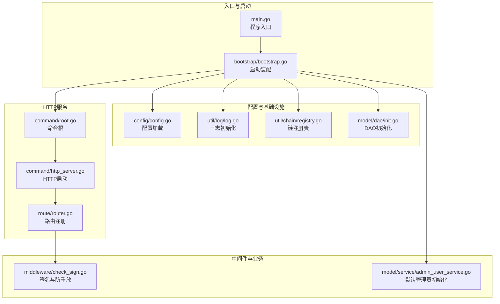
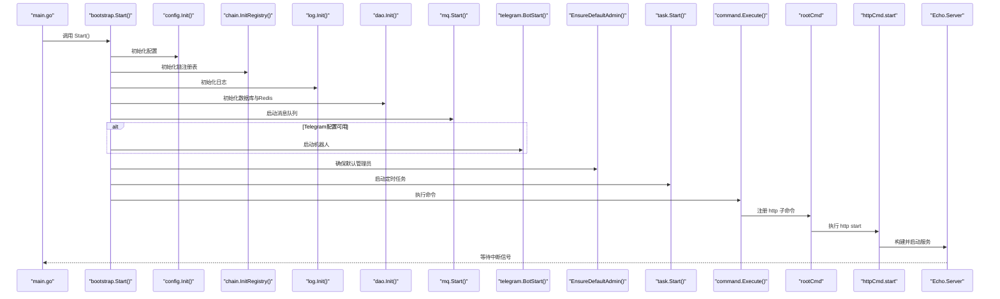
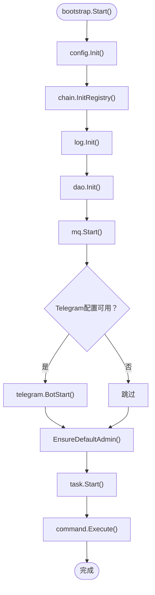
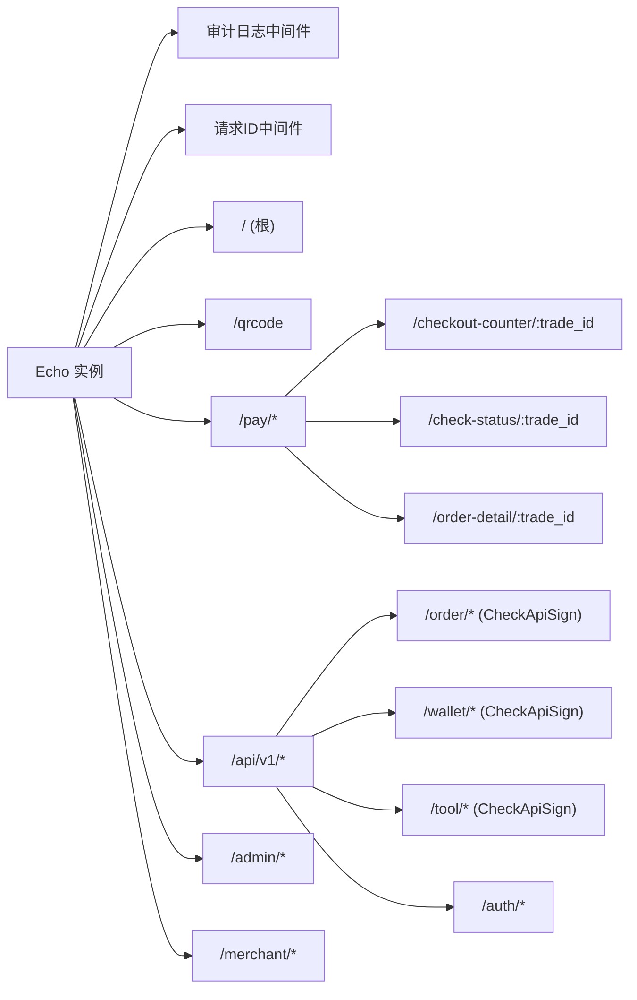
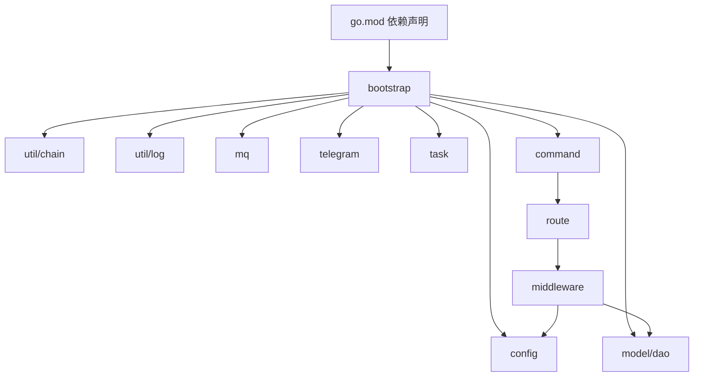

# 项目结构与启动

<cite>
**本文引用的文件**
- [main.go](file://EPUSDT/src/main.go)
- [bootstrap.go](file://EPUSDT/src/bootstrap/bootstrap.go)
- [config.go](file://EPUSDT/src/config/config.go)
- [router.go](file://EPUSDT/src/route/router.go)
- [root.go](file://EPUSDT/src/command/root.go)
- [http_server.go](file://EPUSDT/src/command/http_server.go)
- [init.go](file://EPUSDT/src/model/dao/init.go)
- [log.go](file://EPUSDT/src/util/log/log.go)
- [registry.go](file://EPUSDT/src/util/chain/registry.go)
- [check_sign.go](file://EPUSDT/src/middleware/check_sign.go)
- [admin_user_service.go](file://EPUSDT/src/model/service/admin_user_service.go)
- [.env.example](file://EPUSDT/src/.env.example)
- [go.mod](file://EPUSDT/src/go.mod)
</cite>

## 目录
1. [简介](#简介)
2. [项目结构](#项目结构)
3. [核心组件](#核心组件)
4. [架构总览](#架构总览)
5. [详细组件分析](#详细组件分析)
6. [依赖分析](#依赖分析)
7. [性能考虑](#性能考虑)
8. [故障排查指南](#故障排查指南)
9. [结论](#结论)
10. [附录](#附录)

## 简介
本文件面向EPUSDT项目的开发者与运维人员，系统化阐述项目的整体架构、启动流程与配置管理，重点解析以下内容：
- main.go入口文件的作用与控制流
- bootstrap初始化过程与组件装配顺序
- config配置系统的实现与环境变量加载机制
- 路由系统的组织方式与中间件注册策略
- 启动顺序与依赖关系
- 故障排查与常见启动问题的解决方案

目标是帮助初学者快速理解项目启动与运行机制，同时为有经验的开发者提供足够的技术细节与可视化图示。

## 项目结构
EPUSDT采用Go语言模块化组织，核心源码位于EPUSDT/src目录下，遵循“按职责分层”的组织方式：
- 入口与启动：main.go、bootstrap/bootstrap.go
- 配置管理：config/config.go
- 路由与中间件：route/router.go、middleware/*
- 服务与业务：model/service/*、controller/*
- 数据访问：model/dao/*
- 工具与基础设施：util/*、mq、task、telegram等
- 命令行与HTTP服务：command/http_server.go、command/root.go
- 配置样例：.env.example

图表来源
- [main.go](file://EPUSDT/src/main.go#L1-L19)
- [bootstrap.go](file://EPUSDT/src/bootstrap/bootstrap.go#L15-L43)
- [config.go](file://EPUSDT/src/config/config.go#L45-L134)
- [log.go](file://EPUSDT/src/util/log/log.go#L15-L21)
- [registry.go](file://EPUSDT/src/util/chain/registry.go#L25-L81)
- [init.go](file://EPUSDT/src/model/dao/init.go#L7-L15)
- [root.go](file://EPUSDT/src/command/root.go#L5-L13)
- [http_server.go](file://EPUSDT/src/command/http_server.go#L42-L69)
- [router.go](file://EPUSDT/src/route/router.go#L12-L114)
- [check_sign.go](file://EPUSDT/src/middleware/check_sign.go#L24-L107)
- [admin_user_service.go](file://EPUSDT/src/model/service/admin_user_service.go#L14-L47)

章节来源
- [main.go](file://EPUSDT/src/main.go#L1-L19)
- [bootstrap.go](file://EPUSDT/src/bootstrap/bootstrap.go#L15-L43)
- [config.go](file://EPUSDT/src/config/config.go#L45-L134)
- [log.go](file://EPUSDT/src/util/log/log.go#L15-L21)
- [registry.go](file://EPUSDT/src/util/chain/registry.go#L25-L81)
- [init.go](file://EPUSDT/src/model/dao/init.go#L7-L15)
- [root.go](file://EPUSDT/src/command/root.go#L5-L13)
- [http_server.go](file://EPUSDT/src/command/http_server.go#L42-L69)
- [router.go](file://EPUSDT/src/route/router.go#L12-L114)
- [check_sign.go](file://EPUSDT/src/middleware/check_sign.go#L24-L107)
- [admin_user_service.go](file://EPUSDT/src/model/service/admin_user_service.go#L14-L47)

## 核心组件
- main.go：程序入口，负责打印欢迎信息、捕获启动异常，并调用bootstrap.Start()执行完整启动序列。
- bootstrap.Start()：统一的启动装配器，负责按序初始化配置、链注册表、日志、DAO、消息队列、Telegram机器人、默认管理员、定时任务，并最终交由命令行框架执行HTTP子命令。
- config.Init()：通过Viper从.env文件加载配置，构造数据库连接串、链RPC与合约配置、审计日志/Gas优化开关、管理员认证参数等。
- route.RegisterRoute()：基于Echo框架注册全部路由，按组划分API版本、业务域与管理后台，并按需挂载审计日志中间件。
- command.HttpServerStart()：构建Echo实例、注册中间件与路由、启动HTTP服务、处理优雅关闭信号。
- model/dao.Init()：统一初始化数据库与Redis连接。
- util/log.Init()：配置Zap日志写入到Lumberjack滚动文件。
- util/chain.InitRegistry()：根据config配置构建链注册表，供后续链上操作使用。
- middleware.CheckApiSign()：API签名校验与防重放（时间戳、nonce、签名版本兼容）。
- model/service.EnsureDefaultAdmin()：首次启动时创建默认管理员账户。

章节来源
- [main.go](file://EPUSDT/src/main.go#L9-L18)
- [bootstrap.go](file://EPUSDT/src/bootstrap/bootstrap.go#L16-L42)
- [config.go](file://EPUSDT/src/config/config.go#L45-L134)
- [router.go](file://EPUSDT/src/route/router.go#L12-L114)
- [http_server.go](file://EPUSDT/src/command/http_server.go#L42-L69)
- [init.go](file://EPUSDT/src/model/dao/init.go#L7-L15)
- [log.go](file://EPUSDT/src/util/log/log.go#L15-L21)
- [registry.go](file://EPUSDT/src/util/chain/registry.go#L25-L81)
- [check_sign.go](file://EPUSDT/src/middleware/check_sign.go#L24-L107)
- [admin_user_service.go](file://EPUSDT/src/model/service/admin_user_service.go#L14-L47)

## 架构总览
下图展示了从main.go到HTTP服务启动的完整调用链，以及关键组件间的依赖关系：

图表来源
- [main.go](file://EPUSDT/src/main.go#L9-L18)
- [bootstrap.go](file://EPUSDT/src/bootstrap/bootstrap.go#L16-L42)
- [config.go](file://EPUSDT/src/config/config.go#L45-L134)
- [registry.go](file://EPUSDT/src/util/chain/registry.go#L25-L81)
- [log.go](file://EPUSDT/src/util/log/log.go#L15-L21)
- [init.go](file://EPUSDT/src/model/dao/init.go#L7-L15)
- [root.go](file://EPUSDT/src/command/root.go#L5-L13)
- [http_server.go](file://EPUSDT/src/command/http_server.go#L42-L69)

## 详细组件分析

### main.go 入口与异常处理
- 责任：打印启动横幅与版本信息；捕获panic并输出错误；调用bootstrap.Start()。
- 关键点：defer中recover确保异常不被吞掉；颜色输出提升可观测性；版本信息来自config模块。

章节来源
- [main.go](file://EPUSDT/src/main.go#L9-L18)

### bootstrap 启动装配器
- 责任：集中管理启动顺序与依赖，保证各子系统按序初始化。
- 顺序要点：
  1) config.Init()：加载.env配置
  2) chain.InitRegistry()：基于配置构建链注册表
  3) log.Init()：初始化日志
  4) dao.Init()：初始化数据库与Redis
  5) mq.Start()：启动消息队列
  6) telegram.BotStart()：条件启动Telegram机器人
  7) EnsureDefaultAdmin()：创建默认管理员
  8) task.Start()：启动定时任务
  9) command.Execute()：进入命令行模式，等待http子命令

图表来源
- [bootstrap.go](file://EPUSDT/src/bootstrap/bootstrap.go#L16-L42)

章节来源
- [bootstrap.go](file://EPUSDT/src/bootstrap/bootstrap.go#L16-L42)

### config 配置系统
- 责任：从.env文件读取配置，构造数据库连接串、链RPC与合约配置、审计日志与Gas优化开关、管理员认证参数、订单过期时间等。
- 关键点：
  - 使用Viper加载.env；动态拼接MySQL DNS；支持多链RPC与合约配置；支持商户私钥映射；支持强制汇率；支持审计日志、Gas优化、Approval监控等开关。
  - 提供GetXXX系列函数以供其他模块读取配置。

章节来源
- [config.go](file://EPUSDT/src/config/config.go#L45-L134)
- [config.go](file://EPUSDT/src/config/config.go#L136-L198)
- [config.go](file://EPUSDT/src/config/config.go#L199-L212)
- [config.go](file://EPUSDT/src/config/config.go#L214-L236)
- [config.go](file://EPUSDT/src/config/config.go#L238-L266)
- [config.go](file://EPUSDT/src/config/config.go#L267-L312)
- [config.go](file://EPUSDT/src/config/config.go#L314-L370)
- [config.go](file://EPUSDT/src/config/config.go#L372-L400)

### util/log 日志系统
- 责任：基于Zap与Lumberjack实现结构化日志，按日期滚动写入文件。
- 关键点：编码器使用生产级JSON格式；文件名包含日期；通过Viper读取滚动参数。

章节来源
- [log.go](file://EPUSDT/src/util/log/log.go#L15-L21)
- [log.go](file://EPUSDT/src/util/log/log.go#L30-L42)

### util/chain 链注册表
- 责任：根据config配置构建链注册表，提供链名标准化、链ID查询、合约地址、RPC列表、精度等查询能力。
- 关键点：支持BSC、EVM、Polygon、TRON；EVM链ID与十六进制表示；TRON链特殊处理。

章节来源
- [registry.go](file://EPUSDT/src/util/chain/registry.go#L25-L81)
- [registry.go](file://EPUSDT/src/util/chain/registry.go#L83-L150)

### model/dao 初始化
- 责任：统一初始化数据库与Redis连接；失败直接终止进程，避免后续组件空引用。
- 关键点：DBInit与RedisInit分别调用，错误致命。

章节来源
- [init.go](file://EPUSDT/src/model/dao/init.go#L7-L15)

### model/service 默认管理员
- 责任：首次启动时根据配置创建默认管理员账户；若已存在则跳过。
- 关键点：使用bcrypt加密存储；JWT密钥来自配置；角色不存在则自动创建。

章节来源
- [admin_user_service.go](file://EPUSDT/src/model/service/admin_user_service.go#L14-L47)

### route 路由与中间件
- 路由组织：
  - 根路径与二维码公开接口
  - 支付相关：收银台、状态检测、订单详情页
  - API v1：订单、钱包、工具、授权支付、管理后台、商家系统
  - 分组使用中间件：审计日志、API签名、管理员认证、商家认证
- 中间件：
  - CheckApiSign：签名校验、时间戳校验、nonce去重（Redis），支持v1/v2签名版本
  - DefaultAuditLogger：按配置启用的审计日志中间件
  - RequestUUID：请求ID注入
  - AdminAuth、MerchantAuth：权限中间件

图表来源
- [router.go](file://EPUSDT/src/route/router.go#L12-L114)
- [check_sign.go](file://EPUSDT/src/middleware/check_sign.go#L24-L107)

章节来源
- [router.go](file://EPUSDT/src/route/router.go#L12-L114)
- [check_sign.go](file://EPUSDT/src/middleware/check_sign.go#L24-L107)

### command 命令行与HTTP服务
- 命令行：
  - rootCmd：命令根，注册http子命令
  - httpCmd：http服务命令
  - startCmd：启动HTTP服务
- HTTP服务：
  - 构建Echo实例，注册中间件与路由
  - 从Viper读取监听地址
  - 优雅关闭：接收中断信号，10秒超时优雅退出

章节来源
- [root.go](file://EPUSDT/src/command/root.go#L5-L13)
- [http_server.go](file://EPUSDT/src/command/http_server.go#L21-L40)
- [http_server.go](file://EPUSDT/src/command/http_server.go#L42-L69)
- [http_server.go](file://EPUSDT/src/command/http_server.go#L71-L78)
- [http_server.go](file://EPUSDT/src/command/http_server.go#L80-L99)

## 依赖分析
- 模块依赖：go.mod声明了Echo、Viper、Zap、Lumberjack、Asynq、Telebot、GORM等核心依赖。
- 运行时依赖：MySQL/Postgres/SQLite、Redis、区块链RPC节点、Telegram Bot。
- 组件耦合：
  - bootstrap对config、chain、log、dao、mq、telegram、task、command形成强依赖
  - route依赖config与middleware
  - http_server依赖route与middleware
  - middleware依赖config与dao（Redis）

图表来源
- [go.mod](file://EPUSDT/src/go.mod#L5-L32)
- [bootstrap.go](file://EPUSDT/src/bootstrap/bootstrap.go#L16-L42)
- [root.go](file://EPUSDT/src/command/root.go#L5-L13)
- [http_server.go](file://EPUSDT/src/command/http_server.go#L42-L69)
- [router.go](file://EPUSDT/src/route/router.go#L12-L114)
- [check_sign.go](file://EPUSDT/src/middleware/check_sign.go#L24-L107)

章节来源
- [go.mod](file://EPUSDT/src/go.mod#L5-L32)

## 性能考虑
- 日志滚动：Lumberjack按大小与天数滚动，避免磁盘膨胀；建议结合磁盘配额与清理策略。
- 链RPC轮询：多链RPC配置支持轮询，提高可用性；建议为不同链配置多个高可用节点。
- 队列并发：消息队列并发度可通过配置调整，避免过载。
- 审计日志与Gas优化：默认启用，可根据业务需求调整开关，平衡合规与性能。
- 缓存与去重：签名中间件使用Redis进行nonce去重，建议合理设置过期时间与容量。

## 故障排查指南
- 启动失败（panic）：
  - 症状：程序直接退出，控制台打印错误
  - 排查：检查main.go中的defer recover输出；查看bootstrap各初始化步骤的错误
  - 常见原因：配置文件缺失或格式错误、数据库连接失败、Redis连接失败、链RPC不可达
- 配置加载失败：
  - 症状：config.Init()报错
  - 排查：确认.env文件存在且字段完整；核对.env.example中的必填项
  - 建议：先复制.env.example为.env，再逐项填写
- 数据库初始化失败：
  - 症状：dao.Init()失败
  - 排查：检查数据库类型与连接参数；确认数据库服务可达；核对表前缀与权限
- Redis初始化失败：
  - 症状：Redis连接失败导致进程退出
  - 排查：确认Redis服务、密码、DB索引正确；网络连通性
- 签名与防重放失败：
  - 症状：API返回签名错误或重复请求
  - 排查：确认请求包含timestamp、nonce、signature；nonce未过期；签名算法版本一致；Redis可用
- HTTP服务无法启动：
  - 症状：端口占用或监听失败
  - 排查：检查http_listen配置；确认端口未被占用；防火墙策略
- Telegram机器人异常：
  - 症状：机器人未启动或消息不通
  - 排查：确认tg_bot_token与tg_manage配置；代理设置（tg_proxy）；网络可达性

章节来源
- [main.go](file://EPUSDT/src/main.go#L10-L14)
- [bootstrap.go](file://EPUSDT/src/bootstrap/bootstrap.go#L16-L42)
- [config.go](file://EPUSDT/src/config/config.go#L45-L134)
- [init.go](file://EPUSDT/src/model/dao/init.go#L7-L15)
- [check_sign.go](file://EPUSDT/src/middleware/check_sign.go#L24-L107)
- [http_server.go](file://EPUSDT/src/command/http_server.go#L53-L68)
- [admin_user_service.go](file://EPUSDT/src/model/service/admin_user_service.go#L14-L47)

## 结论
EPUSDT的启动流程清晰、层次分明：main.go负责入口与异常兜底，bootstrap集中装配各子系统，config提供统一配置，route与middleware定义对外接口与安全策略，command封装HTTP服务生命周期。通过严格的初始化顺序与中间件保护，系统具备良好的可维护性与可扩展性。建议在部署前完善.env配置与基础设施连通性，并结合日志与监控持续优化性能与稳定性。

## 附录
- 启动命令参考
  - 启动HTTP服务：在命令行执行 http start 子命令（由命令根注册）
- 关键配置项参考
  - 应用与监听：app_name、app_uri、app_debug、http_listen
  - 静态资源与运行时：static_path、runtime_root_path
  - 日志：log_save_path、log_max_size、log_max_age、max_backups
  - 数据库：db_type、mysql_*、postgres_*、sqlite_*、sqlite_table_prefix
  - Redis：redis_host、redis_port、redis_passwd、redis_db、redis_pool_size、redis_max_retries、redis_idle_timeout
  - 消息队列：queue_concurrency、queue_level_critical、queue_level_default、queue_level_low
  - Telegram：tg_bot_token、tg_proxy、tg_manage
  - API认证：api_auth_token
  - 管理员：admin_jwt_secret、admin_init_username、admin_init_password
  - 商户私钥：merchant_private_key、merchant_private_keys
  - 订单与汇率：order_expiration_time、order_notice_max_retry、forced_usdt_rate
  - 多链RPC与合约：bsc_rpc_urls、eth_rpc_urls、polygon_rpc_urls、bscscan_api_key、eth_usdt_contract、bsc_usdt_contract、polygon_usdt_contract、eth_usdt_decimals、bsc_usdt_decimals、polygon_usdt_decimals
  - 区块链功能：auth_master_key、audit_log_enabled、gas_optimize_enabled

章节来源
- [.env.example](file://EPUSDT/src/.env.example#L1-L129)