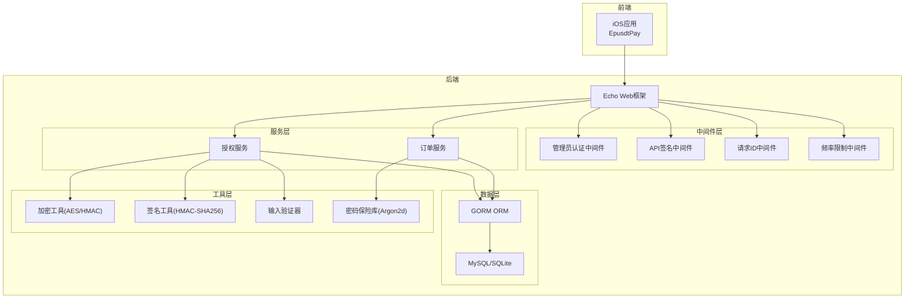
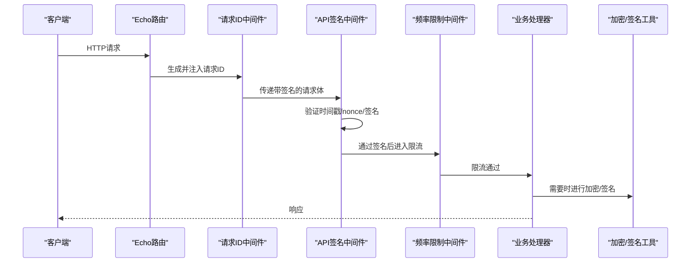
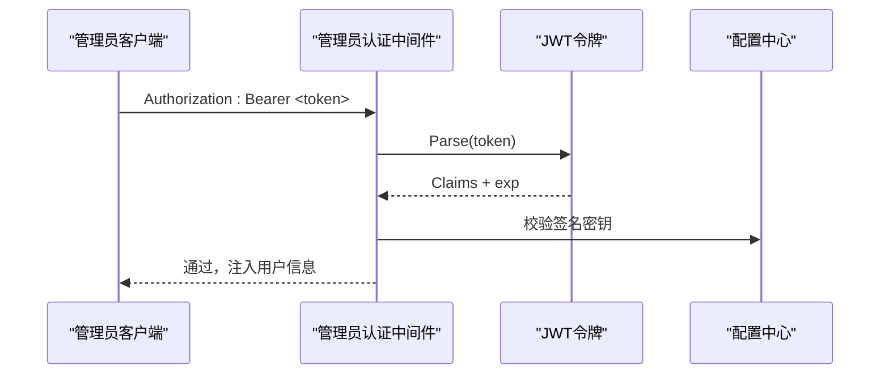
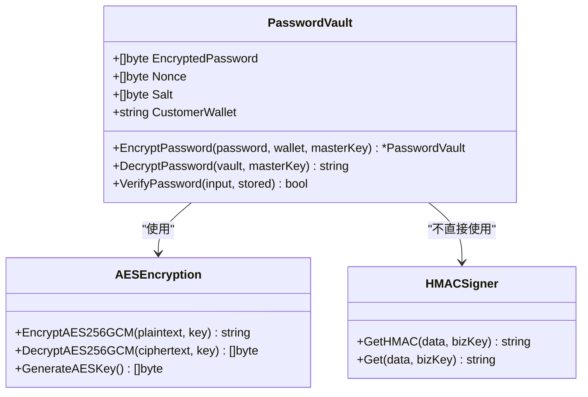
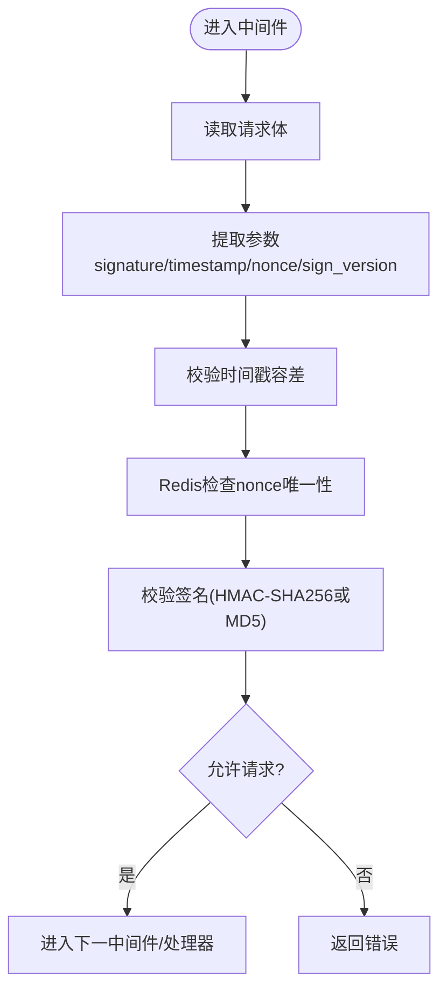
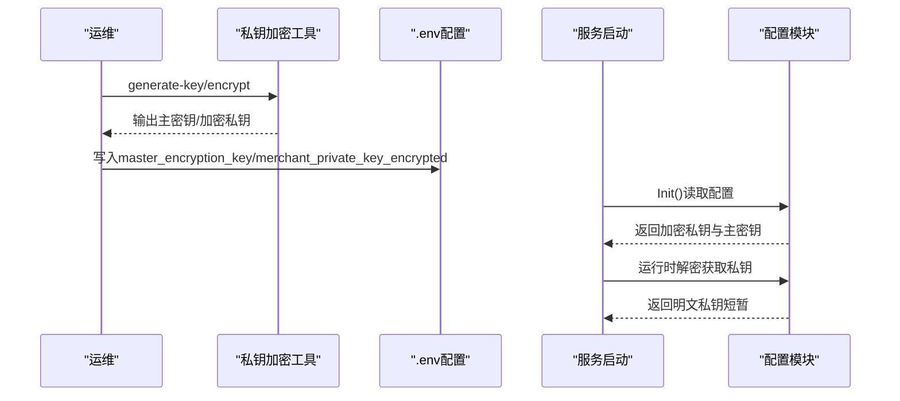
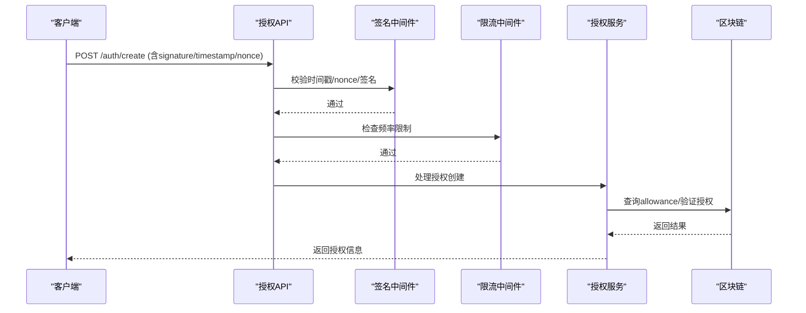
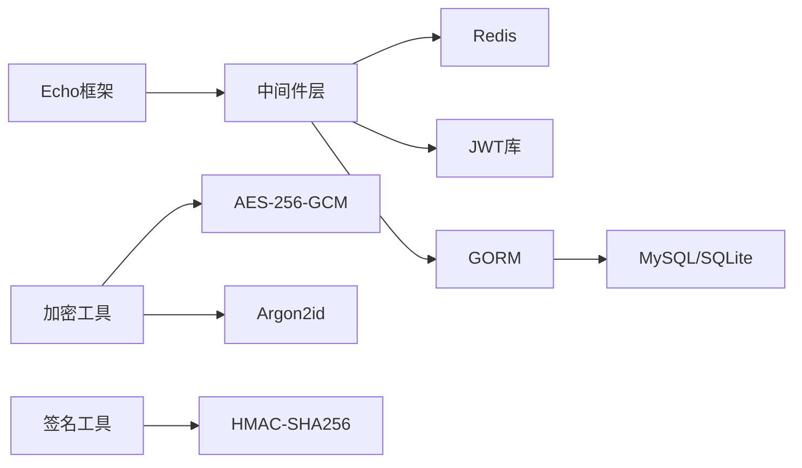

# 安全设计

<cite>
**本文档引用的文件**
- [安全审计报告.md](file://SECURITY_AUDIT_REPORT.md)
- [安全加固实施方案.md](file://SECURITY_HARDENING_PLAN.md)
- [安全部署指南.md](file://SECURITY_DEPLOYMENT_GUIDE.md)
- [中间件/管理员认证中间件.go](file://src/middleware/admin_auth.go)
- [中间件/API签名中间件.go](file://src/middleware/check_sign.go)
- [中间件/请求ID中间件.go](file://src/middleware/request_id.go)
- [中间件/频率限制中间件.go](file://src/middleware/rate_limiter.go)
- [工具/密码保险库.go](file://src/util/crypto/password_vault.go)
- [工具/AES加密工具.go](file://src/util/crypto/aes_crypto.go)
- [工具/输入验证器.go](file://src/util/validator/input_validator.go)
- [工具/签名工具.go](file://src/util/sign/sign.go)
- [配置/配置.go](file://src/config/config.go)
- [服务/授权服务.go](file://src/model/service/ktv_authorize_service.go)
- [数据模型/授权数据模型.go](file://src/model/mdb/ktv_authorize_mdb.go)
- [数据访问/授权数据访问.go](file://src/model/data/ktv_authorize_data.go)
- [工具/私钥加密工具.go](file://tools/encrypt_private_key.go)
</cite>

## 目录
1. [简介](#简介)
2. [项目结构](#项目结构)
3. [核心组件](#核心组件)
4. [架构总览](#架构总览)
5. [详细组件分析](#详细组件分析)
6. [依赖关系分析](#依赖关系分析)
7. [性能考量](#性能考量)
8. [故障排查指南](#故障排查指南)
9. [结论](#结论)
10. [附录](#附录)

## 简介
本文件面向EPUSDT系统，提供全面的安全设计文档。内容覆盖认证授权机制、数据加密与输入验证、中间件层安全实现（请求ID、限流、签名验证）、私钥加密与密码保护、敏感数据处理、安全审计与改进建议、安全加固计划、区块链交易安全、钱包授权安全机制与防重放措施、网络安全与传输加密、存储安全、安全事件响应流程与漏洞修复指导。

## 项目结构
EPUSDT系统采用Go语言后端与Swift/iOS前端组合，后端以Echo框架为核心，采用中间件层统一处理安全控制，服务层负责业务逻辑，数据层通过GORM访问数据库，工具层提供加密、签名、输入验证等功能模块。

**图表来源**
- [中间件/管理员认证中间件.go](file://src/middleware/admin_auth.go#L1-L58)
- [中间件/API签名中间件.go](file://src/middleware/check_sign.go#L1-L108)
- [中间件/请求ID中间件.go](file://src/middleware/request_id.go#L1-L19)
- [中间件/频率限制中间件.go](file://src/middleware/rate_limiter.go#L1-L124)
- [工具/密码保险库.go](file://src/util/crypto/password_vault.go#L1-L139)
- [工具/AES加密工具.go](file://src/util/crypto/aes_crypto.go#L1-L90)
- [工具/输入验证器.go](file://src/util/validator/input_validator.go#L1-L100)
- [工具/签名工具.go](file://src/util/sign/sign.go#L1-L153)
- [服务/授权服务.go](file://src/model/service/ktv_authorize_service.go#L1-L200)
- [数据模型/授权数据模型.go](file://src/model/mdb/ktv_authorize_mdb.go#L1-L59)
- [数据访问/授权数据访问.go](file://src/model/data/ktv_authorize_data.go#L1-L137)

**章节来源**
- [中间件/管理员认证中间件.go](file://src/middleware/admin_auth.go#L1-L58)
- [中间件/API签名中间件.go](file://src/middleware/check_sign.go#L1-L108)
- [中间件/请求ID中间件.go](file://src/middleware/request_id.go#L1-L19)
- [中间件/频率限制中间件.go](file://src/middleware/rate_limiter.go#L1-L124)
- [工具/密码保险库.go](file://src/util/crypto/password_vault.go#L1-L139)
- [工具/AES加密工具.go](file://src/util/crypto/aes_crypto.go#L1-L90)
- [工具/输入验证器.go](file://src/util/validator/input_validator.go#L1-L100)
- [工具/签名工具.go](file://src/util/sign/sign.go#L1-L153)
- [服务/授权服务.go](file://src/model/service/ktv_authorize_service.go#L1-L200)
- [数据模型/授权数据模型.go](file://src/model/mdb/ktv_authorize_mdb.go#L1-L59)
- [数据访问/授权数据访问.go](file://src/model/data/ktv_authorize_data.go#L1-L137)

## 核心组件
- 认证授权机制：JWT管理员认证、API签名验证、授权密码校验、请求ID追踪、频率限制。
- 数据加密与输入验证：AES-256-GCM对称加密、Argon2id密钥派生、HMAC-SHA256签名、输入白名单与HTML转义。
- 中间件层：集中处理安全控制，统一接入点，便于审计与升级。
- 区块链交易安全：私钥加密存储、防重放nonce、时间戳容差、链上授权验证。
- 存储安全：数据库参数化查询、敏感字段脱敏、日志审计与合规。

**章节来源**
- [中间件/管理员认证中间件.go](file://src/middleware/admin_auth.go#L1-L58)
- [中间件/API签名中间件.go](file://src/middleware/check_sign.go#L1-L108)
- [中间件/频率限制中间件.go](file://src/middleware/rate_limiter.go#L1-L124)
- [工具/密码保险库.go](file://src/util/crypto/password_vault.go#L1-L139)
- [工具/AES加密工具.go](file://src/util/crypto/aes_crypto.go#L1-L90)
- [工具/输入验证器.go](file://src/util/validator/input_validator.go#L1-L100)
- [工具/签名工具.go](file://src/util/sign/sign.go#L1-L153)
- [配置/配置.go](file://src/config/config.go#L1-L400)

## 架构总览
EPUSDT安全架构围绕“中间件统一控制 + 工具层加密支撑 + 服务层业务安全”展开，通过请求ID、签名验证、时间戳与nonce防重放、Redis限流、JWT认证、数据库参数化查询等手段，形成多层纵深防御。

**图表来源**
- [中间件/API签名中间件.go](file://src/middleware/check_sign.go#L24-L107)
- [中间件/频率限制中间件.go](file://src/middleware/rate_limiter.go#L20-L84)
- [中间件/请求ID中间件.go](file://src/middleware/request_id.go#L9-L18)
- [工具/签名工具.go](file://src/util/sign/sign.go#L15-L44)

**章节来源**
- [中间件/API签名中间件.go](file://src/middleware/check_sign.go#L1-L108)
- [中间件/频率限制中间件.go](file://src/middleware/rate_limiter.go#L1-L124)
- [中间件/请求ID中间件.go](file://src/middleware/request_id.go#L1-L19)
- [工具/签名工具.go](file://src/util/sign/sign.go#L1-L153)

## 详细组件分析

### 认证授权机制
- JWT管理员认证：中间件解析Authorization头，校验签名算法一致性与过期时间，设置用户上下文。
- API签名验证：支持MD5与HMAC-SHA256双版本，时间戳容差±5分钟，Redis存储nonce防重放。
- 授权密码校验：查询接口使用自定义中间件，对密码格式与尝试次数进行限制。
- 请求ID追踪：为每个请求生成UUID，便于跨服务追踪与审计。

**图表来源**
- [中间件/管理员认证中间件.go](file://src/middleware/admin_auth.go#L12-L56)
- [配置/配置.go](file://src/config/config.go#L180-L190)

**章节来源**
- [中间件/管理员认证中间件.go](file://src/middleware/admin_auth.go#L1-L58)
- [配置/配置.go](file://src/config/config.go#L1-L400)

### 数据加密与输入验证
- 对称加密：AES-256-GCM，nonce长度12字节，密文包含nonce+密文+tag。
- 密钥派生：Argon2id，结合主密钥与钱包地址派生会话密钥，支持盐值与nonce。
- 签名算法：HMAC-SHA256替代MD5，参数序列化后签名，支持map/struct两种输入。
- 输入验证：白名单正则、长度限制、HTML转义、危险字符过滤。

**图表来源**
- [工具/密码保险库.go](file://src/util/crypto/password_vault.go#L14-L139)
- [工具/AES加密工具.go](file://src/util/crypto/aes_crypto.go#L12-L90)
- [工具/签名工具.go](file://src/util/sign/sign.go#L15-L67)

**章节来源**
- [工具/密码保险库.go](file://src/util/crypto/password_vault.go#L1-L139)
- [工具/AES加密工具.go](file://src/util/crypto/aes_crypto.go#L1-L90)
- [工具/签名工具.go](file://src/util/sign/sign.go#L1-L153)
- [工具/输入验证器.go](file://src/util/validator/input_validator.go#L1-L100)

### 中间件层安全实现
- 请求ID中间件：生成UUID并注入请求头，便于日志关联与审计。
- API签名中间件：读取请求体，提取signature、timestamp、nonce、sign_version，分别进行校验。
- 频率限制中间件：基于Redis有序集合实现滑动窗口算法，支持IP、用户、端点级限流。
- 管理员认证中间件：JWT解析与校验，双重过期验证，防止算法替换攻击。

**图表来源**
- [中间件/API签名中间件.go](file://src/middleware/check_sign.go#L24-L107)
- [中间件/频率限制中间件.go](file://src/middleware/rate_limiter.go#L46-L84)

**章节来源**
- [中间件/请求ID中间件.go](file://src/middleware/request_id.go#L1-L19)
- [中间件/API签名中间件.go](file://src/middleware/check_sign.go#L1-L108)
- [中间件/频率限制中间件.go](file://src/middleware/rate_limiter.go#L1-L124)
- [中间件/管理员认证中间件.go](file://src/middleware/admin_auth.go#L1-L58)

### 私钥加密与密码保护
- 私钥加密存储：使用AES-256-GCM加密私钥，主密钥来自环境变量，提供加密/解密工具。
- 密码保护：授权密码采用bcrypt哈希存储，配合前缀索引优化查询；同时支持Argon2d派生的密码保险库方案。
- 敏感数据处理：配置文件中不再存储明文私钥，运行时解密后立即使用并清理内存引用。

**图表来源**
- [工具/私钥加密工具.go](file://tools/encrypt_private_key.go#L1-L113)
- [配置/配置.go](file://src/config/config.go#L45-L134)
- [配置/配置.go](file://src/config/config.go#L180-L208)

**章节来源**
- [工具/私钥加密工具.go](file://tools/encrypt_private_key.go#L1-L113)
- [配置/配置.go](file://src/config/config.go#L1-L400)

### 区块链交易安全与防重放
- 防重放：nonce基于Redis原子SETNX，过期时间5分钟；时间戳容差±5分钟。
- 签名升级：从MD5迁移到HMAC-SHA256，支持sign_version字段渐进式升级。
- 链上授权：支持TRON与EVM链，自动确认授权基于allowance校验，避免重复授权。

**图表来源**
- [中间件/API签名中间件.go](file://src/middleware/check_sign.go#L24-L107)
- [中间件/频率限制中间件.go](file://src/middleware/rate_limiter.go#L20-L84)
- [服务/授权服务.go](file://src/model/service/ktv_authorize_service.go#L94-L130)

**章节来源**
- [中间件/API签名中间件.go](file://src/middleware/check_sign.go#L1-L108)
- [中间件/频率限制中间件.go](file://src/middleware/rate_limiter.go#L1-L124)
- [服务/授权服务.go](file://src/model/service/ktv_authorize_service.go#L1-L200)

### 网络安全与传输加密
- HTTPS强制：推荐Nginx反向代理，启用HSTS、X-Frame-Options、X-Content-Type-Options等安全头。
- Cookie安全：Secure、HttpOnly、SameSite严格模式。
- 防火墙：仅开放必要端口（SSH/HTTP/HTTPS），限制SSH访问来源。

**章节来源**
- [安全部署指南.md](file://SECURITY_DEPLOYMENT_GUIDE.md#L84-L160)

### 存储安全
- 数据库：GORM参数化查询，避免SQL注入；敏感字段脱敏输出。
- 日志：分级记录，敏感信息脱敏；审计关键操作（登录、授权、扣款、私钥访问）。
- 配置：.env权限600，加入.gitignore，主密钥离线备份。

**章节来源**
- [安全审计报告.md](file://SECURITY_AUDIT_REPORT.md#L307-L325)
- [安全审计报告.md](file://SECURITY_AUDIT_REPORT.md#L403-L434)
- [安全部署指南.md](file://SECURITY_DEPLOYMENT_GUIDE.md#L315-L348)

### 安全事件响应与漏洞修复
- 事件响应：监控fail2ban、日志轮转、审计日志、定期备份与恢复演练。
- 漏洞修复：依赖扫描（go list -json -m all | nancy sleuth）、安全公告订阅、自动化更新。
- 密钥轮换：主密钥、API Auth Token、JWT Secret定期轮换，离线备份与多人托管。

**章节来源**
- [安全审计报告.md](file://SECURITY_AUDIT_REPORT.md#L437-L455)
- [安全部署指南.md](file://SECURITY_DEPLOYMENT_GUIDE.md#L398-L449)

## 依赖关系分析
- 中间件依赖：Echo框架，Redis用于限流与nonce存储，JWT库用于管理员认证。
- 工具依赖：crypto/aes、crypto/cipher、golang.org/x/crypto/argon2、crypto/hmac等标准库。
- 数据层依赖：GORM ORM，MySQL/SQLite数据库。

**图表来源**
- [中间件/频率限制中间件.go](file://src/middleware/rate_limiter.go#L1-L124)
- [工具/密码保险库.go](file://src/util/crypto/password_vault.go#L1-L139)
- [工具/签名工具.go](file://src/util/sign/sign.go#L1-L153)

**章节来源**
- [中间件/频率限制中间件.go](file://src/middleware/rate_limiter.go#L1-L124)
- [工具/密码保险库.go](file://src/util/crypto/password_vault.go#L1-L139)
- [工具/签名工具.go](file://src/util/sign/sign.go#L1-L153)

## 性能考量
- 频率限制：Redis滑动窗口算法，窗口外清理与过期控制，避免内存泄漏。
- 签名验证：HMAC-SHA256计算开销较小，参数排序与序列化成本可控。
- 数据库：GORM参数化查询，避免SQL注入同时保持高性能。
- 加密：AES-GCM与Argon2id在现代CPU上性能良好，建议批量处理与合理缓存。

## 故障排查指南
- 服务无法启动：检查systemd状态、journalctl日志、应用日志路径。
- 私钥解密失败：使用加密工具decrypt验证主密钥与加密私钥匹配。
- Redis连接失败：使用redis-cli测试连接，确认密码与端口。
- HTTPS验证：curl -I https://域名，检查HSTS与证书有效性。
- 频率限制：快速发送请求验证阈值，观察429返回与X-RateLimit头。

**章节来源**
- [安全部署指南.md](file://SECURITY_DEPLOYMENT_GUIDE.md#L398-L449)

## 结论
EPUSDT系统已具备较为完善的中间件安全控制与基础加密能力。建议优先完成私钥加密存储、授权接口签名验证、授权密码哈希存储、请求频率限制与HTTPS强制等高优先级加固，并持续完善审计日志、GDPR合规与依赖安全监控，确保系统在生产环境下的整体安全性与可维护性。

## 附录
- 安全加固计划要点：私钥加密存储、API签名算法升级、授权密码哈希、频率限制、HTTPS与传输安全、XSS防护、审计日志、GDPR合规。
- 部署检查清单：默认凭证修改、主密钥生成与存储、HTTPS启用、Redis密码认证、防火墙配置、日志轮转、备份与恢复测试。
- 安全事件响应：监控告警、日志分析、密钥轮换、漏洞修复与回滚预案。

**章节来源**
- [安全加固实施方案.md](file://SECURITY_HARDENING_PLAN.md#L1-L800)
- [安全部署指南.md](file://SECURITY_DEPLOYMENT_GUIDE.md#L1-L449)
- [安全审计报告.md](file://SECURITY_AUDIT_REPORT.md#L1-L550)