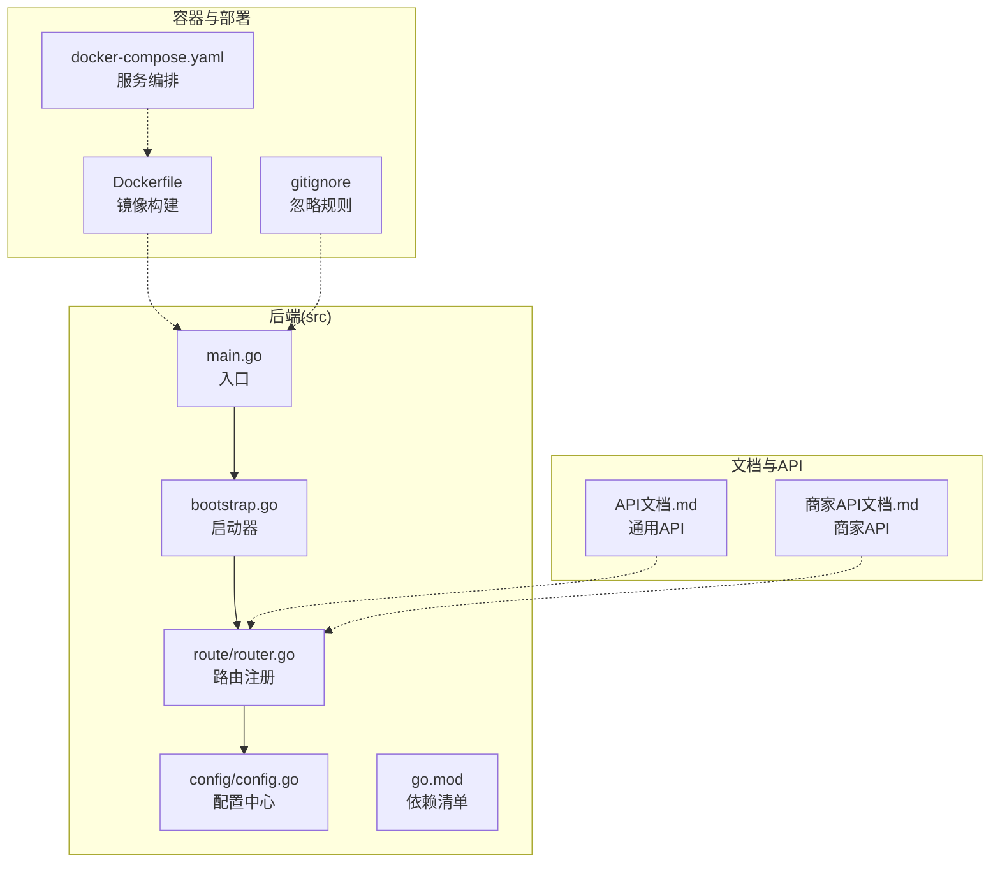
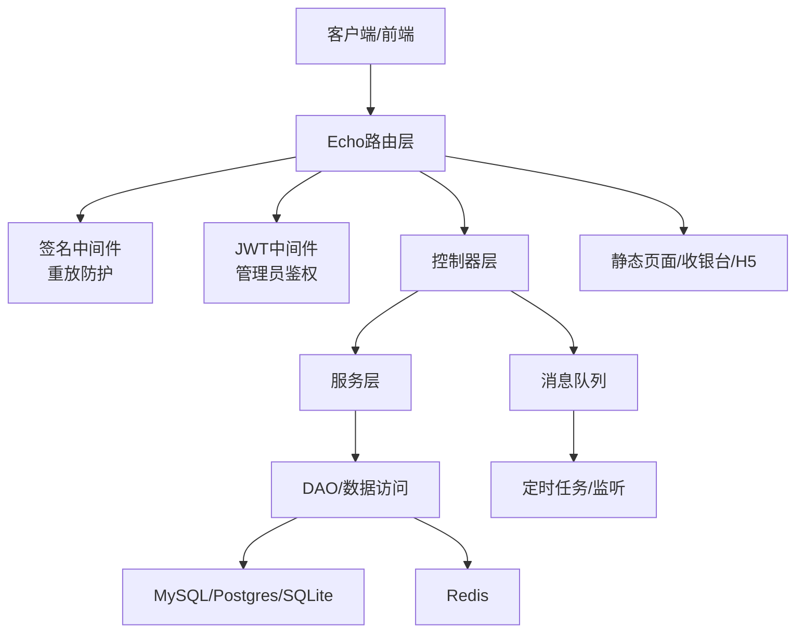
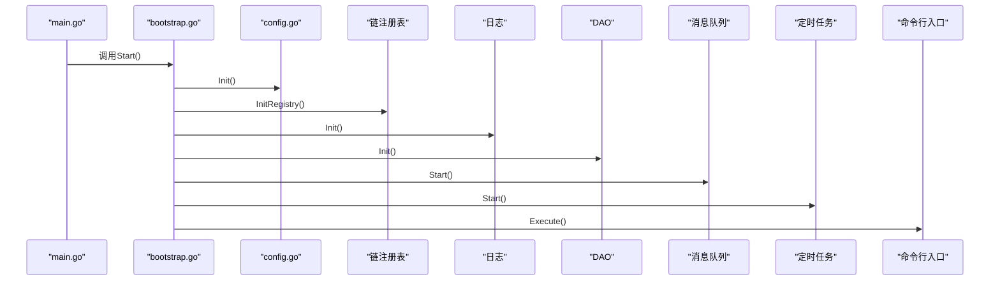
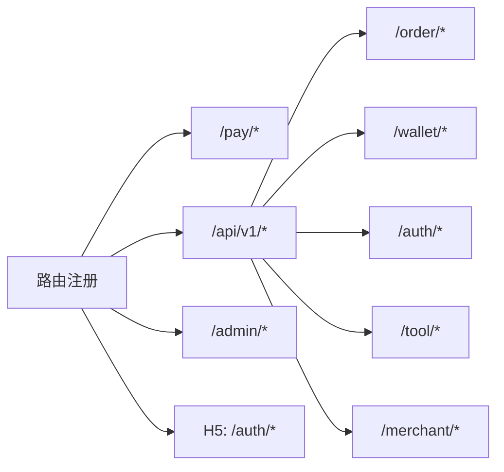
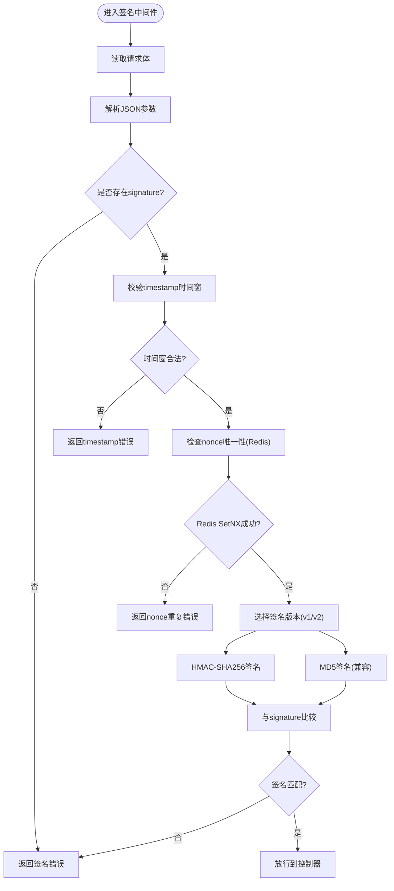
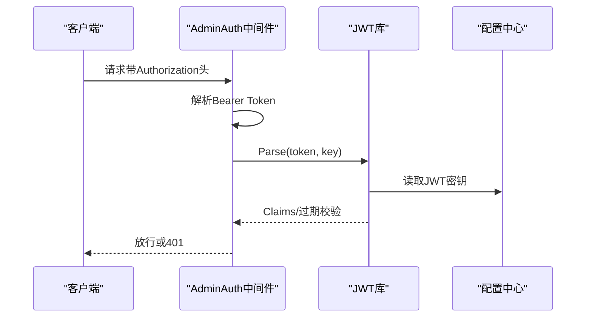
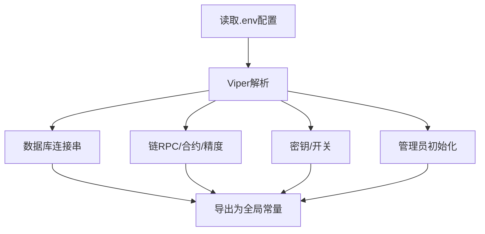
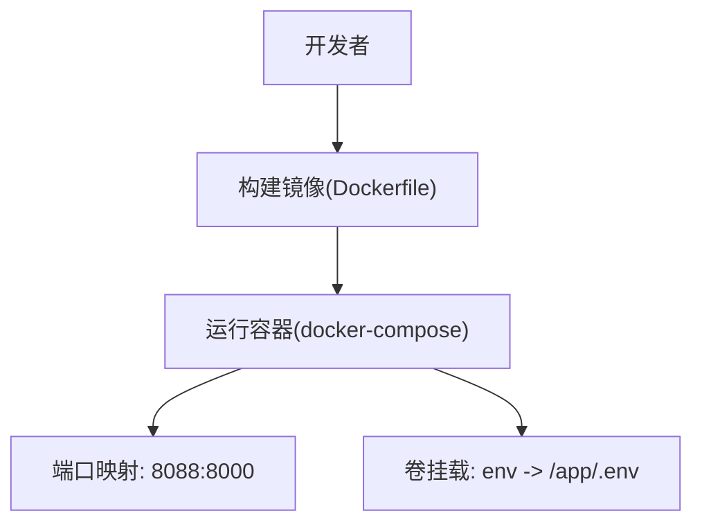
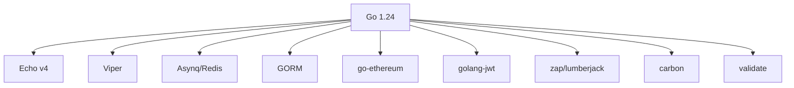

# 开发指南

<cite>
**本文引用的文件**   
- [main.go](file://EPUSDT/src/main.go)
- [bootstrap.go](file://EPUSDT/src/bootstrap/bootstrap.go)
- [router.go](file://EPUSDT/src/route/router.go)
- [config.go](file://EPUSDT/src/config/config.go)
- [go.mod](file://EPUSDT/src/go.mod)
- [Dockerfile](file://EPUSDT/Dockerfile)
- [docker-compose.yaml](file://EPUSDT/docker-compose.yaml)
- [.gitignore](file://EPUSDT/.gitignore)
- [API文档.md](file://EPUSDT/API_DOCUMENTATION.md)
- [商家API文档.md](file://EPUSDT/MERCHANT_API_DOCUMENTATION.md)
- [base.go](file://EPUSDT/src/controller/base.go)
- [admin_auth.go](file://EPUSDT/src/middleware/admin_auth.go)
- [check_sign.go](file://EPUSDT/src/middleware/check_sign.go)
- [sign.go](file://EPUSDT/src/util/sign/sign.go)
</cite>

## 目录
1. [简介](#简介)
2. [项目结构](#项目结构)
3. [核心组件](#核心组件)
4. [架构总览](#架构总览)
5. [详细组件分析](#详细组件分析)
6. [依赖分析](#依赖分析)
7. [性能考虑](#性能考虑)
8. [故障排查指南](#故障排查指南)
9. [结论](#结论)
10. [附录](#附录)

## 简介
本开发指南面向EPUSDT项目，覆盖开发环境配置、代码规范与最佳实践、Go语言与Swift开发规范、前端开发规范、代码审查标准、测试策略与调试技巧、目录结构与模块划分、依赖管理、Git工作流与版本控制策略、开发工具与IDE配置、性能优化与资源管理、以及团队协作与文档编写标准。目标是帮助新成员快速上手并保持高质量交付。

## 项目结构
EPUSDT采用分层清晰的Go后端与iOS前端混合架构，后端通过Echo框架提供REST API与静态页面，前端iOS工程位于独立目录并通过Xcode组织。根目录提供容器化部署与文档。

**图示来源**
- [main.go](file://EPUSDT/src/main.go#L1-L19)
- [bootstrap.go](file://EPUSDT/src/bootstrap/bootstrap.go#L1-L44)
- [router.go](file://EPUSDT/src/route/router.go#L1-L115)
- [config.go](file://EPUSDT/src/config/config.go#L1-L400)
- [go.mod](file://EPUSDT/src/go.mod#L1-L100)
- [Dockerfile](file://EPUSDT/Dockerfile#L1-L25)
- [docker-compose.yaml](file://EPUSDT/docker-compose.yaml#L1-L12)
- [.gitignore](file://EPUSDT/.gitignore#L1-L5)
- [API文档.md](file://EPUSDT/API_DOCUMENTATION.md#L1-L1001)
- [商家API文档.md](file://EPUSDT/MERCHANT_API_DOCUMENTATION.md#L1-L757)

**章节来源**
- [main.go](file://EPUSDT/src/main.go#L1-L19)
- [bootstrap.go](file://EPUSDT/src/bootstrap/bootstrap.go#L1-L44)
- [router.go](file://EPUSDT/src/route/router.go#L1-L115)
- [config.go](file://EPUSDT/src/config/config.go#L1-L400)
- [go.mod](file://EPUSDT/src/go.mod#L1-L100)
- [Dockerfile](file://EPUSDT/Dockerfile#L1-L25)
- [docker-compose.yaml](file://EPUSDT/docker-compose.yaml#L1-L12)
- [.gitignore](file://EPUSDT/.gitignore#L1-L5)
- [API文档.md](file://EPUSDT/API_DOCUMENTATION.md#L1-L1001)
- [商家API文档.md](file://EPUSDT/MERCHANT_API_DOCUMENTATION.md#L1-L757)

## 核心组件
- 应用入口与启动
  - 入口文件负责打印版本信息并启动引导器，引导器负责加载配置、链注册表、日志、数据库、消息队列、定时任务与命令行入口。
- 路由与中间件
  - 路由按模块分组，统一挂载审计日志中间件；API签名中间件提供重放防护与签名校验；管理员JWT中间件提供后台鉴权。
- 配置中心
  - 通过Viper读取.env配置，集中管理数据库连接、链RPC、合约参数、密钥与开关项。
- 签名与安全
  - 支持MD5与HMAC-SHA256签名，兼容双版本；nonce重放防护基于Redis原子写入；JWT签发与校验严格校验算法与过期时间。
- 文档与API
  - 提供通用API与商家API两套文档，覆盖订单、授权、钱包、管理后台等接口。

**章节来源**
- [main.go](file://EPUSDT/src/main.go#L1-L19)
- [bootstrap.go](file://EPUSDT/src/bootstrap/bootstrap.go#L1-L44)
- [router.go](file://EPUSDT/src/route/router.go#L1-L115)
- [config.go](file://EPUSDT/src/config/config.go#L1-L400)
- [check_sign.go](file://EPUSDT/src/middleware/check_sign.go#L1-L108)
- [admin_auth.go](file://EPUSDT/src/middleware/admin_auth.go#L1-L58)
- [sign.go](file://EPUSDT/src/util/sign/sign.go#L1-L153)
- [API文档.md](file://EPUSDT/API_DOCUMENTATION.md#L1-L1001)
- [商家API文档.md](file://EPUSDT/MERCHANT_API_DOCUMENTATION.md#L1-L757)

## 架构总览
后端采用“入口→引导→路由→控制器→服务/DAO→外部系统”的分层模式；容器化部署通过Dockerfile与docker-compose实现；API通过签名与JWT双重安全机制保护。

**图示来源**
- [router.go](file://EPUSDT/src/route/router.go#L1-L115)
- [check_sign.go](file://EPUSDT/src/middleware/check_sign.go#L1-L108)
- [admin_auth.go](file://EPUSDT/src/middleware/admin_auth.go#L1-L58)
- [bootstrap.go](file://EPUSDT/src/bootstrap/bootstrap.go#L1-L44)

## 详细组件分析

### 组件A：启动与引导流程
- 入口加载配置、链注册表、日志、DAO、消息队列、Telegram机器人与定时任务，随后执行命令行入口。
- 建议：在生产环境确保配置文件存在且权限正确；DAO初始化可按需启用不同存储后端。

**图示来源**
- [main.go](file://EPUSDT/src/main.go#L1-L19)
- [bootstrap.go](file://EPUSDT/src/bootstrap/bootstrap.go#L1-L44)
- [config.go](file://EPUSDT/src/config/config.go#L1-L400)

**章节来源**
- [main.go](file://EPUSDT/src/main.go#L1-L19)
- [bootstrap.go](file://EPUSDT/src/bootstrap/bootstrap.go#L1-L44)

### 组件B：路由与API分组
- 路由按模块分组：支付、API v1、授权、管理后台、商家系统，并对敏感接口挂载签名与JWT中间件。
- 建议：新增接口遵循现有分组与中间件约定，避免绕过安全校验。

**图示来源**
- [router.go](file://EPUSDT/src/route/router.go#L1-L115)

**章节来源**
- [router.go](file://EPUSDT/src/route/router.go#L1-L115)

### 组件C：API签名与重放防护
- 签名中间件解析请求体、提取timestamp与nonce，校验时间窗口与nonce唯一性，再进行签名比对。
- 支持v1（MD5）与v2（HMAC-SHA256）签名版本，建议逐步迁移至v2。

**图示来源**
- [check_sign.go](file://EPUSDT/src/middleware/check_sign.go#L1-L108)
- [sign.go](file://EPUSDT/src/util/sign/sign.go#L1-L153)

**章节来源**
- [check_sign.go](file://EPUSDT/src/middleware/check_sign.go#L1-L108)
- [sign.go](file://EPUSDT/src/util/sign/sign.go#L1-L153)

### 组件D：管理员JWT鉴权
- 中间件解析Authorization头，校验签名算法、密钥与过期时间，注入用户信息到上下文。
- 建议：密钥定期轮换，严格控制令牌有效期与刷新策略。

**图示来源**
- [admin_auth.go](file://EPUSDT/src/middleware/admin_auth.go#L1-L58)
- [config.go](file://EPUSDT/src/config/config.go#L1-L400)

**章节来源**
- [admin_auth.go](file://EPUSDT/src/middleware/admin_auth.go#L1-L58)
- [config.go](file://EPUSDT/src/config/config.go#L1-L400)

### 组件E：配置中心
- 通过Viper加载.env，统一管理数据库连接串、链RPC、合约地址与精度、密钥、开关与默认管理员信息。
- 建议：敏感配置通过环境变量注入，避免硬编码；提供默认值与校验逻辑。

**图示来源**
- [config.go](file://EPUSDT/src/config/config.go#L1-L400)

**章节来源**
- [config.go](file://EPUSDT/src/config/config.go#L1-L400)

### 组件F：容器化与部署
- Dockerfile分阶段构建，Alpine运行时，拷贝静态资源与二进制，ENTRYPOINT启动HTTP服务。
- docker-compose挂载.env到容器内，映射端口，便于本地开发与测试。

**图示来源**
- [Dockerfile](file://EPUSDT/Dockerfile#L1-L25)
- [docker-compose.yaml](file://EPUSDT/docker-compose.yaml#L1-L12)

**章节来源**
- [Dockerfile](file://EPUSDT/Dockerfile#L1-L25)
- [docker-compose.yaml](file://EPUSDT/docker-compose.yaml#L1-L12)

## 依赖分析
- 语言与框架
  - Go 1.24，Echo v4提供Web框架能力，Viper负责配置，Asynq/Redis处理异步任务，GORM支持多数据库。
- 区块链与加密
  - go-ethereum提供EVM生态支持，golang-jwt用于JWT，HMAC-SHA256签名替代MD5。
- 工具与可观测性
  - lumberjack日志滚动，zap日志库，carbon时间库，validate输入校验。

**图示来源**
- [go.mod](file://EPUSDT/src/go.mod#L1-L100)

**章节来源**
- [go.mod](file://EPUSDT/src/go.mod#L1-L100)

## 性能考虑
- 签名与重放防护
  - Redis SetNX保证nonce唯一性，建议合理设置过期时间与键空间清理策略，避免热点key竞争。
- 数据库与缓存
  - 优先使用连接池与索引优化；对高频查询增加缓存层，注意缓存一致性。
- 定时任务与消息队列
  - 合理设置任务并发与重试策略，避免阻塞主线程；对失败任务进行死信队列处理。
- 静态资源与容器
  - 静态资源与二进制分离，启用压缩与缓存头；容器镜像最小化，减少启动时间。

## 故障排查指南
- 启动失败
  - 检查配置文件路径与权限，确认.env存在且键值正确；查看日志输出定位panic原因。
- API签名错误
  - 确认timestamp在允许范围内，nonce未被使用；核对签名算法与token；必要时切换至v2签名。
- JWT鉴权失败
  - 校验Authorization头格式、密钥一致性与过期时间；检查令牌签发方与算法。
- 容器无法访问
  - 检查端口映射与卷挂载；确认容器内.env路径与权限；查看容器日志。

**章节来源**
- [check_sign.go](file://EPUSDT/src/middleware/check_sign.go#L1-L108)
- [admin_auth.go](file://EPUSDT/src/middleware/admin_auth.go#L1-L58)
- [Dockerfile](file://EPUSDT/Dockerfile#L1-L25)
- [docker-compose.yaml](file://EPUSDT/docker-compose.yaml#L1-L12)

## 结论
EPUSDT项目具备清晰的分层架构与完善的安全机制，结合容器化部署与详尽的API文档，能够支撑多链USDT支付与授权扣款场景。建议在开发过程中严格遵循本文规范，持续优化性能与稳定性，并保持文档与代码同步更新。

## 附录

### 开发环境配置（Go）
- 工具链
  - Go 1.24+，推荐使用GoLand或VS Code + Go插件。
- 依赖安装
  - 使用go.mod进行依赖管理，首次克隆后执行依赖下载与整理。
- 环境变量
  - 复制.env.example为.env，按需填写数据库、链RPC、密钥与开关项。
- 启动方式
  - 本地直接运行或通过docker-compose启动，确保端口未被占用。

**章节来源**
- [go.mod](file://EPUSDT/src/go.mod#L1-L100)
- [.gitignore](file://EPUSDT/.gitignore#L1-L5)

### Swift开发规范（iOS）
- 代码风格
  - 遵循Apple官方Swift API设计准则，使用类型安全与可选链；命名语义化，避免缩写。
- 依赖管理
  - 使用Swift Package Manager或CocoaPods，统一第三方库版本；避免循环依赖。
- 安全与隐私
  - 敏感信息不硬编码，使用Keychain；网络请求使用HTTPS与证书固定。
- 测试
  - 单元测试与UI测试并重，覆盖率不低于80%；集成测试覆盖关键流程。

### 前端开发规范（Web/HTML）
- 静态资源
  - 静态页面位于static目录，遵循CDN与缓存策略；确保跨域与安全头配置。
- 交互与体验
  - 优先使用语义化HTML与无障碍属性；对移动端进行适配与性能优化。

### 代码审查标准
- 规范性
  - 命名、注释、空行与缩进符合团队约定；函数单一职责，避免过长方法。
- 安全性
  - 输入校验、权限控制、日志脱敏与错误处理；禁止明文存储敏感信息。
- 可维护性
  - 模块解耦、依赖方向清晰；新增功能配套单元测试与集成测试。

### 测试策略
- 单元测试
  - 覆盖核心算法与工具函数；使用Mock隔离外部依赖。
- 集成测试
  - 覆盖关键API与业务流程；模拟Redis、数据库与外部链节点。
- 性能测试
  - 压测接口吞吐与延迟，识别瓶颈并优化。

### 调试技巧
- 日志
  - 使用zap输出结构化日志，按级别与模块分类；生产环境避免泄露敏感信息。
- 断点与追踪
  - 使用IDE断点与pprof分析CPU/内存；对异步任务添加唯一ID便于追踪。
- 网络与链上
  - 使用curl或Postman验证API；对链上交易使用区块浏览器回溯。

### Git工作流程与版本控制
- 分支模型
  - 主分支仅合并稳定版本；特性开发在feature分支，修复hotfix分支；发布打标签。
- 提交规范
  - 标题简洁明确，正文描述动机与变更点；关联Issue与PR。
- 合并与审核
  - Pull Request至少一次代码审查；通过CI后再合并。

### 开发工具与IDE配置
- Go
  - GoLand/VS Code，启用go fmt、go vet与静态检查；配置文件保存时自动格式化。
- Swift
  - Xcode，启用严格的编译警告；使用SwiftLint统一风格。
- 容器
  - Docker Desktop，本地调试与部署一体化。

### 性能优化与资源管理
- 内存
  - 避免大对象频繁分配，使用sync.Pool复用；及时释放大对象与闭包引用。
- 并发
  - 控制goroutine数量与通道缓冲；使用context取消与超时。
- 存储
  - 合理索引与查询条件；批量写入与事务合并；定期清理过期数据。

### 团队协作与文档编写
- 文档
  - API文档与变更同步更新；README包含快速开始与贡献指南。
- 沟通
  - 使用统一的沟通渠道与问题跟踪系统；每日站会同步进展与风险。