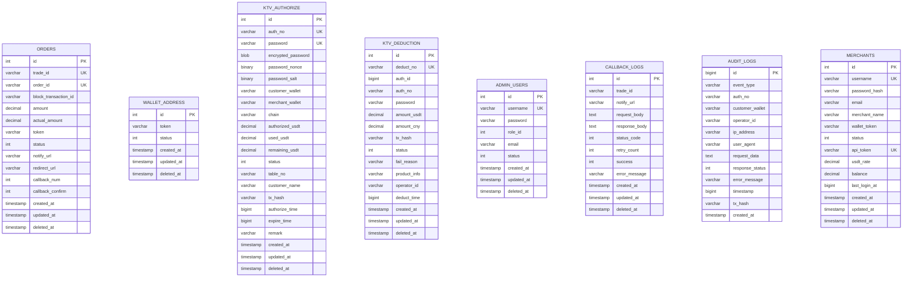

# 快速开始

<cite>
**本文引用的文件**
- [Dockerfile](file://EPUSDT/Dockerfile)
- [docker-compose.yaml](file://EPUSDT/docker-compose.yaml)
- [src/config/config.go](file://EPUSDT/src/config/config.go)
- [src/main.go](file://EPUSDT/src/main.go)
- [src/bootstrap/bootstrap.go](file://EPUSDT/src/bootstrap/bootstrap.go)
- [sql/v0.0.1.sql](file://EPUSDT/sql/v0.0.1.sql)
- [API_EXAMPLES.md](file://EPUSDT/API_EXAMPLES.md)
- [wiki/API.md](file://EPUSDT/wiki/API.md)
- [MERCHANT_API_DOCUMENTATION.md](file://EPUSDT/MERCHANT_API_DOCUMENTATION.md)
- [SECURITY_DEPLOYMENT_GUIDE.md](file://EPUSDT/SECURITY_DEPLOYMENT_GUIDE.md)
- [tools/encrypt_private_key.go](file://EPUSDT/tools/encrypt_private_key.go)
- [wiki/manual_RUN.md](file://EPUSDT/wiki/manual_RUN.md)
</cite>

## 目录
1. [简介](#简介)
2. [项目结构](#项目结构)
3. [核心组件](#核心组件)
4. [架构总览](#架构总览)
5. [详细组件分析](#详细组件分析)
6. [依赖与环境要求](#依赖与环境要求)
7. [安装与部署步骤](#安装与部署步骤)
8. [Docker 部署方案](#docker-部署方案)
9. [传统部署方案](#传统部署方案)
10. [数据库配置与初始化](#数据库配置与初始化)
11. [区块链节点与钱包配置](#区块链节点与钱包配置)
12. [基本使用与API示例](#基本使用与api示例)
13. [性能与稳定性建议](#性能与稳定性建议)
14. [故障排除指南](#故障排除指南)
15. [结论](#结论)

## 简介
本指南面向首次接触 EPUSDT 的用户，帮助你在最短时间内完成系统安装、环境配置、数据库初始化、区块链节点与钱包配置，并提供 Docker 与传统两种部署方案。同时给出基础 API 调用示例与测试方法，以及常见问题的排查思路。

## 项目结构
EPUSDT 后端采用 Go 语言开发，核心入口位于 src/main.go，配置加载在 src/config/config.go，启动流程由 src/bootstrap/bootstrap.go 控制。Docker 镜像构建与编排由 Dockerfile 与 docker-compose.yaml 提供。数据库结构定义在 sql/v0.0.1.sql。API 文档与示例分别在 wiki/API.md、API_EXAMPLES.md 与 MERCHANT_API_DOCUMENTATION.md 中。

**图示来源**
- [src/main.go](file://EPUSDT/src/main.go#L1-L19)
- [src/bootstrap/bootstrap.go](file://EPUSDT/src/bootstrap/bootstrap.go#L1-L44)
- [src/config/config.go](file://EPUSDT/src/config/config.go#L1-L138)
- [Dockerfile](file://EPUSDT/Dockerfile#L1-L25)
- [docker-compose.yaml](file://EPUSDT/docker-compose.yaml#L1-L12)
- [sql/v0.0.1.sql](file://EPUSDT/sql/v0.0.1.sql#L1-L243)

**章节来源**
- [src/main.go](file://EPUSDT/src/main.go#L1-L19)
- [src/bootstrap/bootstrap.go](file://EPUSDT/src/bootstrap/bootstrap.go#L1-L44)
- [Dockerfile](file://EPUSDT/Dockerfile#L1-L25)
- [docker-compose.yaml](file://EPUSDT/docker-compose.yaml#L1-L12)
- [sql/v0.0.1.sql](file://EPUSDT/sql/v0.0.1.sql#L1-L243)

## 核心组件
- 配置模块：负责从 .env 加载运行参数，包括数据库、Redis、RPC 节点、合约地址、汇率、管理员密钥等。
- 数据访问层：初始化 MySQL/SQLite/Redis 等存储，创建必要的表结构。
- 消息队列与定时任务：处理回调重试、订单过期、链上监听等异步任务。
- 命令行入口：提供 http start 等子命令启动 HTTP 服务。
- 安全工具：提供主密钥生成、私钥加密/解密工具，配合安全部署指南使用。

**章节来源**
- [src/config/config.go](file://EPUSDT/src/config/config.go#L1-L138)
- [src/bootstrap/bootstrap.go](file://EPUSDT/src/bootstrap/bootstrap.go#L15-L43)
- [tools/encrypt_private_key.go](file://EPUSDT/tools/encrypt_private_key.go#L1-L113)

## 架构总览
EPUSDT 以 HTTP API 为核心，结合区块链链上监听、消息队列与定时任务，形成“订单创建—链上支付—回调通知—异步处理”的闭环。系统通过配置模块集中管理外部依赖（数据库、Redis、RPC 节点、Telegram 机器人等）。

**图示来源**
- [src/config/config.go](file://EPUSDT/src/config/config.go#L45-L134)
- [src/bootstrap/bootstrap.go](file://EPUSDT/src/bootstrap/bootstrap.go#L15-L43)
- [wiki/API.md](file://EPUSDT/wiki/API.md#L70-L148)

## 详细组件分析

### 配置加载流程
配置模块从 .env 读取键值，构造数据库连接串、RPC 列表、合约地址、审计与优化开关、TronGrid API Key 等。若未显式设置某些参数，将采用默认值或回退策略。

**图示来源**
- [src/config/config.go](file://EPUSDT/src/config/config.go#L45-L134)

**章节来源**
- [src/config/config.go](file://EPUSDT/src/config/config.go#L45-L134)

### 启动流程
启动时先加载配置、初始化链注册表、日志、DAO、消息队列、定时任务，随后执行命令行入口（如 http start）。默认监听端口由配置决定。

**图示来源**
- [src/main.go](file://EPUSDT/src/main.go#L9-L18)
- [src/bootstrap/bootstrap.go](file://EPUSDT/src/bootstrap/bootstrap.go#L15-L43)

**章节来源**
- [src/main.go](file://EPUSDT/src/main.go#L9-L18)
- [src/bootstrap/bootstrap.go](file://EPUSDT/src/bootstrap/bootstrap.go#L15-L43)

### 数据库初始化
数据库结构定义在 sql/v0.0.1.sql，包含订单、钱包地址、KTV 授权与扣款、管理员、回调日志、审计日志等表。部署时需创建数据库并导入该 SQL。

**图示来源**
- [sql/v0.0.1.sql](file://EPUSDT/sql/v0.0.1.sql#L1-L243)

**章节来源**
- [sql/v0.0.1.sql](file://EPUSDT/sql/v0.0.1.sql#L1-L243)

### 安全与密钥管理
系统提供主密钥生成与私钥加解密工具，配合安全部署指南使用，确保商家私钥的安全存储与传输。

**图示来源**
- [tools/encrypt_private_key.go](file://EPUSDT/tools/encrypt_private_key.go#L55-L112)
- [SECURITY_DEPLOYMENT_GUIDE.md](file://EPUSDT/SECURITY_DEPLOYMENT_GUIDE.md#L15-L81)

**章节来源**
- [tools/encrypt_private_key.go](file://EPUSDT/tools/encrypt_private_key.go#L1-L113)
- [SECURITY_DEPLOYMENT_GUIDE.md](file://EPUSDT/SECURITY_DEPLOYMENT_GUIDE.md#L15-L81)

## 依赖与环境要求
- 操作系统：Linux（推荐 Debian/Ubuntu/CentOS）。
- 运行时：Go 1.24+（编译）、运行时二进制或容器。
- 数据库：MySQL/SQLite（根据配置选择）。
- 缓存：Redis（用于限流、防重放等）。
- 区块链：TRON、BSC、ETH、Polygon 的 RPC 节点与 USDT 合约地址（可在配置中指定）。
- 反向代理：Nginx（HTTPS 与 HTTP 重定向，可选）。
- 容器：Docker 与 docker-compose（可选）。

**章节来源**
- [SECURITY_DEPLOYMENT_GUIDE.md](file://EPUSDT/SECURITY_DEPLOYMENT_GUIDE.md#L3-L13)
- [src/config/config.go](file://EPUSDT/src/config/config.go#L23-L134)

## 安装与部署步骤

### 前置准备
- 准备服务器并安装必要软件：Go、MySQL、Redis、Git、Nginx（可选）。
- 准备域名与 SSL 证书（Let’s Encrypt），或在应用层配置 TLS。
- 准备 .env 配置文件（见下一节）。

**章节来源**
- [SECURITY_DEPLOYMENT_GUIDE.md](file://EPUSDT/SECURITY_DEPLOYMENT_GUIDE.md#L84-L160)

### 配置 .env
- 复制示例文件并编辑：将 app_uri、mysql_*、redis_*、api_auth_token 等关键项补齐。
- 如启用 Telegram 机器人，配置 tg_bot_token 与 tg_manage。
- 如需强制汇率，设置 forced_usdt_rate。
- 如需启用 HTTPS，配置 tls_cert_file 与 tls_key_file（应用层）或通过 Nginx 反代。

**章节来源**
- [wiki/manual_RUN.md](file://EPUSDT/wiki/manual_RUN.md#L111-L176)
- [src/config/config.go](file://EPUSDT/src/config/config.go#L56-L106)

## Docker 部署方案

### 使用官方镜像
- 在 docker-compose.yaml 中映射 .env 文件到 /app/.env，并暴露 8088:8000 端口。
- 启动服务：docker-compose up -d。

**图示来源**
- [Dockerfile](file://EPUSDT/Dockerfile#L1-L25)
- [docker-compose.yaml](file://EPUSDT/docker-compose.yaml#L1-L12)

**章节来源**
- [Dockerfile](file://EPUSDT/Dockerfile#L1-L25)
- [docker-compose.yaml](file://EPUSDT/docker-compose.yaml#L1-L12)

### 自行构建镜像
- 在 Dockerfile 中，先构建二进制，再复制静态资源与二进制到运行镜像。
- ENTRYPOINT 指定 ./epusdt http start。

**章节来源**
- [Dockerfile](file://EPUSDT/Dockerfile#L1-L25)

## 传统部署方案

### 二进制部署（手动）
- 下载发布包并解压，赋予执行权限。
- 导入数据库结构（参见“数据库配置与初始化”）。
- 配置 .env 并启动服务（supervisor 或 systemd）。
- 配置 Nginx 反向代理与 HTTPS。

**图示来源**
- [wiki/manual_RUN.md](file://EPUSDT/wiki/manual_RUN.md#L5-L215)

**章节来源**
- [wiki/manual_RUN.md](file://EPUSDT/wiki/manual_RUN.md#L5-L215)

## 数据库配置与初始化

### MySQL/SQLite 选择
- 在 .env 中配置 mysql_* 或 sqlite_* 相关项。
- 若使用 SQLite，确保文件路径可写。

**章节来源**
- [src/config/config.go](file://EPUSDT/src/config/config.go#L66-L73)

### 初始化数据库
- 创建数据库与用户（或使用 SQLite 文件）。
- 导入 sql/v0.0.1.sql，创建所有表与索引。
- 确认表存在且索引生效。

**章节来源**
- [sql/v0.0.1.sql](file://EPUSDT/sql/v0.0.1.sql#L1-L243)
- [wiki/manual_RUN.md](file://EPUSDT/wiki/manual_RUN.md#L15-L82)

## 区块链节点与钱包配置

### RPC 节点与合约
- 在 .env 中配置 bsc_rpc_urls、eth_rpc_urls、polygon_rpc_urls。
- 可设置 BSC/ETH/Polygon 的 USDT 合约地址与精度。
- 可配置 TronGrid API Key。

**章节来源**
- [src/config/config.go](file://EPUSDT/src/config/config.go#L77-L134)

### 商家私钥与安全
- 使用 tools/encrypt_private_key.go 生成主密钥并加密私钥。
- 将加密后的私钥写入 .env，避免明文存储。
- 定期轮换主密钥与 API Token、JWT Secret。

**章节来源**
- [tools/encrypt_private_key.go](file://EPUSDT/tools/encrypt_private_key.go#L55-L112)
- [SECURITY_DEPLOYMENT_GUIDE.md](file://EPUSDT/SECURITY_DEPLOYMENT_GUIDE.md#L398-L449)

## 基本使用与API示例

### 创建支付订单（KTV 授权）
- 使用 API 创建授权请求，返回 auth_no、password、auth_url。
- 客户扫码授权 approve，随后商家使用 password 发起扣款。

**图示来源**
- [MERCHANT_API_DOCUMENTATION.md](file://EPUSDT/MERCHANT_API_DOCUMENTATION.md#L146-L196)
- [API_EXAMPLES.md](file://EPUSDT/API_EXAMPLES.md#L201-L294)

**章节来源**
- [MERCHANT_API_DOCUMENTATION.md](file://EPUSDT/MERCHANT_API_DOCUMENTATION.md#L146-L196)
- [API_EXAMPLES.md](file://EPUSDT/API_EXAMPLES.md#L201-L294)

### 创建普通支付订单
- 商户调用创建交易接口，传入金额、回调地址等参数并签名。
- 支付成功后接收异步回调，验证签名并处理业务。

**章节来源**
- [wiki/API.md](file://EPUSDT/wiki/API.md#L70-L148)
- [API_EXAMPLES.md](file://EPUSDT/API_EXAMPLES.md#L7-L104)

### 回调处理与幂等
- 回调需验证签名，处理成功后返回“ok”，避免重复回调导致的重复入账。
- 建议记录回调日志与重试次数，便于排查。

**章节来源**
- [wiki/API.md](file://EPUSDT/wiki/API.md#L144-L165)
- [API_EXAMPLES.md](file://EPUSDT/API_EXAMPLES.md#L448-L608)

## 性能与稳定性建议
- 合理设置 Redis 连接池与超时，避免阻塞。
- 使用连接池与并发控制，避免频繁轮询。
- 启用审计日志与回调日志，便于追踪问题。
- 定时任务与消息队列并发度按资源调整，避免资源争用。

[本节为通用建议，无需特定文件引用]

## 故障排除指南

### 服务无法启动
- 检查 systemd 或 supervisor 状态与日志。
- 确认 .env 配置项齐全（尤其是 app_uri、mysql、redis、api_auth_token）。
- 确认端口未被占用，防火墙放行 8000（或 8088）。

**章节来源**
- [SECURITY_DEPLOYMENT_GUIDE.md](file://EPUSDT/SECURITY_DEPLOYMENT_GUIDE.md#L398-L411)

### 私钥解密失败
- 使用工具 decrypt 验证主密钥与加密私钥是否匹配。
- 检查 .env 中 master_encryption_key 与 merchant_private_key_encrypted 是否正确。

**章节来源**
- [tools/encrypt_private_key.go](file://EPUSDT/tools/encrypt_private_key.go#L96-L112)
- [SECURITY_DEPLOYMENT_GUIDE.md](file://EPUSDT/SECURITY_DEPLOYMENT_GUIDE.md#L413-L418)

### Redis 连接失败
- 使用 redis-cli 测试连接，确认主机、端口、密码与 db。
- 检查防火墙与安全组策略。

**章节来源**
- [SECURITY_DEPLOYMENT_GUIDE.md](file://EPUSDT/SECURITY_DEPLOYMENT_GUIDE.md#L420-L426)

### HTTPS 与 Nginx
- 确认证书路径与权限，HSTS 与安全头配置。
- 仅开放必要端口，限制 SSH 访问。

**章节来源**
- [SECURITY_DEPLOYMENT_GUIDE.md](file://EPUSDT/SECURITY_DEPLOYMENT_GUIDE.md#L84-L204)

## 结论
通过本指南，你可以在本地或生产环境中快速完成 EPUSDT 的安装与部署，完成数据库初始化、区块链节点与钱包配置，并基于提供的 API 示例完成基本业务流程。建议在生产环境遵循安全部署指南，定期轮换密钥与证书，配置监控与日志轮转，确保系统稳定与安全。