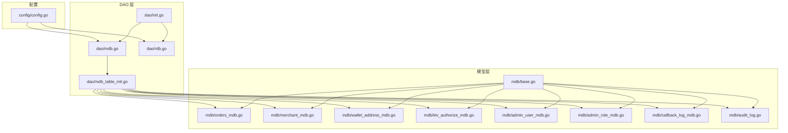
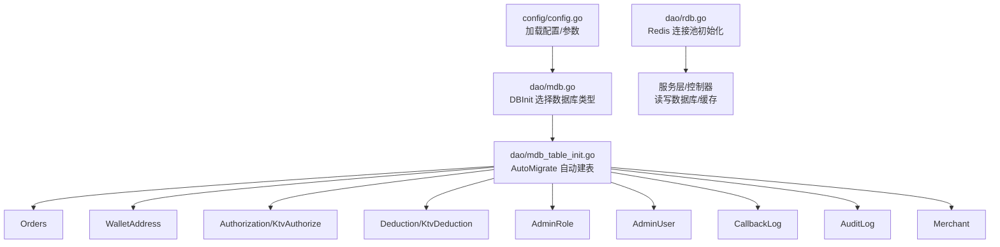
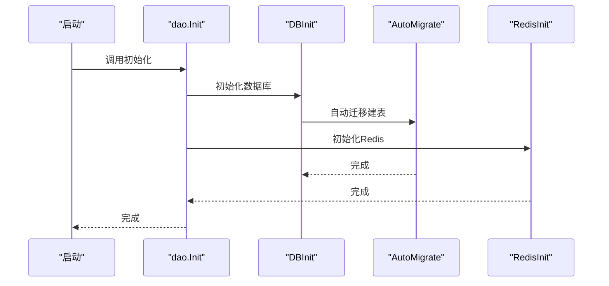

# 数据库设计

<cite>
**本文引用的文件**
- [sql/v0.0.1.sql](file://EPUSDT/sql/v0.0.1.sql)
- [src/model/mdb/base.go](file://EPUSDT/src/model/mdb/base.go)
- [src/model/mdb/orders_mdb.go](file://EPUSDT/src/model/mdb/orders_mdb.go)
- [src/model/mdb/merchant_mdb.go](file://EPUSDT/src/model/mdb/merchant_mdb.go)
- [src/model/mdb/wallet_address_mdb.go](file://EPUSDT/src/model/mdb/wallet_address_mdb.go)
- [src/model/mdb/ktv_authorize_mdb.go](file://EPUSDT/src/model/mdb/ktv_authorize_mdb.go)
- [src/model/mdb/admin_user_mdb.go](file://EPUSDT/src/model/mdb/admin_user_mdb.go)
- [src/model/mdb/admin_role_mdb.go](file://EPUSDT/src/model/mdb/admin_role_mdb.go)
- [src/model/mdb/callback_log_mdb.go](file://EPUSDT/src/model/mdb/callback_log_mdb.go)
- [src/model/mdb/audit_log.go](file://EPUSDT/src/model/mdb/audit_log.go)
- [src/model/dao/init.go](file://EPUSDT/src/model/dao/init.go)
- [src/model/dao/mdb.go](file://EPUSDT/src/model/dao/mdb.go)
- [src/model/dao/rdb.go](file://EPUSDT/src/model/dao/rdb.go)
- [src/model/dao/mdb_table_init.go](file://EPUSDT/src/model/dao/mdb_table_init.go)
- [src/config/config.go](file://EPUSDT/src/config/config.go)
</cite>

## 目录
1. [简介](#简介)
2. [项目结构](#项目结构)
3. [核心组件](#核心组件)
4. [架构总览](#架构总览)
5. [详细组件分析](#详细组件分析)
6. [依赖分析](#依赖分析)
7. [性能考虑](#性能考虑)
8. [故障排查指南](#故障排查指南)
9. [结论](#结论)
10. [附录](#附录)

## 简介
本文件为 EPUSDT 数据库系统的全面数据模型文档，覆盖实体关系、字段定义与数据类型、主键/外键、索引与约束、数据验证与业务规则、数据库架构图、示例数据、数据访问模式、缓存策略与性能考量、数据生命周期与归档策略、数据迁移路径与版本管理、以及数据安全与访问控制等。文档同时结合 GORM ORM 使用方式、数据库连接池配置与事务管理实践，给出具体表结构说明与关系图示。

## 项目结构
EPUSDT 的数据库层采用 GORM ORM，模型位于 src/model/mdb，初始化与连接在 src/model/dao，配置在 src/config。数据库初始化通过自动迁移实现，Redis 作为缓存与消息队列支撑。



图表来源
- [src/config/config.go](file://EPUSDT/src/config/config.go#L45-L134)
- [src/model/dao/init.go](file://EPUSDT/src/model/dao/init.go#L7-L15)
- [src/model/dao/mdb.go](file://EPUSDT/src/model/dao/mdb.go#L12-L30)
- [src/model/dao/rdb.go](file://EPUSDT/src/model/dao/rdb.go#L16-L46)
- [src/model/dao/mdb_table_init.go](file://EPUSDT/src/model/dao/mdb_table_init.go#L13-L55)
- [src/model/mdb/base.go](file://EPUSDT/src/model/mdb/base.go#L8-L13)
- [src/model/mdb/orders_mdb.go](file://EPUSDT/src/model/mdb/orders_mdb.go#L11-L25)
- [src/model/mdb/merchant_mdb.go](file://EPUSDT/src/model/mdb/merchant_mdb.go#L4-L16)
- [src/model/mdb/wallet_address_mdb.go](file://EPUSDT/src/model/mdb/wallet_address_mdb.go#L9-L16)
- [src/model/mdb/ktv_authorize_mdb.go](file://EPUSDT/src/model/mdb/ktv_authorize_mdb.go#L13-L33)
- [src/model/mdb/admin_user_mdb.go](file://EPUSDT/src/model/mdb/admin_user_mdb.go#L4-L10)
- [src/model/mdb/admin_role_mdb.go](file://EPUSDT/src/model/mdb/admin_role_mdb.go#L4-L7)
- [src/model/mdb/callback_log_mdb.go](file://EPUSDT/src/model/mdb/callback_log_mdb.go#L4-L14)
- [src/model/mdb/audit_log.go](file://EPUSDT/src/model/mdb/audit_log.go#L6-L20)

章节来源
- [src/config/config.go](file://EPUSDT/src/config/config.go#L45-L134)
- [src/model/dao/init.go](file://EPUSDT/src/model/dao/init.go#L7-L15)
- [src/model/dao/mdb.go](file://EPUSDT/src/model/dao/mdb.go#L12-L30)
- [src/model/dao/rdb.go](file://EPUSDT/src/model/dao/rdb.go#L16-L46)
- [src/model/dao/mdb_table_init.go](file://EPUSDT/src/model/dao/mdb_table_init.go#L13-L55)

## 核心组件
- 基础模型 BaseModel：统一提供自增 ID、创建/更新/删除时间戳与软删除支持。
- 订单 Orders：支付订单核心表，包含订单号、金额、链标识、回调与状态。
- 商家 Merchant：商户账户、API 令牌、汇率与余额。
- 钱包 WalletAddress：链上钱包与链标识、所属商家、状态。
- KTV 授权与扣款：KtvAuthorize 与 KtvDeduction，支持密码凭证、加密存储、额度与状态。
- 管理员与角色：AdminUser 与 AdminRole，角色仅作标识。
- 回调日志 CallbackLog：订单回调请求/响应与状态。
- 审计日志 AuditLog：事件类型、授权编号、钱包、IP、UA、时间戳等。

章节来源
- [src/model/mdb/base.go](file://EPUSDT/src/model/mdb/base.go#L8-L13)
- [src/model/mdb/orders_mdb.go](file://EPUSDT/src/model/mdb/orders_mdb.go#L11-L25)
- [src/model/mdb/merchant_mdb.go](file://EPUSDT/src/model/mdb/merchant_mdb.go#L4-L16)
- [src/model/mdb/wallet_address_mdb.go](file://EPUSDT/src/model/mdb/wallet_address_mdb.go#L9-L16)
- [src/model/mdb/ktv_authorize_mdb.go](file://EPUSDT/src/model/mdb/ktv_authorize_mdb.go#L13-L33)
- [src/model/mdb/admin_user_mdb.go](file://EPUSDT/src/model/mdb/admin_user_mdb.go#L4-L10)
- [src/model/mdb/admin_role_mdb.go](file://EPUSDT/src/model/mdb/admin_role_mdb.go#L4-L7)
- [src/model/mdb/callback_log_mdb.go](file://EPUSDT/src/model/mdb/callback_log_mdb.go#L4-L14)
- [src/model/mdb/audit_log.go](file://EPUSDT/src/model/mdb/audit_log.go#L6-L20)

## 架构总览
数据库层以 GORM 为核心，通过配置加载数据库与 Redis 连接，DAO 初始化负责建立连接并执行自动迁移。模型层定义各表结构与索引，审计日志贯穿关键业务流程。



图表来源
- [src/config/config.go](file://EPUSDT/src/config/config.go#L45-L134)
- [src/model/dao/mdb.go](file://EPUSDT/src/model/dao/mdb.go#L12-L30)
- [src/model/dao/mdb_table_init.go](file://EPUSDT/src/model/dao/mdb_table_init.go#L13-L55)
- [src/model/dao/rdb.go](file://EPUSDT/src/model/dao/rdb.go#L16-L46)
- [src/model/mdb/orders_mdb.go](file://EPUSDT/src/model/mdb/orders_mdb.go#L11-L25)
- [src/model/mdb/merchant_mdb.go](file://EPUSDT/src/model/mdb/merchant_mdb.go#L4-L16)
- [src/model/mdb/wallet_address_mdb.go](file://EPUSDT/src/model/mdb/wallet_address_mdb.go#L9-L16)
- [src/model/mdb/ktv_authorize_mdb.go](file://EPUSDT/src/model/mdb/ktv_authorize_mdb.go#L13-L33)
- [src/model/mdb/admin_user_mdb.go](file://EPUSDT/src/model/mdb/admin_user_mdb.go#L4-L10)
- [src/model/mdb/admin_role_mdb.go](file://EPUSDT/src/model/mdb/admin_role_mdb.go#L4-L7)
- [src/model/mdb/callback_log_mdb.go](file://EPUSDT/src/model/mdb/callback_log_mdb.go#L4-L14)
- [src/model/mdb/audit_log.go](file://EPUSDT/src/model/mdb/audit_log.go#L6-L20)

## 详细组件分析

### 实体关系与表结构
以下 ER 图展示核心实体及其关系。订单与钱包存在隐性关联（订单中的 token 与钱包 token 对齐），授权与扣款形成闭环，审计日志贯穿关键事件。

```mermaid
erDiagram
ORDERS {
int id PK
string trade_id UK
string order_id UK
string block_transaction_id IDX
decimal amount
decimal actual_amount
string token
string chain
int status
string notify_url
string redirect_url
int callback_num
int callback_confirm
timestamp created_at
timestamp updated_at
timestamp deleted_at
}
MERCHANTS {
int id PK
string username UK
string password_hash
string email
string merchant_name
string wallet_token
int status
string api_token UK
decimal usdt_rate
decimal balance
bigint last_login_at
timestamp created_at
timestamp updated_at
timestamp deleted_at
}
WALLET_ADDRESS {
int id PK
string token
string chain
int chain_id
bigint merchant_id IDX
int status
timestamp created_at
timestamp updated_at
timestamp deleted_at
}
KTV_AUTHORIZE {
int id PK
string auth_no UK
string password UK
blob encrypted_password
binary password_nonce
binary password_salt
string customer_wallet IDX
string merchant_wallet
string chain
decimal authorized_usdt
decimal used_usdt
decimal remaining_usdt
int status
string table_no
string customer_name
string tx_hash
bigint authorize_time
bigint expire_time
string remark
timestamp created_at
timestamp updated_at
timestamp deleted_at
}
KTV_DEDUCTION {
int id PK
string deduct_no UK
bigint auth_id IDX
string auth_no
string password
decimal amount_usdt
decimal amount_cny
string tx_hash
int status
string fail_reason
string product_info
string operator_id
bigint deduct_time
timestamp created_at
timestamp updated_at
timestamp deleted_at
}
ADMIN_USERS {
int id PK
string username UK
string password_hash
bigint role_id
int status
timestamp created_at
timestamp updated_at
timestamp deleted_at
}
ADMIN_ROLES {
int id PK
string name UK
timestamp created_at
timestamp updated_at
timestamp deleted_at
}
CALLBACK_LOGS {
int id PK
string trade_id IDX
string order_id IDX
string notify_url
text request_body
text response_body
int status_code
int success
string error_message
timestamp created_at
timestamp updated_at
timestamp deleted_at
}
AUDIT_LOGS {
bigint id PK
string event_type IDX
string auth_no IDX
string customer_wallet IDX
string operator_id
string ip_address
string user_agent
text request_data
int response_status
string error_message
bigint timestamp IDX
string tx_hash
timestamp created_at
}
ORDERS ||--o{ CALLBACK_LOGS : "按 trade_id/order_id 关联"
WALLET_ADDRESS ||--o{ ORDERS : "token 关联"
MERCHANTS ||--o{ WALLET_ADDRESS : "merchant_id 关联"
KTV_AUTHORIZE ||--o{ KTV_DEDUCTION : "auth_id 关联"
ADMIN_USERS }o--|| ADMIN_ROLES : "role_id 关联"
```

图表来源
- [EPUSDT/sql/v0.0.1.sql](file://EPUSDT/sql/v0.0.1.sql#L2-L24)
- [EPUSDT/sql/v0.0.1.sql](file://EPUSDT/sql/v0.0.1.sql#L30-L40)
- [EPUSDT/sql/v0.0.1.sql](file://EPUSDT/sql/v0.0.1.sql#L46-L76)
- [EPUSDT/sql/v0.0.1.sql](file://EPUSDT/sql/v0.0.1.sql#L85-L116)
- [EPUSDT/sql/v0.0.1.sql](file://EPUSDT/sql/v0.0.1.sql#L119-L149)
- [EPUSDT/sql/v0.0.1.sql](file://EPUSDT/sql/v0.0.1.sql#L155-L171)
- [EPUSDT/sql/v0.0.1.sql](file://EPUSDT/sql/v0.0.1.sql#L181-L210)
- [EPUSDT/sql/v0.0.1.sql](file://EPUSDT/sql/v0.0.1.sql#L213-L242)

章节来源
- [EPUSDT/sql/v0.0.1.sql](file://EPUSDT/sql/v0.0.1.sql#L2-L24)
- [EPUSDT/sql/v0.0.1.sql](file://EPUSDT/sql/v0.0.1.sql#L30-L40)
- [EPUSDT/sql/v0.0.1.sql](file://EPUSDT/sql/v0.0.1.sql#L46-L76)
- [EPUSDT/sql/v0.0.1.sql](file://EPUSDT/sql/v0.0.1.sql#L85-L116)
- [EPUSDT/sql/v0.0.1.sql](file://EPUSDT/sql/v0.0.1.sql#L119-L149)
- [EPUSDT/sql/v0.0.1.sql](file://EPUSDT/sql/v0.0.1.sql#L155-L171)
- [EPUSDT/sql/v0.0.1.sql](file://EPUSDT/sql/v0.0.1.sql#L181-L210)
- [EPUSDT/sql/v0.0.1.sql](file://EPUSDT/sql/v0.0.1.sql#L213-L242)

### 字段定义与数据类型
- 订单 Orders
  - 主键：id（自增）
  - 唯一索引：order_id、trade_id
  - 普通索引：block_transaction_id
  - 关键字段：trade_id、order_id、block_transaction_id、amount、actual_amount、token、chain、status、notify_url、redirect_url、callback_num、callback_confirm、created_at、updated_at、deleted_at
- 商家 Merchant
  - 主键：id；唯一索引：username、api_token；普通索引：wallet_token、status
  - 关键字段：username、password_hash、email、merchant_name、wallet_token、status、api_token、usdt_rate、balance、last_login_at
- 钱包 WalletAddress
  - 主键：id；普通索引：token、merchant_id
  - 关键字段：token、chain、chain_id、merchant_id、status
- KTV 授权 KtvAuthorize
  - 主键：id；唯一索引：auth_no、password；普通索引：customer_wallet、status
  - 关键字段：auth_no、password、encrypted_password、password_nonce、password_salt、customer_wallet、merchant_wallet、chain、authorized_usdt、used_usdt、remaining_usdt、status、table_no、customer_name、tx_hash、authorize_time、expire_time、remark
- KTV 扣款 KtvDeduction
  - 主键：id；唯一索引：deduct_no；普通索引：auth_id、password、status
  - 关键字段：deduct_no、auth_id、auth_no、password、amount_usdt、amount_cny、tx_hash、status、fail_reason、product_info、operator_id、deduct_time
- 管理员 AdminUser
  - 主键：id；唯一索引：username；普通索引：role_id
  - 关键字段：username、password_hash、role_id、status
- 管理员角色 AdminRole
  - 主键：id；唯一索引：name
  - 关键字段：name
- 回调日志 CallbackLog
  - 主键：id；普通索引：trade_id、success
  - 关键字段：trade_id、order_id、notify_url、request_body、response_body、status_code、success、error_message
- 审计日志 AuditLog
  - 主键：id；普通索引：event_type、auth_no、customer_wallet、timestamp
  - 关键字段：event_type、auth_no、customer_wallet、operator_id、ip_address、user_agent、request_data、response_status、error_message、timestamp、tx_hash、created_at

章节来源
- [EPUSDT/sql/v0.0.1.sql](file://EPUSDT/sql/v0.0.1.sql#L2-L24)
- [EPUSDT/sql/v0.0.1.sql](file://EPUSDT/sql/v0.0.1.sql#L30-L40)
- [EPUSDT/sql/v0.0.1.sql](file://EPUSDT/sql/v0.0.1.sql#L46-L76)
- [EPUSDT/sql/v0.0.1.sql](file://EPUSDT/sql/v0.0.1.sql#L85-L116)
- [EPUSDT/sql/v0.0.1.sql](file://EPUSDT/sql/v0.0.1.sql#L119-L149)
- [EPUSDT/sql/v0.0.1.sql](file://EPUSDT/sql/v0.0.1.sql#L155-L171)
- [EPUSDT/sql/v0.0.1.sql](file://EPUSDT/sql/v0.0.1.sql#L181-L210)
- [EPUSDT/sql/v0.0.1.sql](file://EPUSDT/sql/v0.0.1.sql#L213-L242)

### 约束与索引
- 唯一约束
  - Orders.order_id、Orders.trade_id
  - KtvAuthorize.auth_no、KtvAuthorize.password
  - KtvDeduction.deduct_no
  - Merchant.username、Merchant.api_token
  - AdminUser.username
  - AdminRole.name
- 索引
  - Orders.block_transaction_id
  - WalletAddress.token、merchant_id
  - KtvAuthorize.customer_wallet、status
  - KtvDeduction.auth_id、password、status
  - Merchant.wallet_token、status
  - CallbackLog.trade_id、success
  - AuditLog.event_type、auth_no、customer_wallet、timestamp
- 软删除
  - BaseModel.deleted_at 支持逻辑删除

章节来源
- [EPUSDT/sql/v0.0.1.sql](file://EPUSDT/sql/v0.0.1.sql#L20-L24)
- [EPUSDT/sql/v0.0.1.sql](file://EPUSDT/sql/v0.0.1.sql#L42-L43)
- [EPUSDT/sql/v0.0.1.sql](file://EPUSDT/sql/v0.0.1.sql#L71-L74)
- [EPUSDT/sql/v0.0.1.sql](file://EPUSDT/sql/v0.0.1.sql#L104-L106)
- [EPUSDT/sql/v0.0.1.sql](file://EPUSDT/sql/v0.0.1.sql#L198-L202)
- [EPUSDT/sql/v0.0.1.sql](file://EPUSDT/sql/v0.0.1.sql#L146-L147)
- [EPUSDT/sql/v0.0.1.sql](file://EPUSDT/sql/v0.0.1.sql#L128-L129)
- [EPUSDT/sql/v0.0.1.sql](file://EPUSDT/sql/v0.0.1.sql#L26-L27)
- [EPUSDT/sql/v0.0.1.sql](file://EPUSDT/sql/v0.0.1.sql#L42-L43)
- [EPUSDT/sql/v0.0.1.sql](file://EPUSDT/sql/v0.0.1.sql#L78-L82)
- [EPUSDT/sql/v0.0.1.sql](file://EPUSDT/sql/v0.0.1.sql#L109-L113)
- [EPUSDT/sql/v0.0.1.sql](file://EPUSDT/sql/v0.0.1.sql#L205-L209)
- [EPUSDT/sql/v0.0.1.sql](file://EPUSDT/sql/v0.0.1.sql#L173-L177)
- [EPUSDT/sql/v0.0.1.sql](file://EPUSDT/sql/v0.0.1.sql#L232-L242)

### 数据验证与业务规则
- 数值精度
  - 金额字段采用高精度 decimal，如 Orders.amount/actual_amount 与 Merchant.balance、KTV 授权/扣款金额均保留至合适小数位。
- 状态枚举
  - Orders.status：等待支付、支付成功、已过期
  - KTV 授权状态：等待授权、授权有效、已撤销、额度已用尽、已过期
  - 回调确认：1 是 2 否
- 时间戳
  - 授权与扣款均记录时间戳，便于过期与审计。
- 安全与隐私
  - 密码凭证字段支持明文与加密存储（encrypted_password、nonce、salt），审计日志对敏感请求数据进行脱敏。
- 业务流程
  - 订单创建后进入等待支付状态，回调成功后更新为支付成功；授权有效期到期后状态变更；扣款记录与授权额度联动。

章节来源
- [src/model/mdb/orders_mdb.go](file://EPUSDT/src/model/mdb/orders_mdb.go#L3-L9)
- [src/model/mdb/ktv_authorize_mdb.go](file://EPUSDT/src/model/mdb/ktv_authorize_mdb.go#L4-L10)
- [src/model/mdb/audit_log.go](file://EPUSDT/src/model/mdb/audit_log.go#L27-L40)

### 示例数据
- 订单 Orders
  - 字段示例：trade_id、order_id、block_transaction_id、amount、actual_amount、token、chain、status、notify_url、redirect_url、callback_num、callback_confirm
- 商家 Merchant
  - 字段示例：username、api_token、wallet_token、status、usdt_rate、balance、last_login_at
- 钱包 WalletAddress
  - 字段示例：token、chain、chain_id、merchant_id、status
- 授权 KtvAuthorize
  - 字段示例：auth_no、password、encrypted_password、password_nonce、password_salt、customer_wallet、merchant_wallet、chain、authorized_usdt、used_usdt、remaining_usdt、status、table_no、customer_name、tx_hash、authorize_time、expire_time、remark
- 扣款 KtvDeduction
  - 字段示例：deduct_no、auth_id、auth_no、password、amount_usdt、amount_cny、tx_hash、status、fail_reason、product_info、operator_id、deduct_time
- 管理员 AdminUser
  - 字段示例：username、password_hash、role_id、status
- 角色 AdminRole
  - 字段示例：name
- 回调日志 CallbackLog
  - 字段示例：trade_id、order_id、notify_url、request_body、response_body、status_code、success、error_message
- 审计日志 AuditLog
  - 字段示例：event_type、auth_no、customer_wallet、operator_id、ip_address、user_agent、request_data、response_status、error_message、timestamp、tx_hash、created_at

章节来源
- [EPUSDT/sql/v0.0.1.sql](file://EPUSDT/sql/v0.0.1.sql#L2-L24)
- [EPUSDT/sql/v0.0.1.sql](file://EPUSDT/sql/v0.0.1.sql#L30-L40)
- [EPUSDT/sql/v0.0.1.sql](file://EPUSDT/sql/v0.0.1.sql#L46-L76)
- [EPUSDT/sql/v0.0.1.sql](file://EPUSDT/sql/v0.0.1.sql#L85-L116)
- [EPUSDT/sql/v0.0.1.sql](file://EPUSDT/sql/v0.0.1.sql#L119-L149)
- [EPUSDT/sql/v0.0.1.sql](file://EPUSDT/sql/v0.0.1.sql#L155-L171)
- [EPUSDT/sql/v0.0.1.sql](file://EPUSDT/sql/v0.0.1.sql#L181-L210)
- [EPUSDT/sql/v0.0.1.sql](file://EPUSDT/sql/v0.0.1.sql#L213-L242)

### 数据访问模式、缓存策略与性能
- 数据访问模式
  - GORM 模型映射到表，统一通过 BaseModel 提供软删除与时间戳。
  - DAO 层集中初始化数据库与 Redis，自动迁移建表。
- 缓存策略
  - Redis 通过配置项设置连接池大小、空闲超时、最大重试等，用于会话、限流、回调幂等等场景。
- 性能考量
  - 为高频查询字段建立索引（如订单号、交易哈希、钱包 token、授权状态等）。
  - 使用 decimal 精确存储金额，避免浮点误差。
  - 审计日志与回调日志按需分页查询，避免全表扫描。

章节来源
- [src/model/mdb/base.go](file://EPUSDT/src/model/mdb/base.go#L8-L13)
- [src/model/dao/mdb_table_init.go](file://EPUSDT/src/model/dao/mdb_table_init.go#L13-L55)
- [src/model/dao/rdb.go](file://EPUSDT/src/model/dao/rdb.go#L16-L46)

### 数据生命周期、保留策略与归档
- 生命周期
  - 订单：从创建到支付或过期；授权：从创建到有效/撤销/过期/额度用尽；扣款：从请求到成功/失败。
- 保留策略
  - 审计日志与回调日志建议按月/季度清理，保留必要证据与排查信息。
- 归档规则
  - 历史订单与日志可定期归档至冷存储，保留关键字段用于审计与合规。

章节来源
- [EPUSDT/sql/v0.0.1.sql](file://EPUSDT/sql/v0.0.1.sql#L213-L242)
- [EPUSDT/sql/v0.0.1.sql](file://EPUSDT/sql/v0.0.1.sql#L155-L171)

### 数据迁移路径与版本管理
- 初始版本
  - 使用 SQL 脚本 v0.0.1.sql 定义初始表结构与约束。
- 迁移路径
  - 新版本通过增量脚本维护，配合 DAO 自动迁移，确保生产环境一致性。
- 版本管理
  - 通过版本号与迁移脚本版本对应，保证回滚与升级可控。

章节来源
- [EPUSDT/sql/v0.0.1.sql](file://EPUSDT/sql/v0.0.1.sql#L1-L243)
- [src/model/dao/mdb_table_init.go](file://EPUSDT/src/model/dao/mdb_table_init.go#L13-L55)

### 数据安全、隐私要求与访问控制
- 数据安全
  - 敏感字段（如密码哈希、加密凭证）仅在必要字段可见，避免泄露。
  - 审计日志对请求数据进行脱敏处理。
- 隐私要求
  - 客户钱包地址、IP、UA 等个人数据遵循最小化原则，仅在审计与合规需要时保留。
- 访问控制
  - 管理员角色 AdminRole 与用户 AdminUser 用于区分权限；API 令牌 Merchant.api_token 用于外部接口鉴权。

章节来源
- [src/model/mdb/audit_log.go](file://EPUSDT/src/model/mdb/audit_log.go#L14-L18)
- [src/model/mdb/merchant_mdb.go](file://EPUSDT/src/model/mdb/merchant_mdb.go#L11-L13)
- [src/model/mdb/admin_user_mdb.go](file://EPUSDT/src/model/mdb/admin_user_mdb.go#L5-L8)
- [src/model/mdb/admin_role_mdb.go](file://EPUSDT/src/model/mdb/admin_role_mdb.go#L5-L6)

### GORM ORM 使用、数据库连接池与事务
- ORM 使用
  - 模型继承 BaseModel，统一软删除与时间戳；通过 TableName 指定表名。
- 连接池配置
  - 通过配置加载数据库类型（MySQL/PostgreSQL/SQLite），DAO 层根据配置初始化连接。
- 事务管理
  - 在关键业务（如订单状态更新、授权额度变更）中使用事务，确保一致性。

章节来源
- [src/model/mdb/base.go](file://EPUSDT/src/model/mdb/base.go#L8-L13)
- [src/model/dao/mdb.go](file://EPUSDT/src/model/dao/mdb.go#L12-L30)
- [src/config/config.go](file://EPUSDT/src/config/config.go#L45-L134)

## 依赖分析
DAO 初始化顺序：Init -> DBInit -> AutoMigrate；Redis 初始化独立但同样由 Init 触发。模型间通过索引与外键（逻辑）关联，审计日志贯穿关键事件。



图表来源
- [src/model/dao/init.go](file://EPUSDT/src/model/dao/init.go#L7-L15)
- [src/model/dao/mdb.go](file://EPUSDT/src/model/dao/mdb.go#L12-L30)
- [src/model/dao/mdb_table_init.go](file://EPUSDT/src/model/dao/mdb_table_init.go#L13-L55)
- [src/model/dao/rdb.go](file://EPUSDT/src/model/dao/rdb.go#L16-L46)

章节来源
- [src/model/dao/init.go](file://EPUSDT/src/model/dao/init.go#L7-L15)
- [src/model/dao/mdb.go](file://EPUSDT/src/model/dao/mdb.go#L12-L30)
- [src/model/dao/mdb_table_init.go](file://EPUSDT/src/model/dao/mdb_table_init.go#L13-L55)
- [src/model/dao/rdb.go](file://EPUSDT/src/model/dao/rdb.go#L16-L46)

## 性能考虑
- 索引优化：为高频过滤与排序字段建立索引，减少全表扫描。
- 查询限制：分页查询与条件裁剪，避免一次性返回大量数据。
- 缓存命中：热点数据放入 Redis，降低数据库压力。
- 事务批处理：批量写入与事务合并，提升吞吐量。
- 数值精度：使用 decimal 存储金额，避免精度丢失。

## 故障排查指南
- 数据库连接失败
  - 检查配置项 db_type 与数据库 DNS；确认网络连通与凭据正确。
- Redis 连接异常
  - 检查 redis_host、redis_port、redis_db、redis_pool_size、redis_idle_timeout 等配置。
- 表结构不一致
  - 确认 AutoMigrate 是否执行成功；核对唯一索引与字段类型。
- 审计日志缺失
  - 检查审计开关与事件类型；确认写入路径与索引。

章节来源
- [src/config/config.go](file://EPUSDT/src/config/config.go#L66-L73)
- [src/model/dao/rdb.go](file://EPUSDT/src/model/dao/rdb.go#L16-L46)
- [src/model/dao/mdb_table_init.go](file://EPUSDT/src/model/dao/mdb_table_init.go#L13-L55)
- [src/model/mdb/audit_log.go](file://EPUSDT/src/model/mdb/audit_log.go#L27-L40)

## 结论
EPUSDT 数据库设计围绕支付与授权场景构建，采用 GORM ORM 与自动迁移机制，配合 Redis 缓存与完善的索引策略，满足高并发与高可用需求。通过审计日志与严格的数据类型与约束，保障数据一致性与合规性。建议持续完善迁移脚本与版本管理，强化缓存与事务策略，并定期评估索引与查询性能。

## 附录
- 配置项要点
  - 数据库类型与连接：db_type、mysql_host、mysql_port、mysql_user、mysql_passwd、mysql_database
  - Redis 连接池：redis_host、redis_port、redis_db、redis_pool_size、redis_idle_timeout、redis_max_retries、redis_passwd
  - 业务参数：order_expiration_time、audit_log_enabled、gas_optimize_enabled、approval_monitor_enabled、approval_monitor_interval
- 关键流程
  - 订单创建与回调：Orders -> CallbackLog
  - 授权与扣款：KtvAuthorize -> KtvDeduction
  - 管理员与角色：AdminUser -> AdminRole

章节来源
- [src/config/config.go](file://EPUSDT/src/config/config.go#L56-L134)
- [EPUSDT/sql/v0.0.1.sql](file://EPUSDT/sql/v0.0.1.sql#L2-L24)
- [EPUSDT/sql/v0.0.1.sql](file://EPUSDT/sql/v0.0.1.sql#L46-L76)
- [EPUSDT/sql/v0.0.1.sql](file://EPUSDT/sql/v0.0.1.sql#L85-L116)
- [EPUSDT/sql/v0.0.1.sql](file://EPUSDT/sql/v0.0.1.sql#L119-L149)
- [EPUSDT/sql/v0.0.1.sql](file://EPUSDT/sql/v0.0.1.sql#L155-L171)
- [EPUSDT/sql/v0.0.1.sql](file://EPUSDT/sql/v0.0.1.sql#L181-L210)
- [EPUSDT/sql/v0.0.1.sql](file://EPUSDT/sql/v0.0.1.sql#L213-L242)