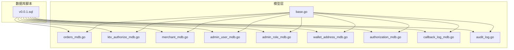
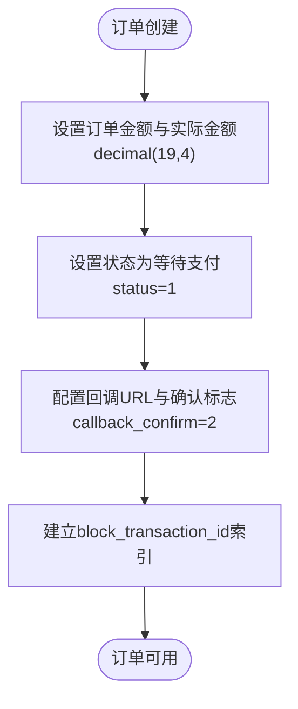
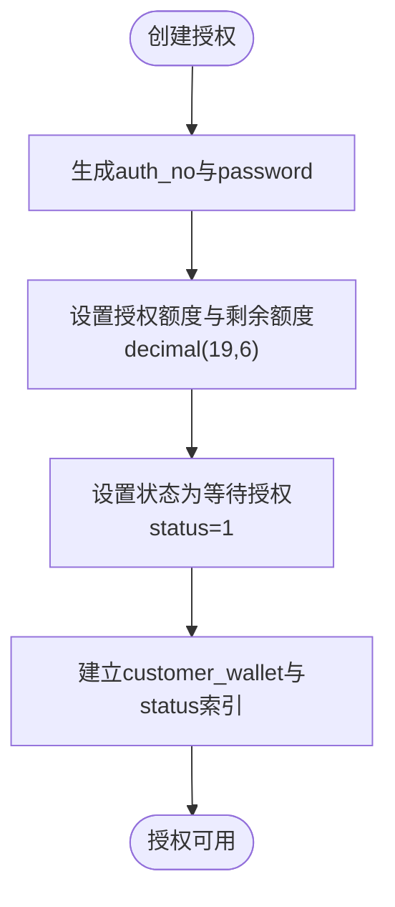
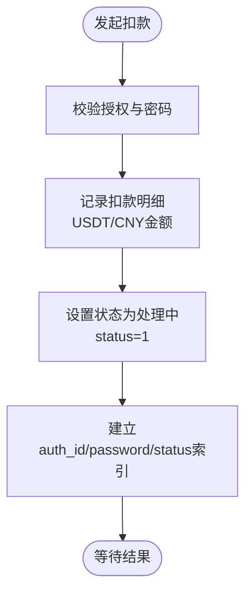
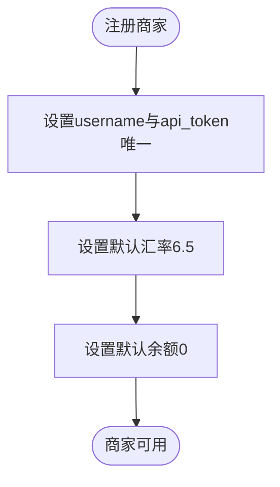
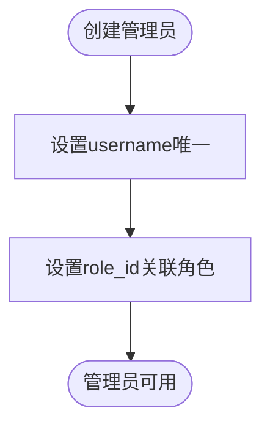
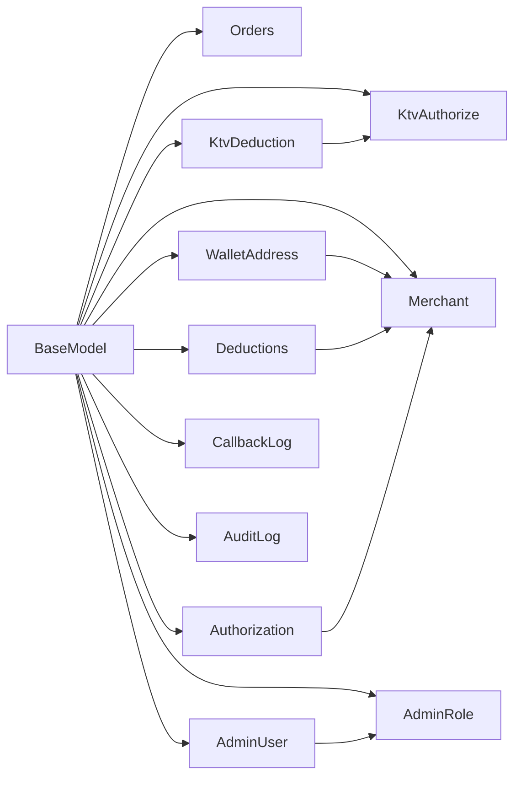

# 表结构设计

<cite>
**本文档引用的文件**
- [v0.0.1.sql](file://EPUSDT/sql/v0.0.1.sql)
- [orders_mdb.go](file://EPUSDT/src/model/mdb/orders_mdb.go)
- [ktv_authorize_mdb.go](file://EPUSDT/src/model/mdb/ktv_authorize_mdb.go)
- [merchant_mdb.go](file://EPUSDT/src/model/mdb/merchant_mdb.go)
- [admin_user_mdb.go](file://EPUSDT/src/model/mdb/admin_user_mdb.go)
- [admin_role_mdb.go](file://EPUSDT/src/model/mdb/admin_role_mdb.go)
- [wallet_address_mdb.go](file://EPUSDT/src/model/mdb/wallet_address_mdb.go)
- [authorization_mdb.go](file://EPUSDT/src/model/mdb/authorization_mdb.go)
- [callback_log_mdb.go](file://EPUSDT/src/model/mdb/callback_log_mdb.go)
- [audit_log.go](file://EPUSDT/src/model/mdb/audit_log.go)
- [base.go](file://EPUSDT/src/model/mdb/base.go)
</cite>

## 目录
1. [简介](#简介)
2. [项目结构](#项目结构)
3. [核心组件](#核心组件)
4. [架构总览](#架构总览)
5. [详细组件分析](#详细组件分析)
6. [依赖分析](#依赖分析)
7. [性能考虑](#性能考虑)
8. [故障排查指南](#故障排查指南)
9. [结论](#结论)

## 简介
本文件面向EPUSDT项目，提供核心业务表的完整结构设计与说明，覆盖orders订单表、ktv_authorizes授权表、ktv_deductions扣款表、merchants商家表、admin_users管理员表等关键表。内容包括字段定义、数据类型、约束条件、索引设计、主外键关系、唯一约束、默认值、业务含义及取值范围，并给出表创建语句的详细注释与字段说明。

## 项目结构
EPUSDT后端采用Go语言与GORM ORM框架，数据库初始化脚本位于sql目录，模型定义位于src/model/mdb目录。各表通过GORM标签映射到数据库表，统一继承BaseModel以支持软删除与时间戳。



**图表来源**
- [v0.0.1.sql](file://EPUSDT/sql/v0.0.1.sql#L1-L243)
- [orders_mdb.go](file://EPUSDT/src/model/mdb/orders_mdb.go#L1-L31)
- [ktv_authorize_mdb.go](file://EPUSDT/src/model/mdb/ktv_authorize_mdb.go#L1-L59)
- [merchant_mdb.go](file://EPUSDT/src/model/mdb/merchant_mdb.go#L1-L21)
- [admin_user_mdb.go](file://EPUSDT/src/model/mdb/admin_user_mdb.go#L1-L15)
- [admin_role_mdb.go](file://EPUSDT/src/model/mdb/admin_role_mdb.go#L1-L12)
- [wallet_address_mdb.go](file://EPUSDT/src/model/mdb/wallet_address_mdb.go#L1-L22)
- [authorization_mdb.go](file://EPUSDT/src/model/mdb/authorization_mdb.go#L1-L66)
- [callback_log_mdb.go](file://EPUSDT/src/model/mdb/callback_log_mdb.go#L1-L19)
- [audit_log.go](file://EPUSDT/src/model/mdb/audit_log.go#L1-L41)
- [base.go](file://EPUSDT/src/model/mdb/base.go#L1-L14)

**章节来源**
- [v0.0.1.sql](file://EPUSDT/sql/v0.0.1.sql#L1-L243)
- [base.go](file://EPUSDT/src/model/mdb/base.go#L1-L14)

## 核心组件
本节对核心业务表进行逐项说明，结合SQL脚本与GORM模型，明确字段、类型、约束、索引与默认值。

- orders 订单表
  - 主键：id（自增）
  - 唯一索引：order_id、trade_id
  - 普通索引：block_transaction_id
  - 字段要点：amount与actual_amount均为保留4位小数的十进制；status取值1/2/3分别表示等待支付/支付成功/已过期；回调相关字段包含通知URL、同步回调URL、回调次数与确认标志。
  - 默认值：callback_num默认0，callback_confirm默认2（未确认）。
  - 业务含义：记录客户发起的支付订单，支持多链钱包地址绑定与异步回调。

- ktv_authorizes 授权表
  - 主键：id（自增）
  - 唯一索引：auth_no、password
  - 普通索引：customer_wallet、status
  - 字段要点：授权额度、已用额度、剩余额度均保留6位小数；status涵盖等待授权、授权有效、已撤销、额度用尽等状态；新增链标识字段与TRON默认值；新增加密存储字段（加密密码、nonce、salt）。
  - 默认值：status默认1，used_usdt默认0。
  - 业务含义：记录KTV场景下的客户授权支付，支持按密码凭证与授权编号查询。

- ktv_deductions 扣款表
  - 主键：id（自增）
  - 唯一索引：deduct_no
  - 普通索引：auth_id、password、status
  - 字段要点：扣款金额同时记录USDT与CNY；状态含处理中、成功、失败；fail_reason记录失败原因；operator_id记录操作员；deduct_time记录扣款时间戳。
  - 默认值：status默认1。
  - 业务含义：记录每次基于授权的扣款明细，支持按授权ID与密码查询。

- merchants 商家表
  - 主键：id（自增）
  - 唯一索引：username、api_token
  - 普通索引：wallet_token、status
  - 字段要点：usdt_rate默认6.5；balance默认0；api_token用于接口鉴权；username唯一；wallet_token关联钱包地址。
  - 默认值：status默认1，usdt_rate默认6.5，balance默认0。
  - 业务含义：记录接入商家信息，支撑汇率与余额管理。

- admin_users 管理员表
  - 主键：id（自增）
  - 唯一索引：username
  - 普通索引：role_id
  - 字段要点：username唯一；role_id关联角色；status默认1启用。
  - 默认值：status默认1。
  - 业务含义：记录后台管理员账户，支持角色关联。

- admin_roles 角色表
  - 主键：id（自增）
  - 唯一索引：name
  - 字段要点：name唯一；用于标识角色。
  - 业务含义：记录管理员角色，当前版本不涉及细粒度权限控制。

- wallet_address 钱包表
  - 主键：id（自增）
  - 普通索引：token
  - 字段要点：token唯一索引；status默认1启用；merchant_id关联商家；chain默认BSC；chain_id对应链ID。
  - 默认值：status默认1，chain默认BSC。
  - 业务含义：记录商家的钱包地址与链信息，支持按token查询。

- authorizations 授权表（扩展）
  - 主键：id（自增）
  - 唯一索引：auth_no
  - 普通索引：merchant_id、customer_wallet
  - 字段要点：新增merchant_id外键关联；chain默认BSC；新增contract_address、chain_id、reference、qr_content等字段。
  - 默认值：status默认1。
  - 业务含义：通用授权表，支持多链与QR码授权流程。

- deductions 扣款表（扩展）
  - 主键：id（自增）
  - 唯一索引：deduct_no
  - 普通索引：auth_id、merchant_id
  - 字段要点：新增merchant_id外键；其余字段与ktv_deductions一致。
  - 默认值：status默认1。
  - 业务含义：通用扣款表，支持多链与多商家场景。

- callback_logs 回调日志表
  - 主键：id（自增）
  - 普通索引：trade_id、success
  - 字段要点：记录订单回调请求与响应、状态码、重试次数、成功标记与错误信息。
  - 默认值：retry_count默认0，success默认2（失败）。
  - 业务含义：记录异步回调执行情况，便于重试与审计。

- audit_logs 审计日志表
  - 主键：id（自增）
  - 普通索引：event_type、auth_no、customer_wallet、timestamp
  - 字段要点：事件类型枚举化；记录授权与扣款关键事件；支持按时间戳排序。
  - 业务含义：安全审计与合规追踪，记录关键操作与异常。

**章节来源**
- [v0.0.1.sql](file://EPUSDT/sql/v0.0.1.sql#L1-L243)
- [orders_mdb.go](file://EPUSDT/src/model/mdb/orders_mdb.go#L1-L31)
- [ktv_authorize_mdb.go](file://EPUSDT/src/model/mdb/ktv_authorize_mdb.go#L1-L59)
- [merchant_mdb.go](file://EPUSDT/src/model/mdb/merchant_mdb.go#L1-L21)
- [admin_user_mdb.go](file://EPUSDT/src/model/mdb/admin_user_mdb.go#L1-L15)
- [admin_role_mdb.go](file://EPUSDT/src/model/mdb/admin_role_mdb.go#L1-L12)
- [wallet_address_mdb.go](file://EPUSDT/src/model/mdb/wallet_address_mdb.go#L1-L22)
- [authorization_mdb.go](file://EPUSDT/src/model/mdb/authorization_mdb.go#L1-L66)
- [callback_log_mdb.go](file://EPUSDT/src/model/mdb/callback_log_mdb.go#L1-L19)
- [audit_log.go](file://EPUSDT/src/model/mdb/audit_log.go#L1-L41)

## 架构总览
下图展示核心表之间的逻辑关系与约束：

```mermaid
erDiagram
ORDERS {
int id PK
varchar trade_id UK
varchar order_id UK
varchar block_transaction_id IDX
decimal amount
decimal actual_amount
varchar token
int status
varchar notify_url
varchar redirect_url
int callback_num
int callback_confirm
timestamp created_at
timestamp updated_at
timestamp deleted_at
}
KTV_AUTHORIZE {
int id PK
varchar auth_no UK
varchar password UK
blob encrypted_password
binary password_nonce
binary password_salt
varchar customer_wallet IDX
varchar merchant_wallet
varchar chain
decimal authorized_usdt
decimal used_usdt
decimal remaining_usdt
int status
varchar table_no
varchar customer_name
varchar tx_hash
bigint authorize_time
bigint expire_time
varchar remark
timestamp created_at
timestamp updated_at
timestamp deleted_at
}
KTV_DEDUCTION {
int id PK
varchar deduct_no UK
bigint auth_id IDX
varchar auth_no
varchar password
decimal amount_usdt
decimal amount_cny
varchar tx_hash
int status
varchar fail_reason
varchar product_info
varchar operator_id
bigint deduct_time
timestamp created_at
timestamp updated_at
timestamp deleted_at
}
MERCHANTS {
int id PK
varchar username UK
varchar password_hash
varchar email
varchar merchant_name
varchar wallet_token
int status
varchar api_token UK
decimal usdt_rate
decimal balance
bigint last_login_at
timestamp created_at
timestamp updated_at
timestamp deleted_at
}
ADMIN_USERS {
int id PK
varchar username UK
varchar password_hash
int role_id
int status
timestamp created_at
timestamp updated_at
timestamp deleted_at
}
ADMIN_ROLES {
int id PK
varchar name UK
timestamp created_at
timestamp updated_at
timestamp deleted_at
}
WALLET_ADDRESS {
int id PK
varchar token
varchar chain
bigint chain_id
bigint merchant_id
int status
timestamp created_at
timestamp updated_at
timestamp deleted_at
}
AUTHORIZE {
int id PK
varchar auth_no UK
bigint merchant_id IDX
varchar customer_wallet IDX
varchar merchant_wallet
varchar chain
bigint chain_id
varchar contract_address
decimal authorized_usdt
decimal used_usdt
decimal remaining_usdt
int status
varchar reference
varchar customer_name
varchar tx_hash
bigint authorize_time
bigint expire_time
varchar qr_content
timestamp created_at
timestamp updated_at
timestamp deleted_at
}
DEDUCTIONS {
int id PK
varchar deduct_no UK
bigint auth_id IDX
varchar auth_no
bigint merchant_id IDX
decimal amount_usdt
decimal amount_cny
varchar tx_hash
int status
varchar fail_reason
varchar product_info
varchar operator_id
bigint deduct_time
timestamp created_at
timestamp updated_at
timestamp deleted_at
}
CALLBACK_LOGS {
int id PK
varchar trade_id IDX
varchar order_id IDX
varchar notify_url
text request_body
text response_body
int status_code
int success
varchar error_message
timestamp created_at
timestamp updated_at
timestamp deleted_at
}
AUDIT_LOGS {
bigint id PK
varchar event_type IDX
varchar auth_no IDX
varchar customer_wallet IDX
varchar operator_id
varchar ip_address
varchar user_agent
text request_data
int response_status
varchar error_message
bigint timestamp IDX
varchar tx_hash
timestamp created_at
}
ORDERS ||--o{ KTV_DEDUCTION : "通过auth_no/密码关联"
KTV_AUTHORIZE ||--o{ KTV_DEDUCTION : "通过auth_id关联"
MERCHANTS ||--o{ WALLET_ADDRESS : "通过merchant_id关联"
ADMIN_USERS }o--|| ADMIN_ROLES : "通过role_id关联"
AUTHORIZE ||--o{ DEDUCTIONS : "通过auth_id关联"
MERCHANTS ||--o{ AUTHORIZE : "通过merchant_id关联"
```

**图表来源**
- [v0.0.1.sql](file://EPUSDT/sql/v0.0.1.sql#L1-L243)
- [orders_mdb.go](file://EPUSDT/src/model/mdb/orders_mdb.go#L1-L31)
- [ktv_authorize_mdb.go](file://EPUSDT/src/model/mdb/ktv_authorize_mdb.go#L1-L59)
- [merchant_mdb.go](file://EPUSDT/src/model/mdb/merchant_mdb.go#L1-L21)
- [admin_user_mdb.go](file://EPUSDT/src/model/mdb/admin_user_mdb.go#L1-L15)
- [admin_role_mdb.go](file://EPUSDT/src/model/mdb/admin_role_mdb.go#L1-L12)
- [wallet_address_mdb.go](file://EPUSDT/src/model/mdb/wallet_address_mdb.go#L1-L22)
- [authorization_mdb.go](file://EPUSDT/src/model/mdb/authorization_mdb.go#L1-L66)
- [callback_log_mdb.go](file://EPUSDT/src/model/mdb/callback_log_mdb.go#L1-L19)
- [audit_log.go](file://EPUSDT/src/model/mdb/audit_log.go#L1-L41)

## 详细组件分析

### orders 订单表
- 字段与约束
  - 主键：id（自增）
  - 唯一索引：order_id、trade_id
  - 普通索引：block_transaction_id
  - 默认值：callback_num默认0，callback_confirm默认2
- 数据类型与精度
  - amount/actual_amount：decimal(19,4)，支持最多19位数字，4位小数
- 业务含义
  - 记录客户支付订单，支持多链钱包绑定与异步回调
- 取值范围
  - status：1（等待支付）、2（支付成功）、3（已过期）



**图表来源**
- [v0.0.1.sql](file://EPUSDT/sql/v0.0.1.sql#L2-L24)
- [orders_mdb.go](file://EPUSDT/src/model/mdb/orders_mdb.go#L11-L25)

**章节来源**
- [v0.0.1.sql](file://EPUSDT/sql/v0.0.1.sql#L2-L24)
- [orders_mdb.go](file://EPUSDT/src/model/mdb/orders_mdb.go#L1-L31)

### ktv_authorizes 授权表
- 字段与约束
  - 主键：id（自增）
  - 唯一索引：auth_no、password
  - 普通索引：customer_wallet、status
  - 默认值：status默认1，used_usdt默认0
- 数据类型与精度
  - authorized_usdt/used_usdt/remaining_usdt：decimal(19,6)
- 业务含义
  - KTV场景下的客户授权支付，支持密码凭证与加密存储字段
- 取值范围
  - status：1（等待授权）、2（授权有效）、3（已撤销）、4（额度用尽）、5（已过期）



**图表来源**
- [v0.0.1.sql](file://EPUSDT/sql/v0.0.1.sql#L46-L76)
- [ktv_authorize_mdb.go](file://EPUSDT/src/model/mdb/ktv_authorize_mdb.go#L13-L33)

**章节来源**
- [v0.0.1.sql](file://EPUSDT/sql/v0.0.1.sql#L46-L76)
- [ktv_authorize_mdb.go](file://EPUSDT/src/model/mdb/ktv_authorize_mdb.go#L1-L59)

### ktv_deductions 扣款表
- 字段与约束
  - 主键：id（自增）
  - 唯一索引：deduct_no
  - 普通索引：auth_id、password、status
  - 默认值：status默认1
- 数据类型与精度
  - amount_usdt/amount_cny：decimal(19,6)/(19,2)
- 业务含义
  - 记录每次基于授权的扣款明细，支持失败原因与操作员记录
- 取值范围
  - status：1（处理中）、2（成功）、3（失败）



**图表来源**
- [v0.0.1.sql](file://EPUSDT/sql/v0.0.1.sql#L85-L116)
- [ktv_authorize_mdb.go](file://EPUSDT/src/model/mdb/ktv_authorize_mdb.go#L39-L58)

**章节来源**
- [v0.0.1.sql](file://EPUSDT/sql/v0.0.1.sql#L85-L116)
- [ktv_authorize_mdb.go](file://EPUSDT/src/model/mdb/ktv_authorize_mdb.go#L39-L58)

### merchants 商家表
- 字段与约束
  - 主键：id（自增）
  - 唯一索引：username、api_token
  - 普通索引：wallet_token、status
  - 默认值：status默认1，usdt_rate默认6.5，balance默认0
- 数据类型与精度
  - usdt_rate：decimal(10,4)，balance：decimal(19,6)
- 业务含义
  - 记录接入商家信息，支撑汇率与余额管理
- 取值范围
  - status：1（启用）、2（禁用）



**图表来源**
- [v0.0.1.sql](file://EPUSDT/sql/v0.0.1.sql#L181-L210)
- [merchant_mdb.go](file://EPUSDT/src/model/mdb/merchant_mdb.go#L4-L16)

**章节来源**
- [v0.0.1.sql](file://EPUSDT/sql/v0.0.1.sql#L181-L210)
- [merchant_mdb.go](file://EPUSDT/src/model/mdb/merchant_mdb.go#L1-L21)

### admin_users 管理员表
- 字段与约束
  - 主键：id（自增）
  - 唯一索引：username
  - 普通索引：role_id
  - 默认值：status默认1
- 业务含义
  - 记录后台管理员账户，支持角色关联
- 取值范围
  - status：1（启用）、2（禁用）



**图表来源**
- [v0.0.1.sql](file://EPUSDT/sql/v0.0.1.sql#L134-L152)
- [admin_user_mdb.go](file://EPUSDT/src/model/mdb/admin_user_mdb.go#L4-L10)

**章节来源**
- [v0.0.1.sql](file://EPUSDT/sql/v0.0.1.sql#L134-L152)
- [admin_user_mdb.go](file://EPUSDT/src/model/mdb/admin_user_mdb.go#L1-L15)

### admin_roles 角色表
- 字段与约束
  - 主键：id（自增）
  - 唯一索引：name
- 业务含义
  - 记录管理员角色，当前版本不涉及细粒度权限控制

**章节来源**
- [v0.0.1.sql](file://EPUSDT/sql/v0.0.1.sql#L119-L131)
- [admin_role_mdb.go](file://EPUSDT/src/model/mdb/admin_role_mdb.go#L1-L12)

### wallet_address 钱包表
- 字段与约束
  - 主键：id（自增）
  - 普通索引：token
  - 默认值：status默认1，chain默认BSC
- 业务含义
  - 记录商家的钱包地址与链信息，支持按token查询
- 取值范围
  - status：1（启用）、2（禁用）

**章节来源**
- [v0.0.1.sql](file://EPUSDT/sql/v0.0.1.sql#L30-L44)
- [wallet_address_mdb.go](file://EPUSDT/src/model/mdb/wallet_address_mdb.go#L9-L16)

### callback_logs 回调日志表
- 字段与约束
  - 主键：id（自增）
  - 普通索引：trade_id、success
  - 默认值：retry_count默认0，success默认2（失败）
- 业务含义
  - 记录异步回调执行情况，便于重试与审计

**章节来源**
- [v0.0.1.sql](file://EPUSDT/sql/v0.0.1.sql#L155-L178)
- [callback_log_mdb.go](file://EPUSDT/src/model/mdb/callback_log_mdb.go#L4-L14)

### audit_logs 审计日志表
- 字段与约束
  - 主键：id（自增）
  - 普通索引：event_type、auth_no、customer_wallet、timestamp
- 业务含义
  - 安全审计与合规追踪，记录关键操作与异常

**章节来源**
- [v0.0.1.sql](file://EPUSDT/sql/v0.0.1.sql#L213-L242)
- [audit_log.go](file://EPUSDT/src/model/mdb/audit_log.go#L6-L20)

## 依赖分析
- 继承关系
  - 所有模型均嵌入BaseModel，统一具备ID、CreatedAt、UpdatedAt、DeletedAt字段与软删除索引。
- 外键关系
  - 通过业务逻辑与索引实现关联，未在SQL脚本中显式声明外键约束。
  - 关键关联点：ktv_deductions.auth_id → ktv_authorizes.id；ktv_deductions.password → ktv_authorizes.password；merchants.id → wallet_address.merchant_id；admin_users.role_id → admin_roles.id；deductions.merchant_id → merchants.id；authorizations.merchant_id → merchants.id。
- 耦合与内聚
  - 表间通过唯一索引与普通索引实现松耦合关联，便于独立扩展与查询优化。



**图表来源**
- [base.go](file://EPUSDT/src/model/mdb/base.go#L8-L13)
- [orders_mdb.go](file://EPUSDT/src/model/mdb/orders_mdb.go#L24-L25)
- [ktv_authorize_mdb.go](file://EPUSDT/src/model/mdb/ktv_authorize_mdb.go#L32-L33)
- [merchant_mdb.go](file://EPUSDT/src/model/mdb/merchant_mdb.go#L15-L16)
- [admin_user_mdb.go](file://EPUSDT/src/model/mdb/admin_user_mdb.go#L9-L10)
- [admin_role_mdb.go](file://EPUSDT/src/model/mdb/admin_role_mdb.go#L7-L7)
- [wallet_address_mdb.go](file://EPUSDT/src/model/mdb/wallet_address_mdb.go#L16-L16)
- [authorization_mdb.go](file://EPUSDT/src/model/mdb/authorization_mdb.go#L40-L40)
- [callback_log_mdb.go](file://EPUSDT/src/model/mdb/callback_log_mdb.go#L14-L14)
- [audit_log.go](file://EPUSDT/src/model/mdb/audit_log.go#L20-L20)

**章节来源**
- [base.go](file://EPUSDT/src/model/mdb/base.go#L1-L14)
- [ktv_authorize_mdb.go](file://EPUSDT/src/model/mdb/ktv_authorize_mdb.go#L1-L59)
- [merchant_mdb.go](file://EPUSDT/src/model/mdb/merchant_mdb.go#L1-L21)
- [admin_user_mdb.go](file://EPUSDT/src/model/mdb/admin_user_mdb.go#L1-L15)
- [authorization_mdb.go](file://EPUSDT/src/model/mdb/authorization_mdb.go#L1-L66)

## 性能考虑
- 索引策略
  - orders：block_transaction_id索引有利于区块链交易哈希检索；order_id与trade_id唯一索引保证幂等性。
  - ktv_authorizes：customer_wallet与status索引提升授权查询与状态筛选效率。
  - ktv_deductions：auth_id、password、status索引支持按授权与状态高效检索。
  - merchants：wallet_token与status索引支持钱包与状态查询。
  - callback_logs：trade_id与success索引便于回调重试与统计。
  - audit_logs：多维度索引支持审计事件的快速检索。
- 数据类型选择
  - 货币金额采用decimal类型并设置合适精度，避免浮点误差。
- 默认值与空值
  - 合理设置默认值减少NULL值带来的查询复杂度与索引失效风险。

## 故障排查指南
- 回调失败
  - 检查callback_logs表中对应trade_id的success标记与error_message，结合重试次数判断问题根因。
- 授权状态异常
  - 核对ktv_authorizes表中status字段与expire_time，确认授权是否过期或被撤销。
- 扣款失败
  - 查看ktv_deductions表中fail_reason与status，定位失败原因并重试。
- 审计追踪
  - 使用audit_logs表按event_type与auth_no检索关键事件，核对时间戳与交易哈希。

**章节来源**
- [callback_log_mdb.go](file://EPUSDT/src/model/mdb/callback_log_mdb.go#L4-L14)
- [ktv_authorize_mdb.go](file://EPUSDT/src/model/mdb/ktv_authorize_mdb.go#L13-L33)
- [ktv_authorize_mdb.go](file://EPUSDT/src/model/mdb/ktv_authorize_mdb.go#L39-L58)
- [audit_log.go](file://EPUSDT/src/model/mdb/audit_log.go#L6-L20)

## 结论
本文档基于SQL脚本与GORM模型，系统梳理了EPUSDT核心业务表的结构设计，明确了字段定义、数据类型、约束条件、索引设计与默认值，并给出了表间关联关系与性能优化建议。建议在后续迭代中补充显式外键约束与级联策略，以进一步增强数据一致性与可维护性。