# MVVM架构设计

<cite>
**本文档引用的文件**
- [AuthViewModel.swift](file://EPUSDT/ios手机系统/EpusdtPay/ViewModels/AuthViewModel.swift)
- [PaymentViewModel.swift](file://EPUSDT/ios手机系统/EpusdtPay/ViewModels/PaymentViewModel.swift)
- [WalletViewModel.swift](file://EPUSDT/ios手机系统/EpusdtPay/ViewModels/WalletViewModel.swift)
- [MerchantViewModel.swift](file://EPUSDT/ios手机系统/EpusdtPay/EpusdtPay/EpusdtPay/ViewModels/MerchantViewModel.swift)
- [User.swift](file://EPUSDT/ios手机系统/EpusdtPay/Models/User.swift)
- [APIService.swift](file://EPUSDT/ios手机系统/EpusdtPay/Services/APIService.swift)
- [KeychainService.swift](file://EPUSDT/ios手机系统/EpusdtPay/Services/KeychainService.swift)
- [Constants.swift](file://EPUSDT/ios手机系统/EpusdtPay/Utilities/Constants.swift)
- [LoginView.swift](file://EPUSDT/ios手机系统/EpusdtPay/Views/Authentication/LoginView.swift)
- [TabBarView.swift](file://EPUSDT/ios手机系统/EpusdtPay/Views/Common/TabBarView.swift)
- [EpusdtPayApp.swift](file://EPUSDT/ios手机系统/EpusdtPay/App/EpusdtPayApp.swift)
</cite>

## 目录
1. [简介](#简介)
2. [项目结构](#项目结构)
3. [核心组件](#核心组件)
4. [架构概览](#架构概览)
5. [详细组件分析](#详细组件分析)
6. [依赖关系分析](#依赖关系分析)
7. [性能考虑](#性能考虑)
8. [故障排除指南](#故障排除指南)
9. [结论](#结论)

## 简介

EPUSDT iOS应用采用MVVM（Model-View-ViewModel）架构模式，实现了清晰的关注点分离和可维护的代码结构。该架构通过视图模型管理业务逻辑和状态，实现视图与业务逻辑的完全解耦。

MVVM架构的核心优势：
- **关注点分离**：视图仅负责UI渲染，业务逻辑集中在视图模型中
- **测试友好**：视图模型独立于UI框架，便于单元测试
- **代码复用**：视图模型可以在不同视图间共享
- **响应式更新**：基于Combine框架的实时数据绑定

## 项目结构

EPUSDT应用遵循SwiftUI和MVVM的最佳实践，采用清晰的分层组织：

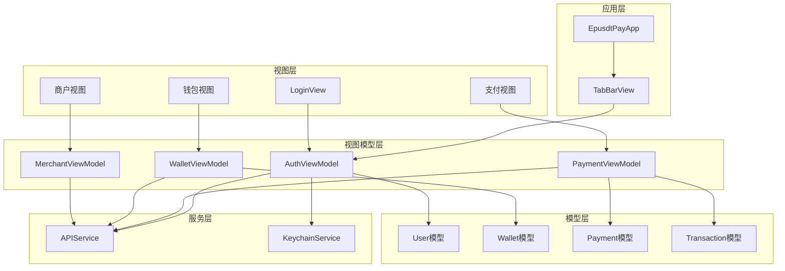

**图表来源**
- [EpusdtPayApp.swift](file://EPUSDT/ios手机系统/EpusdtPay/App/EpusdtPayApp.swift#L11-L35)
- [LoginView.swift](file://EPUSDT/ios手机系统/EpusdtPay/Views/Authentication/LoginView.swift#L10-L170)
- [TabBarView.swift](file://EPUSDT/ios手机系统/EpusdtPay/Views/Common/TabBarView.swift#L10-L61)

**章节来源**
- [EpusdtPayApp.swift](file://EPUSDT/ios手机系统/EpusdtPay/App/EpusdtPayApp.swift#L11-L35)
- [LoginView.swift](file://EPUSDT/ios手机系统/EpusdtPay/Views/Authentication/LoginView.swift#L10-L170)
- [TabBarView.swift](file://EPUSDT/ios手机系统/EpusdtPay/Views/Common/TabBarView.swift#L10-L61)

## 核心组件

### 视图模型基础架构

所有视图模型都遵循统一的设计模式，继承自ObservableObject协议，使用@Published属性实现响应式数据绑定。

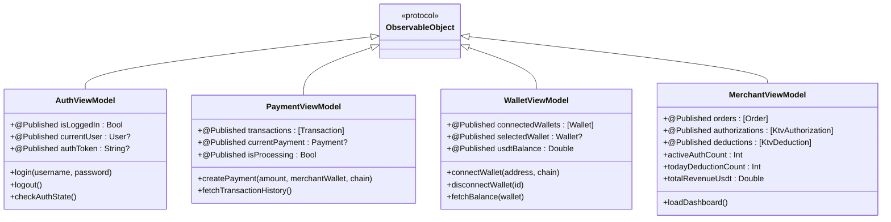

**图表来源**
- [AuthViewModel.swift](file://EPUSDT/ios手机系统/EpusdtPay/ViewModels/AuthViewModel.swift#L11-L94)
- [PaymentViewModel.swift](file://EPUSDT/ios手机系统/EpusdtPay/ViewModels/PaymentViewModel.swift#L11-L60)
- [WalletViewModel.swift](file://EPUSDT/ios手机系统/EpusdtPay/ViewModels/WalletViewModel.swift#L11-L45)
- [MerchantViewModel.swift](file://EPUSDT/ios手机系统/EpusdtPay/EpusdtPay/EpusdtPay/ViewModels/MerchantViewModel.swift#L11-L67)

### 数据模型体系

应用采用强类型的数据模型设计，确保类型安全和编译时检查：

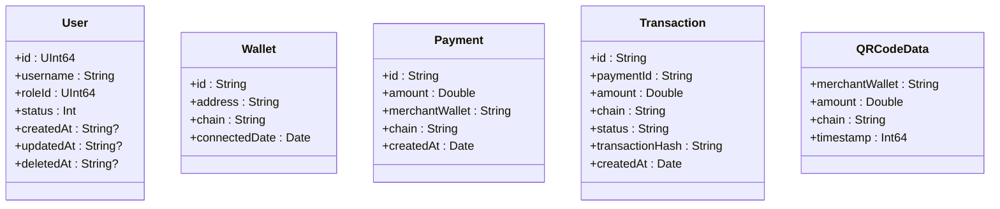

**图表来源**
- [User.swift](file://EPUSDT/ios手机系统/EpusdtPay/Models/User.swift#L10-L96)

**章节来源**
- [AuthViewModel.swift](file://EPUSDT/ios手机系统/EpusdtPay/ViewModels/AuthViewModel.swift#L11-L94)
- [PaymentViewModel.swift](file://EPUSDT/ios手机系统/EpusdtPay/ViewModels/PaymentViewModel.swift#L11-L60)
- [WalletViewModel.swift](file://EPUSDT/ios手机系统/EpusdtPay/ViewModels/WalletViewModel.swift#L11-L45)
- [MerchantViewModel.swift](file://EPUSDT/ios手机系统/EpusdtPay/EpusdtPay/EpusdtPay/ViewModels/MerchantViewModel.swift#L11-L67)
- [User.swift](file://EPUSDT/ios手机系统/EpusdtPay/Models/User.swift#L10-L96)

## 架构概览

### MVVM通信机制

EPUSDT应用实现了完整的MVVM通信管道，支持单向和双向数据流：

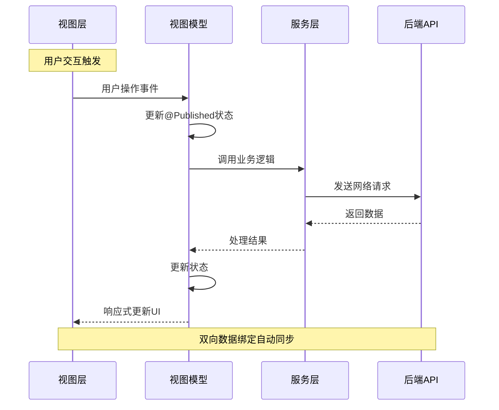

**图表来源**
- [LoginView.swift](file://EPUSDT/ios手机系统/EpusdtPay/Views/Authentication/LoginView.swift#L144-L154)
- [AuthViewModel.swift](file://EPUSDT/ios手机系统/EpusdtPay/ViewModels/AuthViewModel.swift#L21-L54)
- [APIService.swift](file://EPUSDT/ios手机系统/EpusdtPay/Services/APIService.swift#L19-L42)

### 状态管理模式

应用采用集中式状态管理，通过@Published属性实现自动响应式更新：

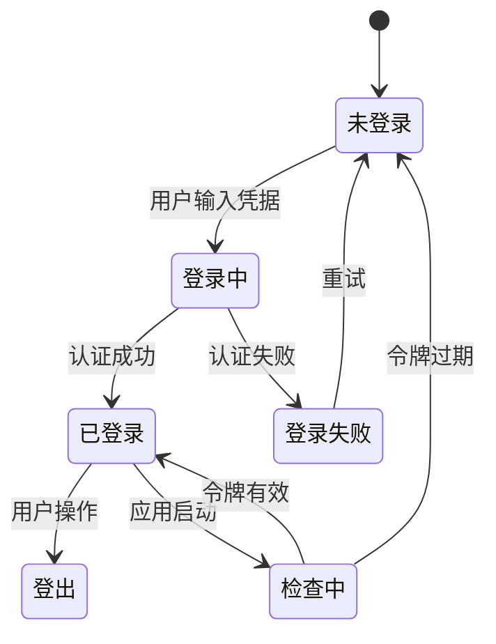

**图表来源**
- [AuthViewModel.swift](file://EPUSDT/ios手机系统/EpusdtPay/ViewModels/AuthViewModel.swift#L60-L84)

**章节来源**
- [LoginView.swift](file://EPUSDT/ios手机系统/EpusdtPay/Views/Authentication/LoginView.swift#L144-L154)
- [AuthViewModel.swift](file://EPUSDT/ios手机系统/EpusdtPay/ViewModels/AuthViewModel.swift#L21-L84)
- [APIService.swift](file://EPUSDT/ios手机系统/EpusdtPay/Services/APIService.swift#L19-L42)

## 详细组件分析

### AuthViewModel - 认证状态管理

AuthViewModel是应用的核心状态管理器，负责用户认证生命周期：

#### 主要职责
- 用户登录和登出管理
- 认证令牌存储和验证
- 用户信息缓存和同步
- 错误状态处理

#### 关键实现特性

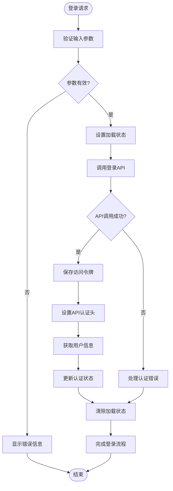

**图表来源**
- [AuthViewModel.swift](file://EPUSDT/ios手机系统/EpusdtPay/ViewModels/AuthViewModel.swift#L21-L54)

#### 安全机制
- 使用KeychainService进行安全存储
- 自动令牌过期检测
- 异步认证流程避免UI阻塞

**章节来源**
- [AuthViewModel.swift](file://EPUSDT/ios手机系统/EpusdtPay/ViewModels/AuthViewModel.swift#L11-L94)
- [KeychainService.swift](file://EPUSDT/ios手机系统/EpusdtPay/Services/KeychainService.swift#L92-L107)

### PaymentViewModel - 支付流程处理

PaymentViewModel专注于支付业务逻辑，管理交易状态和支付流程：

#### 支付状态机

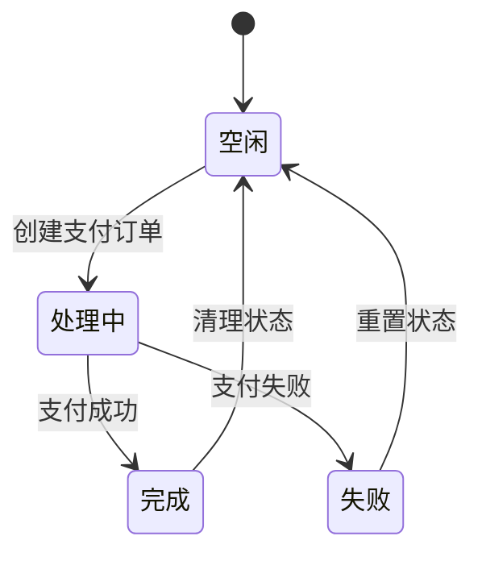

**图表来源**
- [PaymentViewModel.swift](file://EPUSDT/ios手机系统/EpusdtPay/ViewModels/PaymentViewModel.swift#L19-L24)

#### 核心功能
- 支付订单创建和管理
- 交易历史查询
- 支付状态跟踪
- 异步支付处理

**章节来源**
- [PaymentViewModel.swift](file://EPUSDT/ios手机系统/EpusdtPay/ViewModels/PaymentViewModel.swift#L11-L60)

### WalletViewModel - 钱包连接管理

WalletViewModel处理区块链钱包连接和余额查询：

#### 钱包生命周期管理

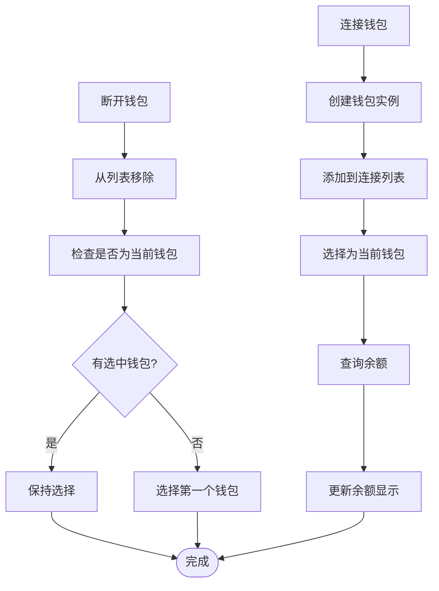

**图表来源**
- [WalletViewModel.swift](file://EPUSDT/ios手机系统/EpusdtPay/ViewModels/WalletViewModel.swift#L19-L35)

**章节来源**
- [WalletViewModel.swift](file://EPUSDT/ios手机系统/EpusdtPay/ViewModels/WalletViewModel.swift#L11-L45)

### MerchantViewModel - 商家功能管理

MerchantViewModel提供商家仪表板的数据管理和统计功能：

#### 统计计算优化

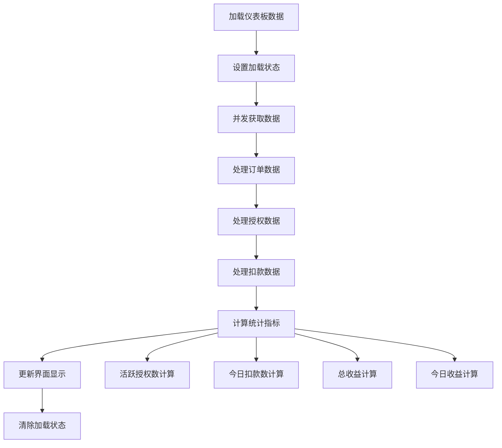

**图表来源**
- [MerchantViewModel.swift](file://EPUSDT/ios手机系统/EpusdtPay/EpusdtPay/EpusdtPay/ViewModels/MerchantViewModel.swift#L42-L66)

**章节来源**
- [MerchantViewModel.swift](file://EPUSDT/ios手机系统/EpusdtPay/EpusdtPay/EpusdtPay/ViewModels/MerchantViewModel.swift#L11-L67)

## 依赖关系分析

### 服务层依赖图

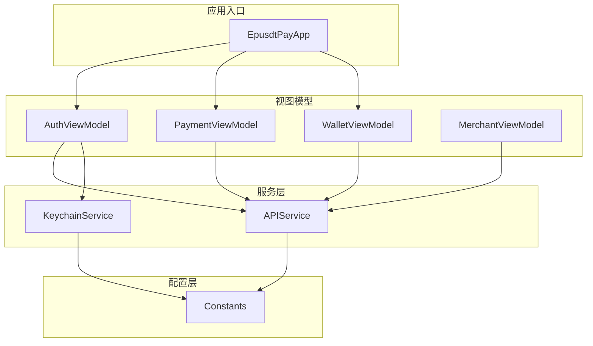

**图表来源**
- [EpusdtPayApp.swift](file://EPUSDT/ios手机系统/EpusdtPay/App/EpusdtPayApp.swift#L13-L15)
- [AuthViewModel.swift](file://EPUSDT/ios手机系统/EpusdtPay/ViewModels/AuthViewModel.swift#L18-L19)
- [APIService.swift](file://EPUSDT/ios手机系统/EpusdtPay/Services/APIService.swift#L11-L17)

### 依赖注入实现

应用采用构造函数注入和环境对象模式实现模块解耦：

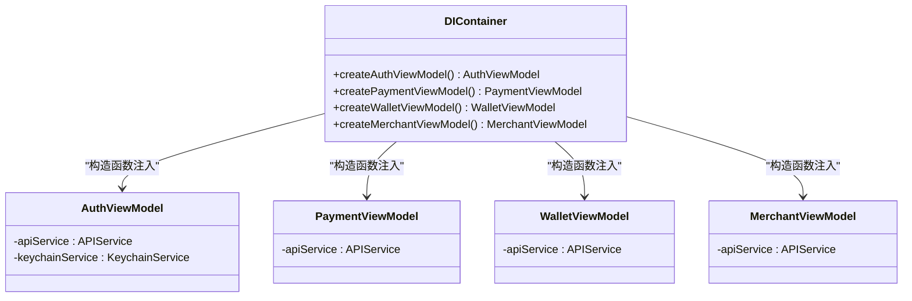

**图表来源**
- [EpusdtPayApp.swift](file://EPUSDT/ios手机系统/EpusdtPay/App/EpusdtPayApp.swift#L13-L15)
- [AuthViewModel.swift](file://EPUSDT/ios手机系统/EpusdtPay/ViewModels/AuthViewModel.swift#L18-L19)

**章节来源**
- [EpusdtPayApp.swift](file://EPUSDT/ios手机系统/EpusdtPay/App/EpusdtPayApp.swift#L13-L15)
- [Constants.swift](file://EPUSDT/ios手机系统/EpusdtPay/Utilities/Constants.swift#L11-L16)

## 性能考虑

### 响应式更新优化

应用采用Combine框架实现高效的响应式更新，避免不必要的UI重绘：

- **状态隔离**：每个视图模型管理自己的状态域
- **细粒度更新**：@Published属性提供精确的状态变更通知
- **主线程安全**：使用MainActor确保UI更新的线程安全性

### 并发处理策略

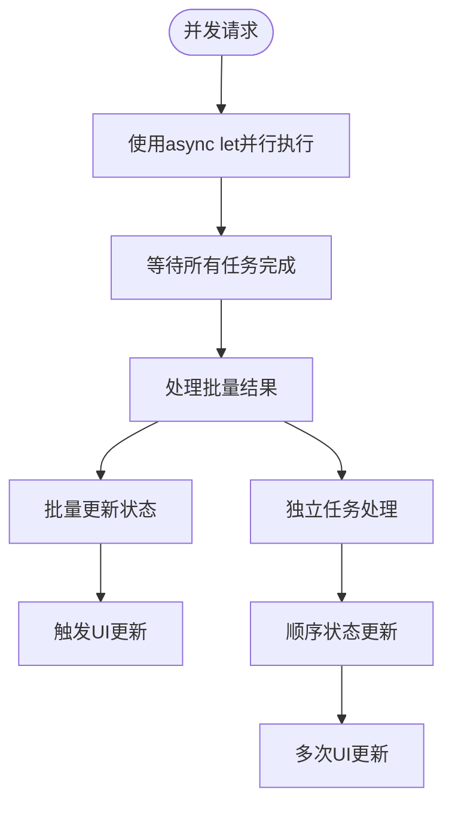

**图表来源**
- [MerchantViewModel.swift](file://EPUSDT/ios手机系统/EpusdtPay/EpusdtPay/EpusdtPay/ViewModels/MerchantViewModel.swift#L47-L51)

### 内存管理最佳实践

- **弱引用**：避免循环引用的内存泄漏
- **及时清理**：在适当时机释放不需要的对象
- **状态重置**：提供完整的状态清理方法

## 故障排除指南

### 常见认证问题

#### 登录失败排查
1. **网络连接检查**：确认设备网络连接正常
2. **API端点验证**：检查服务器地址配置
3. **令牌存储验证**：确认Keychain权限正常
4. **错误信息分析**：根据错误描述定位问题

#### 会话过期处理
- 实现自动重新登录机制
- 提供会话续期选项
- 显示友好的过期提示

**章节来源**
- [AuthViewModel.swift](file://EPUSDT/ios手机系统/EpusdtPay/ViewModels/AuthViewModel.swift#L77-L82)
- [KeychainService.swift](file://EPUSDT/ios手机系统/EpusdtPay/Services/KeychainService.swift#L142-L160)

### 支付流程问题

#### 支付超时处理
- 实现支付状态轮询机制
- 提供手动刷新选项
- 显示详细的错误信息

#### 交易历史加载
- 实现分页加载机制
- 提供加载状态指示
- 支持下拉刷新功能

### 钱包连接问题

#### 连接失败排查
1. **网络状态检查**：验证区块链节点连接
2. **钱包兼容性**：确认支持的钱包类型
3. **链配置验证**：检查网络配置正确性
4. **余额查询**：实现重试机制

## 结论

EPUSDT iOS应用的MVVM架构设计展现了现代iOS开发的最佳实践：

### 架构优势
- **清晰的职责分离**：每个组件都有明确的职责边界
- **高度的可测试性**：视图模型独立于UI框架，便于单元测试
- **优秀的可维护性**：模块化设计便于功能扩展和维护
- **强大的响应式能力**：基于Combine的实时数据绑定

### 技术亮点
- **安全的认证机制**：使用Keychain进行敏感数据存储
- **优雅的错误处理**：完善的错误状态管理和用户提示
- **高效的并发处理**：利用async/await和Combine实现高性能
- **灵活的配置管理**：统一的常量和配置管理

### 未来改进方向
- **单元测试覆盖**：增加视图模型的单元测试覆盖率
- **性能监控**：实现应用性能指标的监控和分析
- **国际化支持**：扩展多语言支持功能
- **离线模式**：实现部分功能的离线可用性

该架构为EPUSDT应用提供了坚实的技术基础，支持未来的功能扩展和性能优化需求。