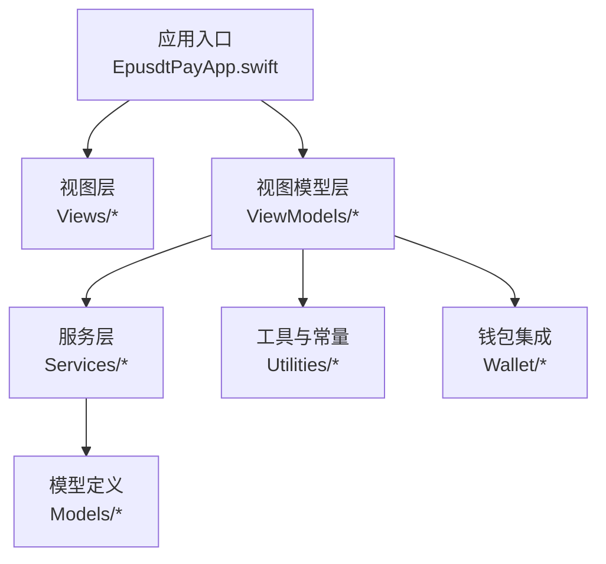
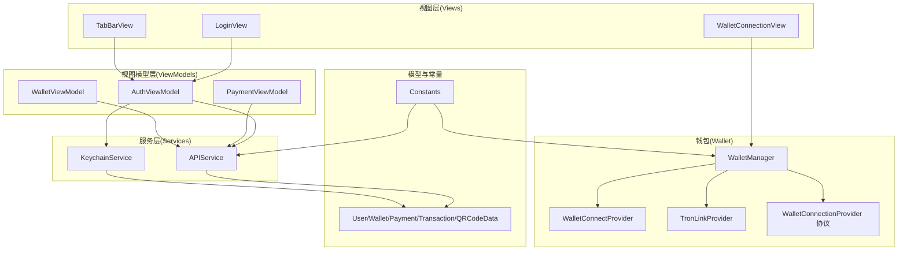
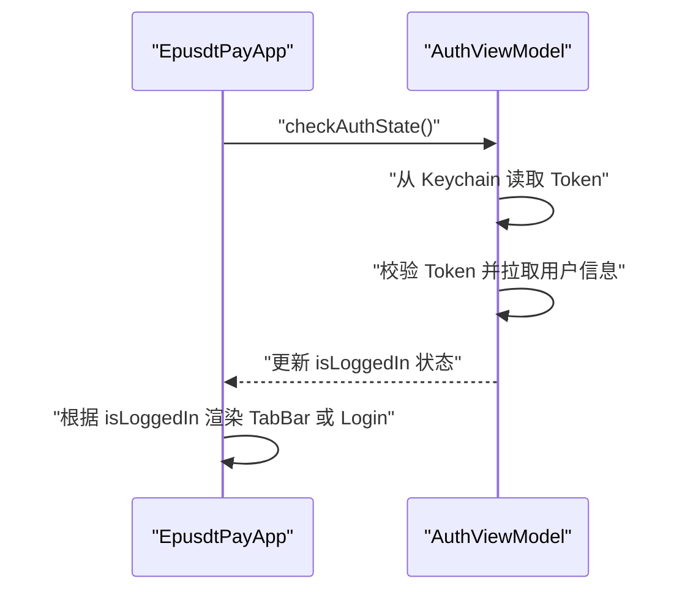
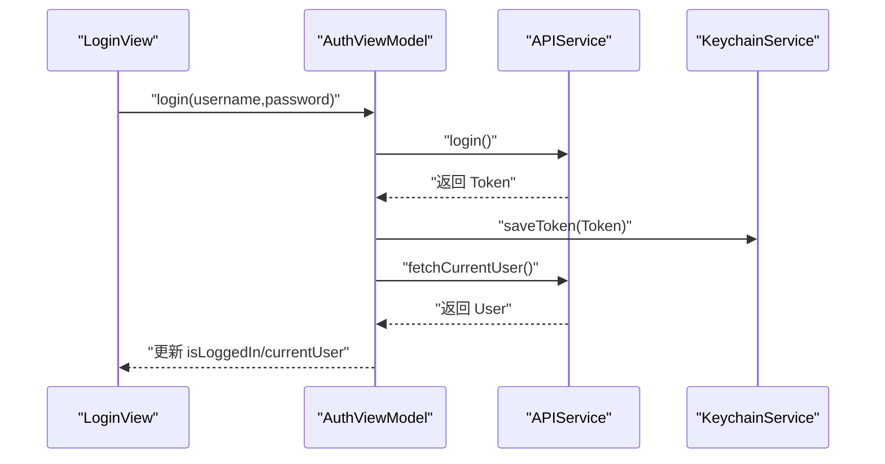
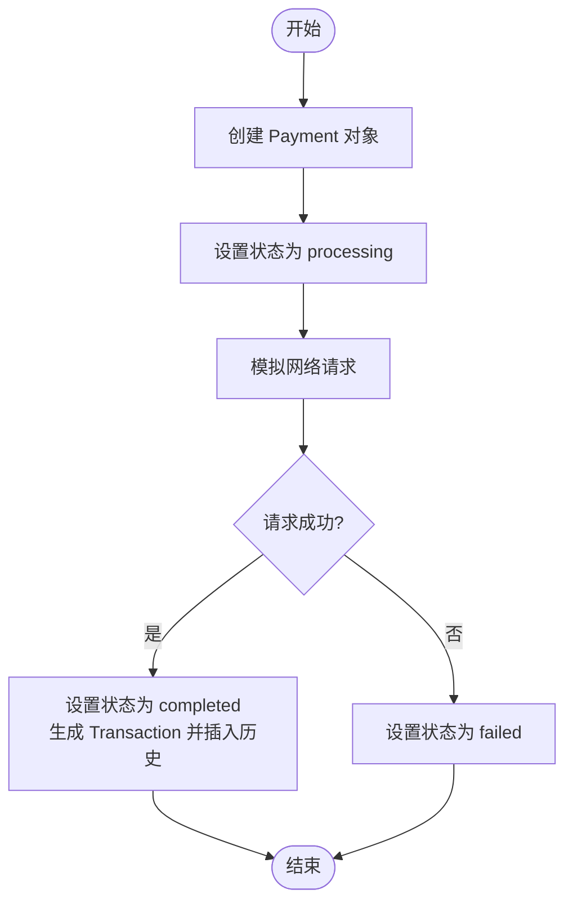
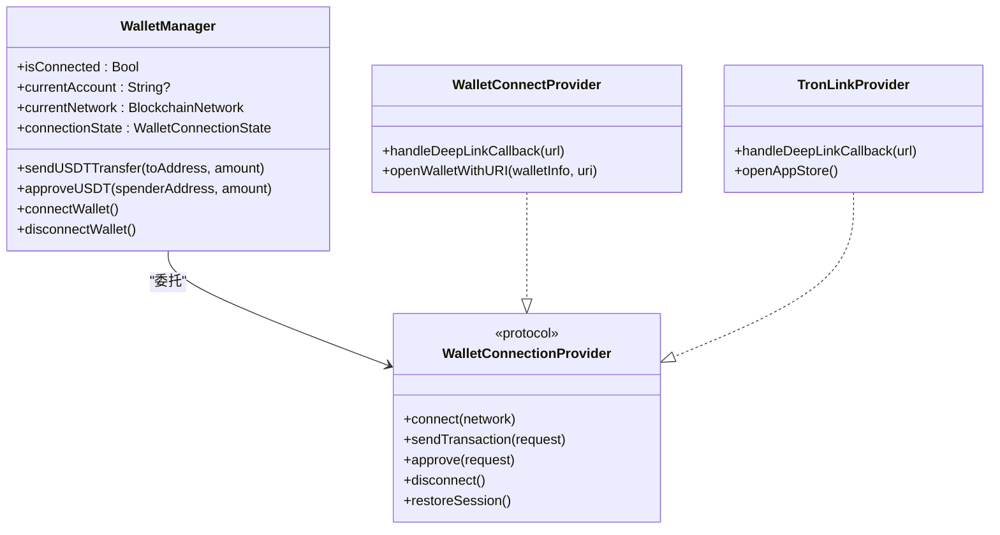
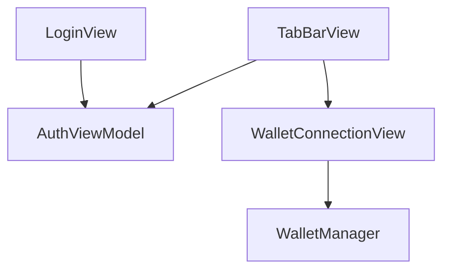
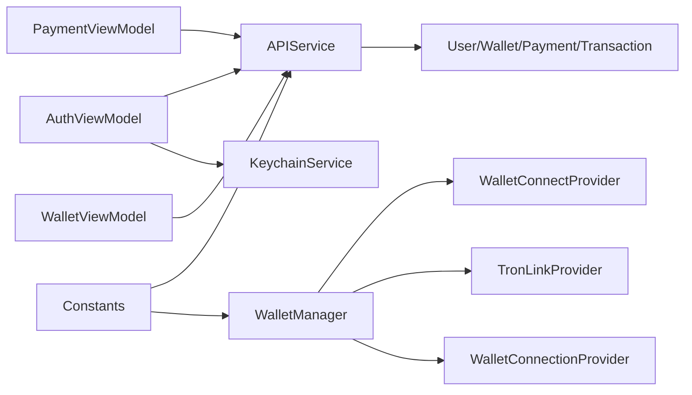
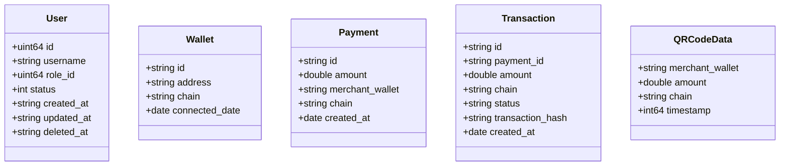

# 移动应用开发

<cite>
**本文引用的文件**
- [EpusdtPayApp.swift](file://EPUSDT/ios手机系统/EpusdtPay/App/EpusdtPayApp.swift)
- [AuthViewModel.swift](file://EPUSDT/ios手机系统/EpusdtPay/ViewModels/AuthViewModel.swift)
- [PaymentViewModel.swift](file://EPUSDT/ios手机系统/EpusdtPay/ViewModels/PaymentViewModel.swift)
- [WalletViewModel.swift](file://EPUSDT/ios手机系统/EpusdtPay/ViewModels/WalletViewModel.swift)
- [APIService.swift](file://EPUSDT/ios手机系统/EpusdtPay/Services/APIService.swift)
- [KeychainService.swift](file://EPUSDT/ios手机系统/EpusdtPay/Services/KeychainService.swift)
- [TabBarView.swift](file://EPUSDT/ios手机系统/EpusdtPay/Views/Common/TabBarView.swift)
- [LoginView.swift](file://EPUSDT/ios手机系统/EpusdtPay/Views/Authentication/LoginView.swift)
- [User.swift](file://EPUSDT/ios手机系统/EpusdtPay/Models/User.swift)
- [Constants.swift](file://EPUSDT/ios手机系统/EpusdtPay/Utilities/Constants.swift)
- [WalletManager.swift](file://EPUSDT/ios手机系统/EpusdtPay/Wallet/WalletManager.swift)
- [WalletConnectionProvider.swift](file://EPUSDT/ios手机系统/EpusdtPay/Wallet/WalletConnectionProvider.swift)
- [WalletConnectProvider.swift](file://EPUSDT/ios手机系统/EpusdtPay/Wallet/WalletConnectProvider.swift)
- [TronLinkProvider.swift](file://EPUSDT/ios手机系统/EpusdtPay/Wallet/TronLinkProvider.swift)
- [WalletConnectionView.swift](file://EPUSDT/ios手机系统/EpusdtPay/Wallet/WalletConnectionView.swift)
</cite>

## 目录
1. [简介](#简介)
2. [项目结构](#项目结构)
3. [核心组件](#核心组件)
4. [架构总览](#架构总览)
5. [详细组件分析](#详细组件分析)
6. [依赖关系分析](#依赖关系分析)
7. [性能考量](#性能考量)
8. [故障排查指南](#故障排查指南)
9. [结论](#结论)
10. [附录](#附录)

## 简介
本项目为 EPUSDT iOS 移动应用，采用 MVVM 架构，结合 SwiftUI 构建用户界面，提供多链钱包连接（EVM 兼容链与 TRON）、支付流程与用户认证能力。应用通过统一的钱包管理器抽象底层钱包提供商差异，向上层 UI 提供一致的连接、授权与交易接口；同时通过服务层封装网络请求与密钥存储，保障安全性与可维护性。

## 项目结构
应用采用按功能域划分的目录组织方式，主要模块包括：
- 应用入口与场景控制：EpusdtPayApp.swift
- 视图与视图模型：Views/ 与 ViewModels/
- 业务服务：Services/
- 模型定义：Models/
- 工具与常量：Utilities/
- 钱包集成：Wallet/

图表来源
- [EpusdtPayApp.swift](file://EPUSDT/ios手机系统/EpusdtPay/App/EpusdtPayApp.swift#L11-L35)
- [TabBarView.swift](file://EPUSDT/ios手机系统/EpusdtPay/Views/Common/TabBarView.swift#L10-L61)
- [AuthViewModel.swift](file://EPUSDT/ios手机系统/EpusdtPay/ViewModels/AuthViewModel.swift#L11-L94)
- [APIService.swift](file://EPUSDT/ios手机系统/EpusdtPay/Services/APIService.swift#L11-L125)
- [WalletManager.swift](file://EPUSDT/ios手机系统/EpusdtPay/Wallet/WalletManager.swift#L19-L76)

章节来源
- [EpusdtPayApp.swift](file://EPUSDT/ios手机系统/EpusdtPay/App/EpusdtPayApp.swift#L11-L35)
- [TabBarView.swift](file://EPUSDT/ios手机系统/EpusdtPay/Views/Common/TabBarView.swift#L10-L61)

## 核心组件
- 应用入口与场景控制：负责应用启动时的身份检查与登录态切换，注入全局视图模型并渲染主界面。
- 视图模型层：封装认证、支付、钱包管理等业务逻辑，提供状态发布与 UI 绑定。
- 服务层：统一网络请求与密钥存储，屏蔽底层细节。
- 钱包集成：统一管理 EVM 与 TRON 钱包连接，抽象交易与授权流程。
- 模型与常量：定义数据结构与配置项，保证前后端一致性与可维护性。

章节来源
- [AuthViewModel.swift](file://EPUSDT/ios手机系统/EpusdtPay/ViewModels/AuthViewModel.swift#L11-L94)
- [PaymentViewModel.swift](file://EPUSDT/ios手机系统/EpusdtPay/ViewModels/PaymentViewModel.swift#L11-L60)
- [WalletViewModel.swift](file://EPUSDT/ios手机系统/EpusdtPay/ViewModels/WalletViewModel.swift#L11-L45)
- [APIService.swift](file://EPUSDT/ios手机系统/EpusdtPay/Services/APIService.swift#L11-L125)
- [KeychainService.swift](file://EPUSDT/ios手机系统/EpusdtPay/Services/KeychainService.swift#L12-L160)
- [WalletManager.swift](file://EPUSDT/ios手机系统/EpusdtPay/Wallet/WalletManager.swift#L19-L76)
- [User.swift](file://EPUSDT/ios手机系统/EpusdtPay/Models/User.swift#L10-L81)
- [Constants.swift](file://EPUSDT/ios手机系统/EpusdtPay/Utilities/Constants.swift#L11-L152)

## 架构总览
MVVM 架构下，视图仅负责展示与用户交互，视图模型承担业务逻辑与状态管理，服务层负责网络与安全存储，模型定义数据契约，钱包模块抽象多链交互。

图表来源
- [LoginView.swift](file://EPUSDT/ios手机系统/EpusdtPay/Views/Authentication/LoginView.swift#L10-L171)
- [TabBarView.swift](file://EPUSDT/ios手机系统/EpusdtPay/Views/Common/TabBarView.swift#L10-L227)
- [WalletConnectionView.swift](file://EPUSDT/ios手机系统/EpusdtPay/Wallet/WalletConnectionView.swift#L15-L800)
- [AuthViewModel.swift](file://EPUSDT/ios手机系统/EpusdtPay/ViewModels/AuthViewModel.swift#L11-L94)
- [PaymentViewModel.swift](file://EPUSDT/ios手机系统/EpusdtPay/ViewModels/PaymentViewModel.swift#L11-L60)
- [WalletViewModel.swift](file://EPUSDT/ios手机系统/EpusdtPay/ViewModels/WalletViewModel.swift#L11-L45)
- [APIService.swift](file://EPUSDT/ios手机系统/EpusdtPay/Services/APIService.swift#L11-L125)
- [KeychainService.swift](file://EPUSDT/ios手机系统/EpusdtPay/Services/KeychainService.swift#L12-L160)
- [WalletManager.swift](file://EPUSDT/ios手机系统/EpusdtPay/Wallet/WalletManager.swift#L19-L76)
- [WalletConnectionProvider.swift](file://EPUSDT/ios手机系统/EpusdtPay/Wallet/WalletConnectionProvider.swift#L12-L417)
- [WalletConnectProvider.swift](file://EPUSDT/ios手机系统/EpusdtPay/Wallet/WalletConnectProvider.swift#L50-L607)
- [TronLinkProvider.swift](file://EPUSDT/ios手机系统/EpusdtPay/Wallet/TronLinkProvider.swift#L42-L586)
- [User.swift](file://EPUSDT/ios手机系统/EpusdtPay/Models/User.swift#L10-L81)
- [Constants.swift](file://EPUSDT/ios手机系统/EpusdtPay/Utilities/Constants.swift#L11-L152)

## 详细组件分析

### 应用入口与场景控制
- 应用启动时初始化认证、钱包与支付视图模型，并在启动时检查登录状态。
- 根据登录状态决定渲染 TabBar 主页或登录页，并注入环境对象供子视图使用。

图表来源
- [EpusdtPayApp.swift](file://EPUSDT/ios手机系统/EpusdtPay/App/EpusdtPayApp.swift#L11-L35)
- [AuthViewModel.swift](file://EPUSDT/ios手机系统/EpusdtPay/ViewModels/AuthViewModel.swift#L60-L84)

章节来源
- [EpusdtPayApp.swift](file://EPUSDT/ios手机系统/EpusdtPay/App/EpusdtPayApp.swift#L11-L35)

### 认证与用户管理
- 登录流程：输入用户名密码，调用 API 服务登录，保存 Token 至 Keychain，设置请求头，拉取用户信息并更新视图模型状态。
- 登录态检查：启动时读取 Token，验证有效性，若有效则自动进入主页。
- 注销：清空 Keychain 与请求头，重置视图模型状态。

图表来源
- [LoginView.swift](file://EPUSDT/ios手机系统/EpusdtPay/Views/Authentication/LoginView.swift#L144-L154)
- [AuthViewModel.swift](file://EPUSDT/ios手机系统/EpusdtPay/ViewModels/AuthViewModel.swift#L21-L54)
- [APIService.swift](file://EPUSDT/ios手机系统/EpusdtPay/Services/APIService.swift#L19-L42)
- [KeychainService.swift](file://EPUSDT/ios手机系统/EpusdtPay/Services/KeychainService.swift#L94-L107)

章节来源
- [AuthViewModel.swift](file://EPUSDT/ios手机系统/EpusdtPay/ViewModels/AuthViewModel.swift#L11-L94)
- [APIService.swift](file://EPUSDT/ios手机系统/EpusdtPay/Services/APIService.swift#L11-L125)
- [KeychainService.swift](file://EPUSDT/ios手机系统/EpusdtPay/Services/KeychainService.swift#L12-L160)
- [LoginView.swift](file://EPUSDT/ios手机系统/EpusdtPay/Views/Authentication/LoginView.swift#L10-L171)

### 支付处理与交易管理
- 支付流程：创建支付订单，模拟发起后端请求，完成后生成交易记录并更新历史。
- 交易历史：提供拉取交易历史的占位实现，便于后续接入真实接口。

图表来源
- [PaymentViewModel.swift](file://EPUSDT/ios手机系统/EpusdtPay/ViewModels/PaymentViewModel.swift#L26-L60)

章节来源
- [PaymentViewModel.swift](file://EPUSDT/ios手机系统/EpusdtPay/ViewModels/PaymentViewModel.swift#L11-L60)

### 钱包管理与多链交互
- 统一管理器：WalletManager 抽象 EVM 与 TRON 钱包差异，提供连接、断开、交易与授权的统一接口。
- Provider 协议：WalletConnectionProvider 定义连接、交易、授权、断开、会话恢复等能力。
- EVM 链：WalletConnectProvider 通过 WalletConnect v2 协议与 MetaMask、Trust 等兼容钱包交互。
- TRON 链：TronLinkProvider 通过 Deep Link 与 TronLink App 交互，支持 TRC20 转账与授权。
- UI 展示：WalletConnectionView 提供链选择、钱包列表、QR 码展示、连接状态与错误提示。

图表来源
- [WalletManager.swift](file://EPUSDT/ios手机系统/EpusdtPay/Wallet/WalletManager.swift#L19-L438)
- [WalletConnectionProvider.swift](file://EPUSDT/ios手机系统/EpusdtPay/Wallet/WalletConnectionProvider.swift#L269-L300)
- [WalletConnectProvider.swift](file://EPUSDT/ios手机系统/EpusdtPay/Wallet/WalletConnectProvider.swift#L50-L607)
- [TronLinkProvider.swift](file://EPUSDT/ios手机系统/EpusdtPay/Wallet/TronLinkProvider.swift#L42-L586)

章节来源
- [WalletManager.swift](file://EPUSDT/ios手机系统/EpusdtPay/Wallet/WalletManager.swift#L19-L438)
- [WalletConnectionProvider.swift](file://EPUSDT/ios手机系统/EpusdtPay/Wallet/WalletConnectionProvider.swift#L12-L417)
- [WalletConnectProvider.swift](file://EPUSDT/ios手机系统/EpusdtPay/Wallet/WalletConnectProvider.swift#L50-L607)
- [TronLinkProvider.swift](file://EPUSDT/ios手机系统/EpusdtPay/Wallet/TronLinkProvider.swift#L42-L586)
- [WalletConnectionView.swift](file://EPUSDT/ios手机系统/EpusdtPay/Wallet/WalletConnectionView.swift#L15-L800)

### 用户界面设计与导航
- TabBar 主页：包含商户、支付、钱包、个人资料四个标签页，统一深色主题与金色强调色。
- 登录页：深色背景、圆角卡片、输入框与错误提示，支持明文/密文切换。
- 钱包连接页：链选择、钱包列表、QR 码展示、连接状态与错误提示，适配 EVM 与 TRON。

图表来源
- [LoginView.swift](file://EPUSDT/ios手机系统/EpusdtPay/Views/Authentication/LoginView.swift#L10-L171)
- [TabBarView.swift](file://EPUSDT/ios手机系统/EpusdtPay/Views/Common/TabBarView.swift#L10-L227)
- [WalletConnectionView.swift](file://EPUSDT/ios手机系统/EpusdtPay/Wallet/WalletConnectionView.swift#L15-L800)

章节来源
- [TabBarView.swift](file://EPUSDT/ios手机系统/EpusdtPay/Views/Common/TabBarView.swift#L10-L227)
- [LoginView.swift](file://EPUSDT/ios手机系统/EpusdtPay/Views/Authentication/LoginView.swift#L10-L171)
- [WalletConnectionView.swift](file://EPUSDT/ios手机系统/EpusdtPay/Wallet/WalletConnectionView.swift#L15-L800)

## 依赖关系分析
- 视图模型依赖服务层：AuthViewModel、PaymentViewModel、WalletViewModel 分别依赖 APIService 与 KeychainService。
- 钱包模块依赖协议：WalletManager 通过 WalletConnectionProvider 抽象底层实现，具体由 WalletConnectProvider 与 TronLinkProvider 提供。
- 常量与配置：Constants 提供 API、区块链网络、UI 等配置，贯穿服务层与钱包层。

图表来源
- [AuthViewModel.swift](file://EPUSDT/ios手机系统/EpusdtPay/ViewModels/AuthViewModel.swift#L11-L94)
- [PaymentViewModel.swift](file://EPUSDT/ios手机系统/EpusdtPay/ViewModels/PaymentViewModel.swift#L11-L60)
- [WalletViewModel.swift](file://EPUSDT/ios手机系统/EpusdtPay/ViewModels/WalletViewModel.swift#L11-L45)
- [APIService.swift](file://EPUSDT/ios手机系统/EpusdtPay/Services/APIService.swift#L11-L125)
- [KeychainService.swift](file://EPUSDT/ios手机系统/EpusdtPay/Services/KeychainService.swift#L12-L160)
- [WalletManager.swift](file://EPUSDT/ios手机系统/EpusdtPay/Wallet/WalletManager.swift#L19-L76)
- [WalletConnectionProvider.swift](file://EPUSDT/ios手机系统/EpusdtPay/Wallet/WalletConnectionProvider.swift#L269-L300)
- [WalletConnectProvider.swift](file://EPUSDT/ios手机系统/EpusdtPay/Wallet/WalletConnectProvider.swift#L50-L607)
- [TronLinkProvider.swift](file://EPUSDT/ios手机系统/EpusdtPay/Wallet/TronLinkProvider.swift#L42-L586)
- [Constants.swift](file://EPUSDT/ios手机系统/EpusdtPay/Utilities/Constants.swift#L11-L152)

章节来源
- [Constants.swift](file://EPUSDT/ios手机系统/EpusdtPay/Utilities/Constants.swift#L11-L152)

## 性能考量
- 网络请求：APIService 使用统一的请求封装，设置超时与错误处理，避免主线程阻塞；建议在真实环境中引入请求队列与重试策略。
- UI 响应：视图模型通过 @Published 状态驱动 SwiftUI 自动刷新，避免手动刷新导致的性能损耗。
- 钱包交互：WalletManager 通过 Combine 订阅 Provider 状态，减少轮询与重复请求；QR 码生成与 Deep Link 跳转在后台线程执行，避免阻塞主线程。
- 存储安全：KeychainService 使用系统加密存储，避免明文保存敏感信息；建议对 Token 与地址进行最小化持久化。

## 故障排查指南
- 登录失败
  - 检查网络连通性与 API 地址配置。
  - 查看 APIService 返回的错误类型与状态码。
  - 确认 Keychain 中 Token 是否正确写入与读取。
- 连接钱包失败
  - 确认所选网络与钱包支持情况。
  - 检查 WalletConnect URI 生成与 Deep Link 跳转是否成功。
  - 对于 TRON 链，确认 TronLink 是否已安装并可打开。
- 交易未确认
  - 检查交易哈希与区块浏览器链接。
  - 对于 TRON 链，留意交易回调超时与轮询机制。
- UI 无响应
  - 确认视图模型状态更新在主线程进行。
  - 检查是否有大量订阅未清理导致内存泄漏。

章节来源
- [APIService.swift](file://EPUSDT/ios手机系统/EpusdtPay/Services/APIService.swift#L135-L154)
- [KeychainService.swift](file://EPUSDT/ios手机系统/EpusdtPay/Services/KeychainService.swift#L140-L160)
- [WalletConnectProvider.swift](file://EPUSDT/ios手机系统/EpusdtPay/Wallet/WalletConnectProvider.swift#L585-L606)
- [TronLinkProvider.swift](file://EPUSDT/ios手机系统/EpusdtPay/Wallet/TronLinkProvider.swift#L373-L476)
- [WalletConnectionView.swift](file://EPUSDT/ios手机系统/EpusdtPay/Wallet/WalletConnectionView.swift#L709-L734)

## 结论
本项目以 MVVM 为核心，结合 SwiftUI 与服务层抽象，实现了认证、支付与多链钱包集成的移动端解决方案。通过统一的钱包管理器与协议化设计，有效隔离了 EVM 与 TRON 钱包差异，提升了可维护性与扩展性。建议在后续迭代中完善真实网络请求、错误重试与监控埋点，进一步提升用户体验与稳定性。

## 附录
- 数据模型概览

图表来源
- [User.swift](file://EPUSDT/ios手机系统/EpusdtPay/Models/User.swift#L10-L97)