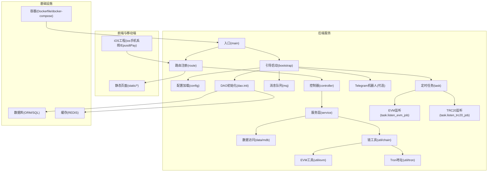
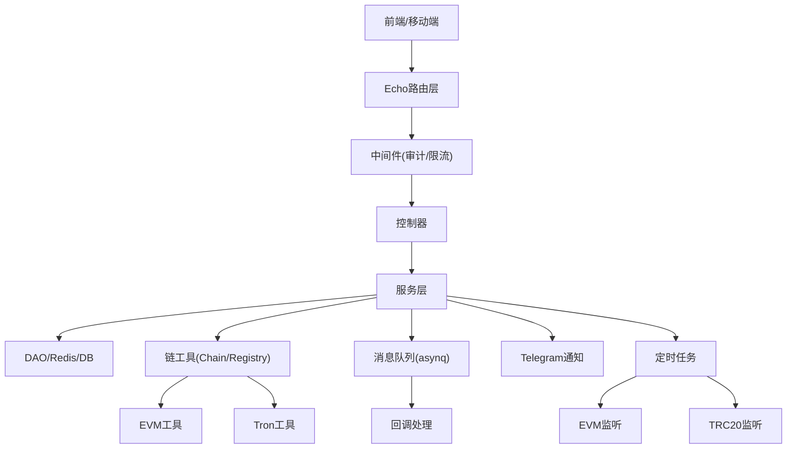
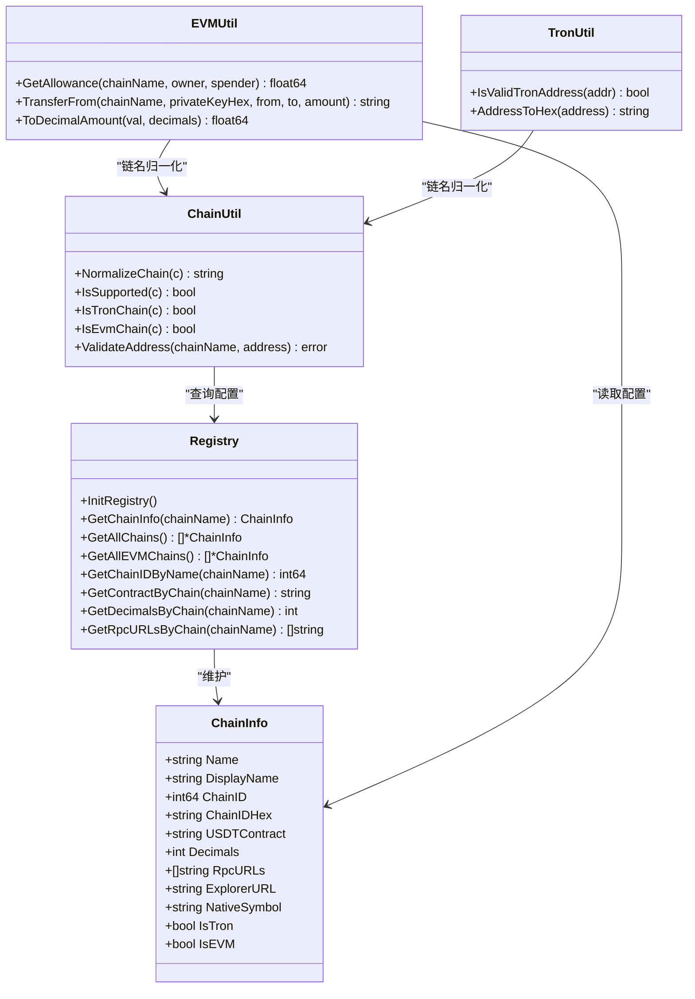
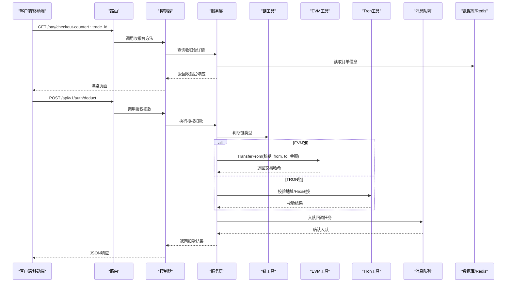
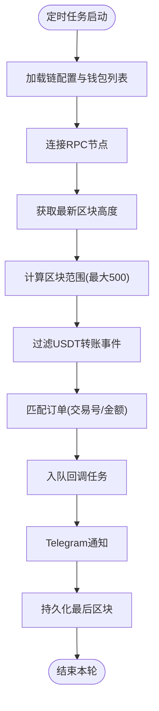
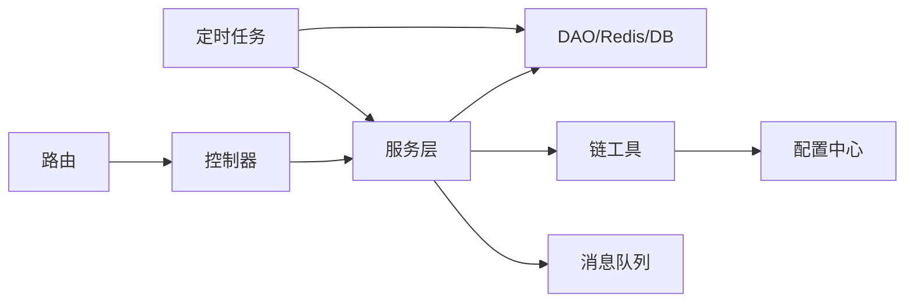
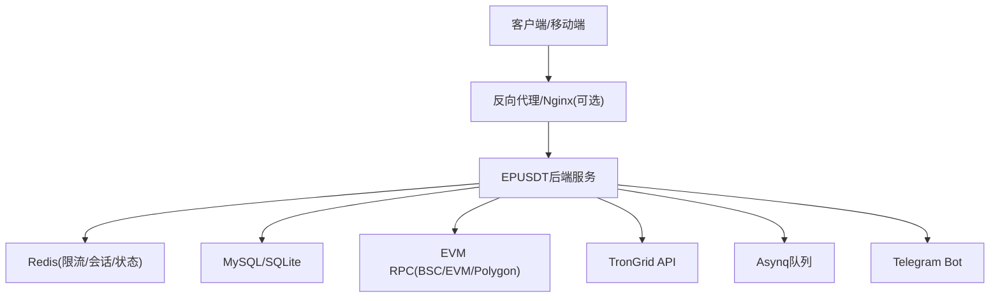

# 系统架构

<cite>
**本文引用的文件**
- [main.go](file://EPUSDT/src/main.go)
- [bootstrap.go](file://EPUSDT/src/bootstrap/bootstrap.go)
- [config.go](file://EPUSDT/src/config/config.go)
- [router.go](file://EPUSDT/src/route/router.go)
- [chain.go](file://EPUSDT/src/util/chain/chain.go)
- [registry.go](file://EPUSDT/src/util/chain/registry.go)
- [init.go](file://EPUSDT/src/model/dao/init.go)
- [rate_limiter.go](file://EPUSDT/src/middleware/rate_limiter.go)
- [pay_service.go](file://EPUSDT/src/model/service/pay_service.go)
- [pay_controller.go](file://EPUSDT/src/controller/comm/pay_controller.go)
- [evm.go](file://EPUSDT/src/util/evm/evm.go)
- [address.go](file://EPUSDT/src/util/tron/address.go)
- [listen_evm_job.go](file://EPUSDT/src/task/listen_evm_job.go)
- [listen_trc20_job.go](file://EPUSDT/src/task/listen_trc20_job.go)
- [Dockerfile](file://EPUSDT/Dockerfile)
- [docker-compose.yaml](file://EPUSDT/docker-compose.yaml)
</cite>

## 目录
1. [引言](#引言)
2. [项目结构](#项目结构)
3. [核心组件](#核心组件)
4. [架构总览](#架构总览)
5. [详细组件分析](#详细组件分析)
6. [依赖关系分析](#依赖关系分析)
7. [性能考量](#性能考量)
8. [故障排查指南](#故障排查指南)
9. [结论](#结论)
10. [附录](#附录)

## 引言
本架构文档面向EPUSDT系统，围绕“多链USDT支付”这一核心目标，系统化阐述后端服务、前端与移动端的架构设计、组件交互、数据流与集成模式，并重点说明多链架构的设计思路与实现方案。文档同时覆盖安全性、监控与灾备等横切关注点，以及基础设施需求、可扩展性与部署拓扑。

## 项目结构
EPUSDT采用Go语言实现的后端服务，结合Echo框架提供REST API；前端静态资源与管理端页面位于静态目录；移动端部分包含iOS工程；系统通过容器化部署，支持多链监听与异步队列处理。

图表来源
- [main.go](file://EPUSDT/src/main.go#L1-L19)
- [bootstrap.go](file://EPUSDT/src/bootstrap/bootstrap.go#L15-L43)
- [router.go](file://EPUSDT/src/route/router.go#L11-L114)
- [init.go](file://EPUSDT/src/model/dao/init.go#L7-L15)
- [listen_evm_job.go](file://EPUSDT/src/task/listen_evm_job.go#L32-L38)
- [listen_trc20_job.go](file://EPUSDT/src/task/listen_trc20_job.go#L15-L32)
- [Dockerfile](file://EPUSDT/Dockerfile#L1-L25)
- [docker-compose.yaml](file://EPUSDT/docker-compose.yaml#L1-L12)

章节来源
- [main.go](file://EPUSDT/src/main.go#L1-L19)
- [bootstrap.go](file://EPUSDT/src/bootstrap/bootstrap.go#L15-L43)
- [router.go](file://EPUSDT/src/route/router.go#L11-L114)
- [Dockerfile](file://EPUSDT/Dockerfile#L1-L25)
- [docker-compose.yaml](file://EPUSDT/docker-compose.yaml#L1-L12)

## 核心组件
- 应用入口与引导
  - 入口负责打印版本信息、捕获启动异常并调用引导启动。
  - 引导启动负责加载配置、链注册表、日志、DAO、消息队列、Telegram机器人与定时任务，并执行命令行子系统。
- 配置中心
  - 从.env读取运行时配置，包括数据库连接串、静态路径、日志路径、各链RPC、合约地址、精度、商户私钥映射、审计日志开关、Gas优化开关、Approval监控开关及其间隔、TronGrid API Key等。
- 路由与中间件
  - Echo路由分组清晰划分公开接口、API v1、管理后台、商家系统；内置审计日志中间件按配置启用；提供IP/用户/端点级限流中间件。
- 数据访问与服务
  - DAO统一初始化数据库与Redis；服务层封装业务流程，如收银台查询、订单状态检测、链上转账与授权扣款等。
- 多链支持与链工具
  - 链注册表集中管理BSC、EVM、Polygon、TRON的链ID、合约、精度、RPC、区块浏览器等；地址校验与链名归一化；EVM侧提供ERC20授权查询与transferFrom签名广播；Tron侧提供地址校验与Hex转换。
- 监听与回调
  - 定时任务扫描各链USDT转账事件，匹配订单并入队回调通知，同时通过Telegram推送支付成功通知。
- 前端与移动端
  - 静态页面提供收银台、授权页、管理后台与商家系统；iOS工程提供钱包授权、支付、商户管理等界面与服务。

章节来源
- [main.go](file://EPUSDT/src/main.go#L9-L18)
- [bootstrap.go](file://EPUSDT/src/bootstrap/bootstrap.go#L16-L42)
- [config.go](file://EPUSDT/src/config/config.go#L45-L134)
- [router.go](file://EPUSDT/src/route/router.go#L12-L114)
- [rate_limiter.go](file://EPUSDT/src/middleware/rate_limiter.go#L20-L123)
- [init.go](file://EPUSDT/src/model/dao/init.go#L7-L15)
- [pay_service.go](file://EPUSDT/src/model/service/pay_service.go#L12-L29)
- [pay_controller.go](file://EPUSDT/src/controller/comm/pay_controller.go#L13-L39)
- [chain.go](file://EPUSDT/src/util/chain/chain.go#L20-L73)
- [registry.go](file://EPUSDT/src/util/chain/registry.go#L25-L102)
- [evm.go](file://EPUSDT/src/util/evm/evm.go#L38-L191)
- [address.go](file://EPUSDT/src/util/tron/address.go#L11-L34)
- [listen_evm_job.go](file://EPUSDT/src/task/listen_evm_job.go#L40-L107)
- [listen_trc20_job.go](file://EPUSDT/src/task/listen_trc20_job.go#L15-L32)

## 架构总览
系统采用分层架构：表现层（静态页面与iOS）、接入层（Echo路由与中间件）、业务层（服务与控制器）、数据层（DAO、Redis、数据库）。多链能力通过链注册表与工具模块抽象，统一对外提供标准化接口。异步队列与定时任务解耦实时链上监听与后续通知处理。

图表来源
- [router.go](file://EPUSDT/src/route/router.go#L12-L114)
- [rate_limiter.go](file://EPUSDT/src/middleware/rate_limiter.go#L20-L123)
- [pay_controller.go](file://EPUSDT/src/controller/comm/pay_controller.go#L13-L39)
- [pay_service.go](file://EPUSDT/src/model/service/pay_service.go#L12-L29)
- [init.go](file://EPUSDT/src/model/dao/init.go#L7-L15)
- [chain.go](file://EPUSDT/src/util/chain/chain.go#L20-L73)
- [registry.go](file://EPUSDT/src/util/chain/registry.go#L25-L102)
- [evm.go](file://EPUSDT/src/util/evm/evm.go#L38-L191)
- [address.go](file://EPUSDT/src/util/tron/address.go#L11-L34)
- [listen_evm_job.go](file://EPUSDT/src/task/listen_evm_job.go#L40-L107)
- [listen_trc20_job.go](file://EPUSDT/src/task/listen_trc20_job.go#L15-L32)

## 详细组件分析

### 多链架构设计与实现
- 设计理念
  - 通过链注册表集中管理各链配置，屏蔽底层差异，向上提供统一的链名归一化、地址校验、RPC选择、合约与精度查询等能力。
  - EVM链采用轮询RPC、动态费用估算与Gas优化策略；Tron链采用专用地址校验与Hex转换。
- 关键实现
  - 链注册表：集中定义BSC、EVM、Polygon、TRON的链ID、合约、精度、RPC、区块浏览器等。
  - 地址校验：EVM地址正则校验，Tron地址Base58Check校验与Hex转换。
  - EVM转账：支持EIP-1559与传统Gas Price两种费用模式，自动估算Gas Limit并签名广播。
  - 监听任务：按链并行扫描USDT转账事件，匹配订单并触发回调通知。

图表来源
- [registry.go](file://EPUSDT/src/util/chain/registry.go#L7-L150)
- [chain.go](file://EPUSDT/src/util/chain/chain.go#L11-L73)
- [evm.go](file://EPUSDT/src/util/evm/evm.go#L24-L261)
- [address.go](file://EPUSDT/src/util/tron/address.go#L11-L58)

章节来源
- [registry.go](file://EPUSDT/src/util/chain/registry.go#L25-L102)
- [chain.go](file://EPUSDT/src/util/chain/chain.go#L20-L73)
- [evm.go](file://EPUSDT/src/util/evm/evm.go#L38-L191)
- [address.go](file://EPUSDT/src/util/tron/address.go#L11-L34)

### 支付流程与授权扣款
- 收银台与状态查询
  - 控制器从服务层获取收银台信息并渲染静态模板；状态查询返回订单状态。
- 授权支付
  - 创建授权、确认授权（含自动确认）、授权扣款、授权信息与历史查询等接口，配合二维码与H5页面。
- 钱包授权扣款
  - 服务层根据链类型调用EVM或Tron工具进行授权查询与转账广播，确保私钥与收款地址一致。

图表来源
- [router.go](file://EPUSDT/src/route/router.go#L23-L63)
- [pay_controller.go](file://EPUSDT/src/controller/comm/pay_controller.go#L13-L39)
- [pay_service.go](file://EPUSDT/src/model/service/pay_service.go#L12-L29)
- [evm.go](file://EPUSDT/src/util/evm/evm.go#L83-L191)
- [address.go](file://EPUSDT/src/util/tron/address.go#L36-L50)

章节来源
- [router.go](file://EPUSDT/src/route/router.go#L23-L63)
- [pay_controller.go](file://EPUSDT/src/controller/comm/pay_controller.go#L13-L39)
- [pay_service.go](file://EPUSDT/src/model/service/pay_service.go#L12-L29)
- [evm.go](file://EPUSDT/src/util/evm/evm.go#L83-L191)
- [address.go](file://EPUSDT/src/util/tron/address.go#L36-L50)

### 链上监听与回调
- EVM监听
  - 并发扫描BSC、EVM、Polygon三链，按区块范围过滤USDT转账事件，匹配订单后入队回调并发送Telegram通知。
- TRC20监听
  - 并行遍历可用钱包地址，触发TRC20回调处理。
- 回调与通知
  - 回调任务携带交易哈希、金额、钱包地址等信息，通知渠道可扩展。

图表来源
- [listen_evm_job.go](file://EPUSDT/src/task/listen_evm_job.go#L40-L107)
- [listen_evm_job.go](file://EPUSDT/src/task/listen_evm_job.go#L109-L159)
- [listen_trc20_job.go](file://EPUSDT/src/task/listen_trc20_job.go#L15-L32)

章节来源
- [listen_evm_job.go](file://EPUSDT/src/task/listen_evm_job.go#L32-L107)
- [listen_trc20_job.go](file://EPUSDT/src/task/listen_trc20_job.go#L15-L32)

### 安全与限流
- 审计日志中间件按配置启用，记录请求与响应摘要。
- 限流中间件基于Redis实现滑动窗口算法，支持IP、用户、端点三种粒度，失败时可配置fail-close或fail-open策略。
- API签名中间件用于保护敏感接口（如订单、钱包、授权、商家API）。

章节来源
- [router.go](file://EPUSDT/src/route/router.go#L13-L16)
- [rate_limiter.go](file://EPUSDT/src/middleware/rate_limiter.go#L20-L123)

## 依赖关系分析
- 组件耦合
  - 控制器依赖服务层；服务层依赖DAO与链工具；链工具依赖配置中心；定时任务依赖服务层与DAO；路由依赖中间件与控制器。
- 外部依赖
  - Echo作为Web框架；Redis用于限流与持久化；Asynq用于消息队列；Geth用于EVM交互；Base58与SHA256用于Tron地址校验。
- 循环依赖
  - 代码结构避免了循环导入；链工具与配置相互独立，通过函数调用传递参数。

图表来源
- [router.go](file://EPUSDT/src/route/router.go#L12-L114)
- [pay_controller.go](file://EPUSDT/src/controller/comm/pay_controller.go#L13-L39)
- [pay_service.go](file://EPUSDT/src/model/service/pay_service.go#L12-L29)
- [init.go](file://EPUSDT/src/model/dao/init.go#L7-L15)
- [config.go](file://EPUSDT/src/config/config.go#L45-L134)
- [listen_evm_job.go](file://EPUSDT/src/task/listen_evm_job.go#L32-L38)

章节来源
- [router.go](file://EPUSDT/src/route/router.go#L12-L114)
- [pay_controller.go](file://EPUSDT/src/controller/comm/pay_controller.go#L13-L39)
- [pay_service.go](file://EPUSDT/src/model/service/pay_service.go#L12-L29)
- [init.go](file://EPUSDT/src/model/dao/init.go#L7-L15)
- [config.go](file://EPUSDT/src/config/config.go#L45-L134)
- [listen_evm_job.go](file://EPUSDT/src/task/listen_evm_job.go#L32-L38)

## 性能考量
- RPC轮询与负载均衡
  - EVM工具对RPC列表进行轮询，提升可用性与吞吐；可根据链名维护独立索引。
- Gas优化
  - 默认启用Gas优化，优先尝试EIP-1559动态费用，回退至传统Gas Price；估算Gas Limit并加20%缓冲，减少重试。
- 缓存与限流
  - 限流基于Redis滑动窗口，设置合理过期时间防止内存泄漏；对热点端点可单独限流。
- 监听批处理
  - EVM监听按最大500区块范围分段处理，降低单次查询压力；缓存区块时间戳避免重复查询。

章节来源
- [evm.go](file://EPUSDT/src/util/evm/evm.go#L233-L244)
- [evm.go](file://EPUSDT/src/util/evm/evm.go#L122-L136)
- [rate_limiter.go](file://EPUSDT/src/middleware/rate_limiter.go#L46-L84)
- [listen_evm_job.go](file://EPUSDT/src/task/listen_evm_job.go#L77-L104)

## 故障排查指南
- 启动失败
  - 检查.env配置项是否正确；确认数据库与Redis可达；查看引导启动日志。
- 支付失败
  - 核对链配置（RPC、合约、精度）；检查私钥与收款地址一致性；确认Gas估算与网络拥堵情况。
- 监听不到到账
  - 检查定时任务是否运行；确认钱包地址已启用且链配置正确；查看Redis中last_block记录。
- 限流导致请求被拒
  - 调整限流阈值或Key策略；区分匿名与认证用户限流；必要时临时关闭fail-close。
- Telegram通知异常
  - 检查Bot Token与管理群配置；确认消息模板与权限。

章节来源
- [bootstrap.go](file://EPUSDT/src/bootstrap/bootstrap.go#L16-L42)
- [config.go](file://EPUSDT/src/config/config.go#L45-L134)
- [evm.go](file://EPUSDT/src/util/evm/evm.go#L83-L191)
- [listen_evm_job.go](file://EPUSDT/src/task/listen_evm_job.go#L161-L175)
- [rate_limiter.go](file://EPUSDT/src/middleware/rate_limiter.go#L28-L40)

## 结论
EPUSDT系统以多链USDT支付为核心，通过链注册表与工具模块实现跨链抽象，结合定时任务与异步队列构建高可靠、可扩展的支付流水线。路由与中间件保障接口安全与稳定性，容器化部署简化运维。未来可在监控告警、链路追踪、灰度发布等方面进一步增强。

## 附录

### 系统上下文图

图表来源
- [Dockerfile](file://EPUSDT/Dockerfile#L14-L24)
- [docker-compose.yaml](file://EPUSDT/docker-compose.yaml#L2-L11)
- [config.go](file://EPUSDT/src/config/config.go#L77-L133)
- [listen_evm_job.go](file://EPUSDT/src/task/listen_evm_job.go#L53-L57)

### 部署拓扑与基础设施
- 容器镜像
  - 基于Alpine的多阶段构建，生产镜像仅包含二进制与静态资源，ENTRYPOINT直接启动HTTP服务。
- Compose编排
  - 映射.env到容器内，暴露8088端口；可挂载运行时配置卷。
- 基础设施要求
  - CPU/内存按并发与监听任务规模评估；Redis与数据库需高可用；EVM RPC需多节点冗余。

章节来源
- [Dockerfile](file://EPUSDT/Dockerfile#L1-L25)
- [docker-compose.yaml](file://EPUSDT/docker-compose.yaml#L1-L12)

### 技术栈与版本兼容性
- 后端
  - Go语言；Echo Web框架；Asynq消息队列；Redis；Geth EVM；Base58/SHA256。
- 前端与移动端
  - 静态HTML/CSS/JS；iOS Swift工程。
- 第三方依赖
  - 通过go.mod管理；Echo、Asynq、Geth、btcutil/base58等。

章节来源
- [main.go](file://EPUSDT/src/main.go#L3-L6)
- [Dockerfile](file://EPUSDT/Dockerfile#L1-L12)