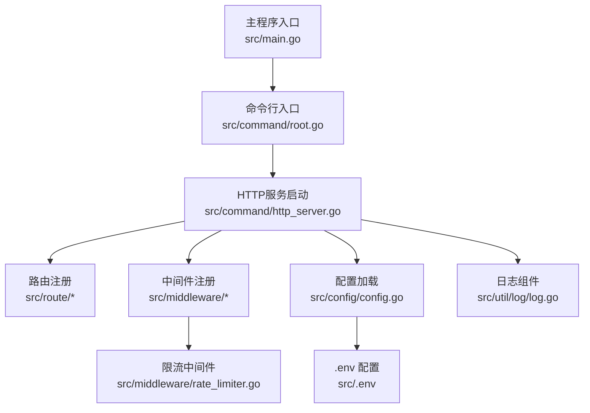
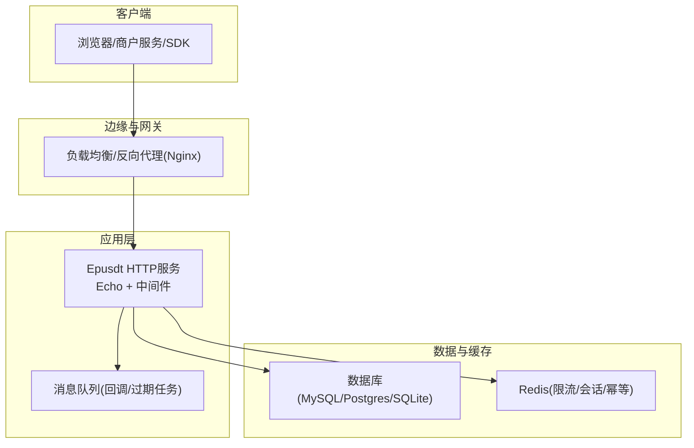
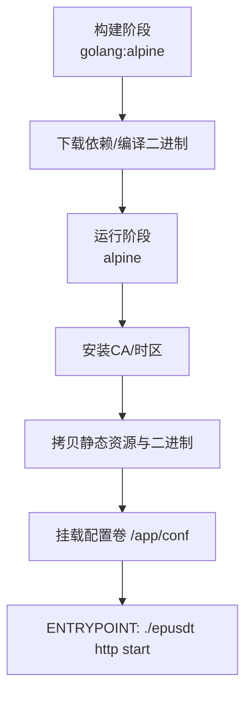
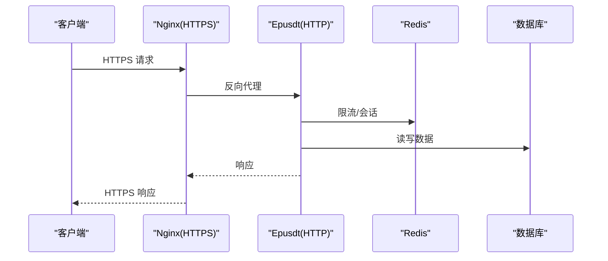
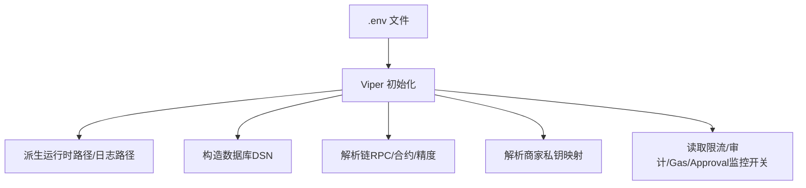
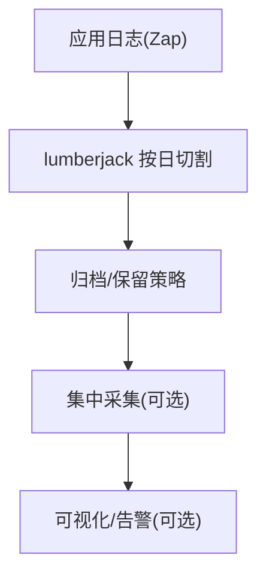
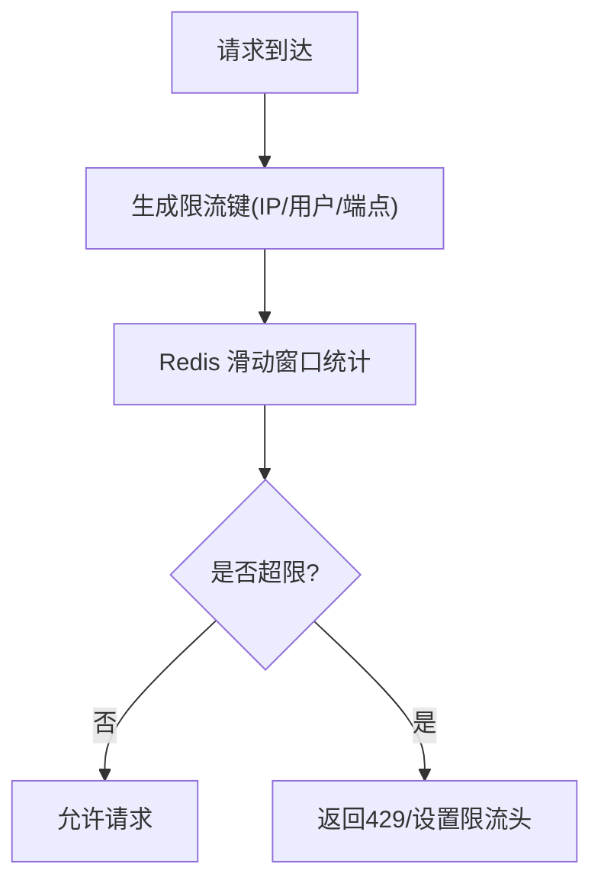
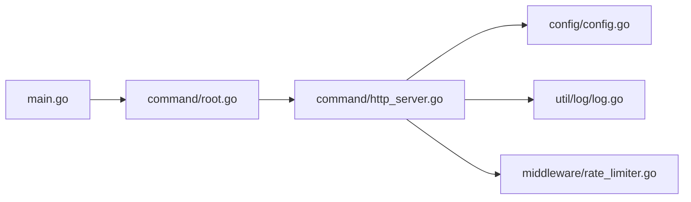

# 部署运维

<cite>
**本文引用的文件**
- [Dockerfile](file://EPUSDT/Dockerfile)
- [docker-compose.yaml](file://EPUSDT/docker-compose.yaml)
- [.env 示例](file://EPUSDT/src/.env)
- [主程序入口 main.go](file://EPUSDT/src/main.go)
- [命令行入口 root.go](file://EPUSDT/src/command/root.go)
- [HTTP服务启动 http_server.go](file://EPUSDT/src/command/http_server.go)
- [配置加载 config.go](file://EPUSDT/src/config/config.go)
- [日志组件 log.go](file://EPUSDT/src/util/log/log.go)
- [限流中间件 rate_limiter.go](file://EPUSDT/src/middleware/rate_limiter.go)
- [安全部署指南 SECURITY_DEPLOYMENT_GUIDE.md](file://EPUSDT/SECURITY_DEPLOYMENT_GUIDE.md)
- [安全检查脚本 security_check.sh](file://EPUSDT/tools/security_check.sh)
- [Redis 启动脚本 redis-start.sh](file://EPUSDT/redis-start.sh)
- [API 文档 API.md](file://EPUSDT/wiki/API.md)
- [API 文档 API 文档总览 API_DOCUMENTATION.md](file://EPUSDT/API_DOCUMENTATION.md)
</cite>

## 目录
1. [简介](#简介)
2. [项目结构](#项目结构)
3. [核心组件](#核心组件)
4. [架构总览](#架构总览)
5. [详细组件分析](#详细组件分析)
6. [依赖分析](#依赖分析)
7. [性能考量](#性能考量)
8. [故障排除指南](#故障排除指南)
9. [结论](#结论)
10. [附录](#附录)

## 简介
本指南面向EPUSDT系统的部署与运维，覆盖环境搭建、配置管理、容器化与传统部署、云平台部署建议、监控与日志、性能指标与告警、备份与灾难恢复、安全加固与合规、高可用与扩展性、以及故障排除与常见问题。文档严格依据仓库现有文件进行梳理与说明，避免臆造信息。

## 项目结构
EPUSDT后端采用Go语言实现，核心入口通过命令行子命令启动HTTP服务，配置通过Viper读取.env文件，日志使用Zap结合lumberjack滚动，限流中间件基于Redis实现滑动窗口算法。容器化通过Dockerfile与docker-compose提供开箱即用的镜像与编排。

图表来源
- [主程序入口 main.go](file://EPUSDT/src/main.go#L1-L19)
- [命令行入口 root.go](file://EPUSDT/src/command/root.go#L1-L14)
- [HTTP服务启动 http_server.go](file://EPUSDT/src/command/http_server.go#L1-L100)
- [配置加载 config.go](file://EPUSDT/src/config/config.go#L1-L400)
- [日志组件 log.go](file://EPUSDT/src/util/log/log.go#L1-L43)
- [限流中间件 rate_limiter.go](file://EPUSDT/src/middleware/rate_limiter.go#L1-L124)

章节来源
- [主程序入口 main.go](file://EPUSDT/src/main.go#L1-L19)
- [命令行入口 root.go](file://EPUSDT/src/command/root.go#L1-L14)
- [HTTP服务启动 http_server.go](file://EPUSDT/src/command/http_server.go#L1-L100)
- [配置加载 config.go](file://EPUSDT/src/config/config.go#L1-L400)
- [日志组件 log.go](file://EPUSDT/src/util/log/log.go#L1-L43)
- [限流中间件 rate_limiter.go](file://EPUSDT/src/middleware/rate_limiter.go#L1-L124)

## 核心组件
- 启动流程：main -> root命令 -> http.start -> Echo服务 -> 路由与中间件 -> 配置与日志初始化
- 配置体系：Viper读取.env，支持多数据库、Redis、Telegram、链RPC、USDT合约与精度、汇率、订单过期等
- 日志体系：Zap JSON编码，lumberjack按天滚动，受配置控制大小/备份数/保留天数
- 限流体系：基于Redis的滑动窗口，支持IP、用户、端点级限流
- 安全基线：HTTPS、防火墙、Redis密码、密钥轮换、日志轮转、fail2ban、systemd服务

章节来源
- [主程序入口 main.go](file://EPUSDT/src/main.go#L1-L19)
- [HTTP服务启动 http_server.go](file://EPUSDT/src/command/http_server.go#L1-L100)
- [配置加载 config.go](file://EPUSDT/src/config/config.go#L1-L400)
- [日志组件 log.go](file://EPUSDT/src/util/log/log.go#L1-L43)
- [限流中间件 rate_limiter.go](file://EPUSDT/src/middleware/rate_limiter.go#L1-L124)

## 架构总览
下图展示从客户端到服务端的关键交互与依赖：

图表来源
- [HTTP服务启动 http_server.go](file://EPUSDT/src/command/http_server.go#L1-L100)
- [配置加载 config.go](file://EPUSDT/src/config/config.go#L1-L400)
- [限流中间件 rate_limiter.go](file://EPUSDT/src/middleware/rate_limiter.go#L1-L124)

## 详细组件分析

### 容器化部署（Docker）
- 基础镜像与构建阶段：Alpine + golang:alpine，下载依赖、编译二进制
- 运行阶段：Alpine，安装CA证书与时区，拷贝静态资源与二进制，挂载配置卷，入口命令为“./epusdt http start”
- docker-compose：本地开发/测试一键启动，映射端口与挂载.env

图表来源
- [Dockerfile](file://EPUSDT/Dockerfile#L1-L25)
- [docker-compose.yaml](file://EPUSDT/docker-compose.yaml#L1-L12)

章节来源
- [Dockerfile](file://EPUSDT/Dockerfile#L1-L25)
- [docker-compose.yaml](file://EPUSDT/docker-compose.yaml#L1-L12)

### 传统部署（systemd + Nginx）
- systemd服务：以简单用户运行，工作目录与读写路径受限，开机自启，失败重启
- Nginx反代：监听80/443，启用HSTS与安全头，转发到本地HTTP端口
- Redis：启用密码认证，配置于.env
- 日志轮转：logrotate按日轮转，保留周期与权限设置

图表来源
- [安全部署指南 SECURITY_DEPLOYMENT_GUIDE.md](file://EPUSDT/SECURITY_DEPLOYMENT_GUIDE.md#L84-L160)
- [HTTP服务启动 http_server.go](file://EPUSDT/src/command/http_server.go#L1-L100)
- [限流中间件 rate_limiter.go](file://EPUSDT/src/middleware/rate_limiter.go#L1-L124)

章节来源
- [安全部署指南 SECURITY_DEPLOYMENT_GUIDE.md](file://EPUSDT/SECURITY_DEPLOYMENT_GUIDE.md#L226-L282)

### 配置管理（.env 与 Viper）
- 关键配置类别：应用基础、日志、数据库、Redis、消息队列、Telegram、API认证、管理后台、商家私钥、订单与汇率、多链RPC与USDT合约
- 配置加载：Viper从当前目录读取“.env”，并派生运行时路径、日志路径、数据库DSN、链RPC列表、合约与精度、限流开关与间隔等
- 环境变量优先级：Viper支持环境变量覆盖，但仓库以“.env”为主

图表来源
- [.env 示例](file://EPUSDT/src/.env#L1-L118)
- [配置加载 config.go](file://EPUSDT/src/config/config.go#L1-L400)

章节来源
- [.env 示例](file://EPUSDT/src/.env#L1-L118)
- [配置加载 config.go](file://EPUSDT/src/config/config.go#L1-L400)

### 日志与监控
- 日志：Zap JSON编码，lumberjack按天滚动，受配置控制大小/备份数/保留天数
- 监控与告警：仓库提供Prometheus/Grafana与fail2ban参考，建议结合业务指标与系统指标建立告警
- 建议：接入APM（如OpenTelemetry）、链上交易追踪、回调成功率与延迟监控

图表来源
- [日志组件 log.go](file://EPUSDT/src/util/log/log.go#L1-L43)

章节来源
- [日志组件 log.go](file://EPUSDT/src/util/log/log.go#L1-L43)
- [安全部署指南 SECURITY_DEPLOYMENT_GUIDE.md](file://EPUSDT/SECURITY_DEPLOYMENT_GUIDE.md#L285-L312)

### 性能与限流
- 限流策略：基于Redis的滑动窗口，支持IP、用户、端点级限流，失败时可选择fail-close或fail-open策略
- 限流配置：可在中间件层按路由或全局注入，结合业务峰值流量评估并发与窗口
- 优化建议：合理设置窗口与配额，结合Redis持久化与哨兵/集群提升可用性

图表来源
- [限流中间件 rate_limiter.go](file://EPUSDT/src/middleware/rate_limiter.go#L1-L124)

章节来源
- [限流中间件 rate_limiter.go](file://EPUSDT/src/middleware/rate_limiter.go#L1-L124)

### 安全加固与合规
- 密钥与配置：生成随机主加密密钥与API认证Token，修改默认管理员密码，HTTPS必需，Redis启用密码
- 防火墙：仅开放必要端口，限制SSH访问
- 运行时：systemd安全选项、日志轮转、备份脚本、定期安全检查
- 合规：敏感信息不出库、.env权限严格、定期轮换密钥与证书

章节来源
- [安全部署指南 SECURITY_DEPLOYMENT_GUIDE.md](file://EPUSDT/SECURITY_DEPLOYMENT_GUIDE.md#L1-L449)
- [安全检查脚本 security_check.sh](file://EPUSDT/tools/security_check.sh#L1-L174)

### 备份与灾难恢复
- 备份对象：数据库、.env、主加密密钥（离线存储）
- 自动化：crontab定时执行备份脚本
- DR：异地存储、演练恢复流程、验证备份完整性

章节来源
- [安全部署指南 SECURITY_DEPLOYMENT_GUIDE.md](file://EPUSDT/SECURITY_DEPLOYMENT_GUIDE.md#L315-L346)

### 高可用与扩展性
- 负载均衡：Nginx/云LB分发请求，健康检查
- 无状态：应用层无状态，会话与状态放入Redis
- 水平扩展：多实例部署，共享Redis与数据库，注意限流键冲突与幂等设计
- 数据库：读写分离、连接池参数调优、慢查询监控

章节来源
- [安全部署指南 SECURITY_DEPLOYMENT_GUIDE.md](file://EPUSDT/SECURITY_DEPLOYMENT_GUIDE.md#L84-L160)
- [配置加载 config.go](file://EPUSDT/src/config/config.go#L1-L400)

## 依赖分析
- 启动链路：main -> root -> http.start -> Echo -> 路由/中间件 -> 配置/日志
- 配置链路：.env -> Viper -> config模块 -> 业务模块
- 限流链路：中间件 -> Redis

图表来源
- [主程序入口 main.go](file://EPUSDT/src/main.go#L1-L19)
- [命令行入口 root.go](file://EPUSDT/src/command/root.go#L1-L14)
- [HTTP服务启动 http_server.go](file://EPUSDT/src/command/http_server.go#L1-L100)
- [配置加载 config.go](file://EPUSDT/src/config/config.go#L1-L400)
- [日志组件 log.go](file://EPUSDT/src/util/log/log.go#L1-L43)
- [限流中间件 rate_limiter.go](file://EPUSDT/src/middleware/rate_limiter.go#L1-L124)

章节来源
- [主程序入口 main.go](file://EPUSDT/src/main.go#L1-L19)
- [HTTP服务启动 http_server.go](file://EPUSDT/src/command/http_server.go#L1-L100)

## 性能考量
- 启动与优雅退出：信号捕获与超时优雅停机
- 中间件：仅在调试模式开启Echo Logger，生产关闭以降低开销
- 日志：JSON编码与lumberjack滚动，避免磁盘IO瓶颈
- 限流：Redis管道化减少RTT，Expire防止内存泄漏
- 数据库：连接池参数与慢查询监控，避免阻塞

章节来源
- [HTTP服务启动 http_server.go](file://EPUSDT/src/command/http_server.go#L1-L100)
- [日志组件 log.go](file://EPUSDT/src/util/log/log.go#L1-L43)
- [限流中间件 rate_limiter.go](file://EPUSDT/src/middleware/rate_limiter.go#L1-L124)

## 故障排除指南
- 服务无法启动：检查systemd状态、journalctl日志、应用日志
- 私钥解密失败：验证主加密密钥与加密私钥，使用工具解密校验
- Redis连接失败：验证密码、端口、网络连通性
- HTTPS与限流验证：使用curl验证HSTS与429行为
- 安全检查：运行security_check.sh，修复错误与警告项

章节来源
- [安全部署指南 SECURITY_DEPLOYMENT_GUIDE.md](file://EPUSDT/SECURITY_DEPLOYMENT_GUIDE.md#L398-L427)
- [安全检查脚本 security_check.sh](file://EPUSDT/tools/security_check.sh#L1-L174)

## 结论
EPUSDT提供了清晰的启动链路、完善的配置与日志体系、可插拔的限流中间件，以及可落地的安全与运维建议。结合容器化与传统部署方案，可快速实现生产级上线。建议在生产中补充监控与告警、完善备份与DR演练、持续进行安全巡检与密钥轮换。

## 附录

### 环境变量与配置要点
- 应用基础：app_name、app_uri、app_debug、http_listen、static_path、runtime_root_path
- 日志：log_save_path、log_max_size、log_max_age、max_backups
- 数据库：db_type、sqlite/mysql/postgres配置、连接池参数
- 缓存：redis_host、redis_port、redis_passwd、redis_db、pool_size、max_retries、idle_timeout
- 消息队列：queue_concurrency、queue_level_*（关键/默认/低）
- Telegram：tg_bot_token、tg_proxy、tg_manage
- API认证：api_auth_token
- 管理后台：admin_jwt_secret、admin_init_username、admin_init_password
- 商家私钥：merchant_private_key（明文）或merchant_private_keys（映射）、master_encryption_key（加密主密钥）
- 订单与回调：order_expiration_time、order_notice_max_retry、forced_usdt_rate
- 多链RPC与USDT：BSC/ETH/Polygon RPC、USDT合约与精度
- 其他：audit_log_enabled、gas_optimize_enabled、approval_monitor_enabled、approval_monitor_interval、trongrid_api_key

章节来源
- [.env 示例](file://EPUSDT/src/.env#L1-L118)
- [配置加载 config.go](file://EPUSDT/src/config/config.go#L1-L400)

### API与回调
- 签名与重放保护：timestamp、nonce、token、MD5签名
- 支付回调：notify_url，需返回“ok”，并验证回调签名
- 管理后台JWT登录与鉴权

章节来源
- [API 文档 API.md](file://EPUSDT/wiki/API.md#L1-L195)
- [API 文档 API 文档总览 API_DOCUMENTATION.md](file://EPUSDT/API_DOCUMENTATION.md#L1-L800)