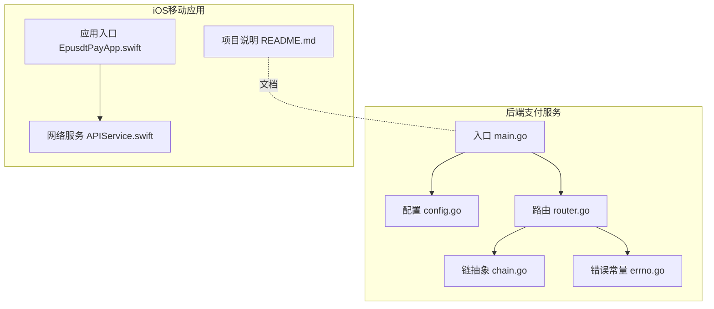
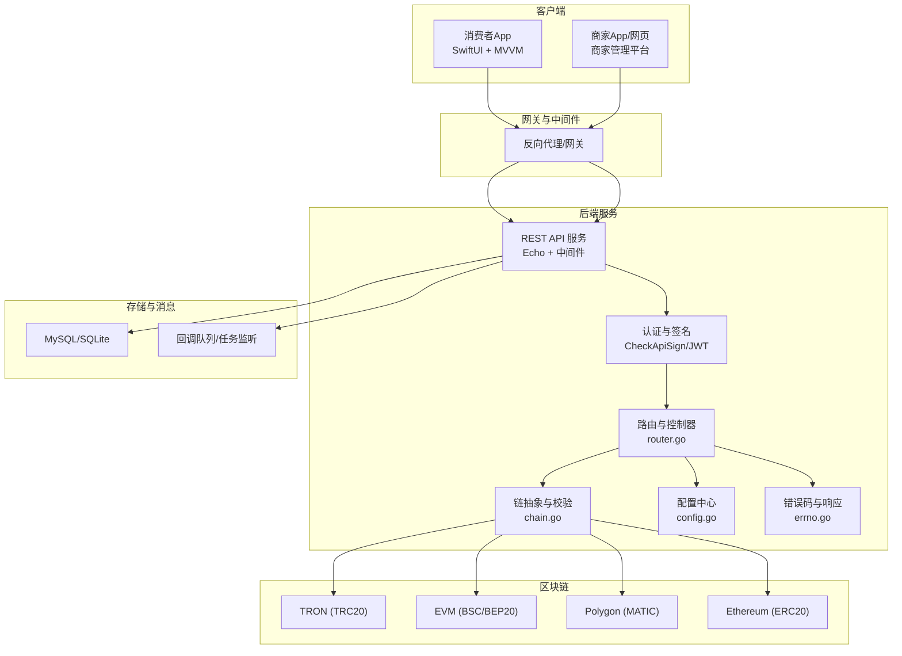
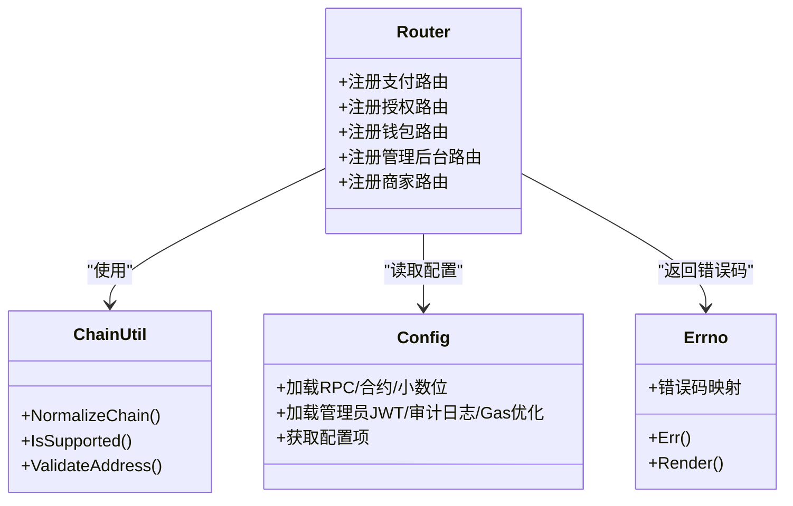
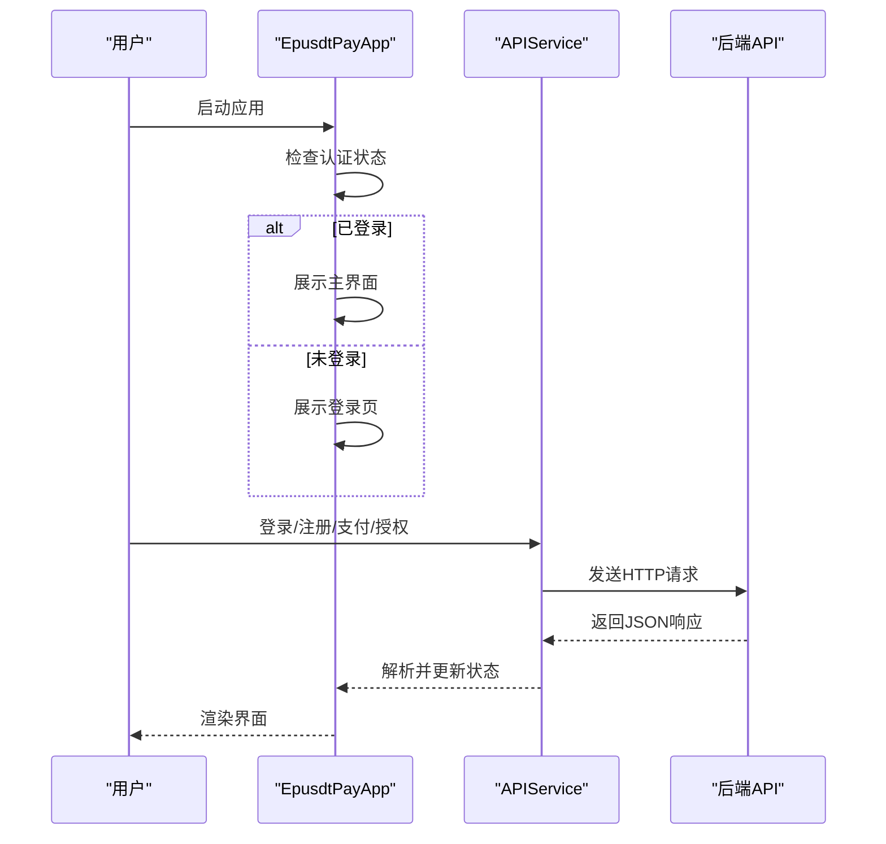
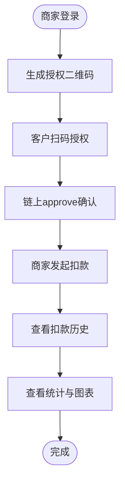
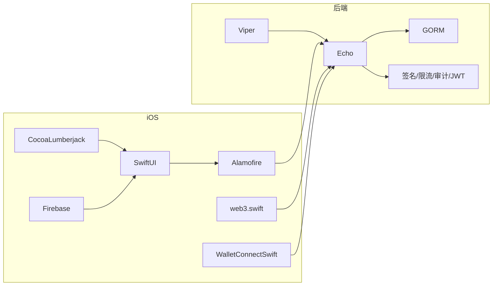

# 项目概述

<cite>
**本文引用的文件**
- [src/main.go](file://EPUSDT/src/main.go)
- [src/config/config.go](file://EPUSDT/src/config/config.go)
- [src/route/router.go](file://EPUSDT/src/route/router.go)
- [src/util/chain/chain.go](file://EPUSDT/src/util/chain/chain.go)
- [src/util/constant/errno.go](file://EPUSDT/src/util/constant/errno.go)
- [API_DOCUMENTATION.md](file://EPUSDT/API_DOCUMENTATION.md)
- [MERCHANT_API_DOCUMENTATION.md](file://EPUSDT/MERCHANT_API_DOCUMENTATION.md)
- [ios手机系统/README.md](file://EPUSDT/ios手机系统/README.md)
- [ios手机系统/EpusdtPay/App/EpusdtPayApp.swift](file://EPUSDT/ios手机系统/EpusdtPay/App/EpusdtPayApp.swift)
- [ios手机系统/EpusdtPay/Services/APIService.swift](file://EPUSDT/ios手机系统/EpusdtPay/Services/APIService.swift)
</cite>

## 目录
1. [引言](#引言)
2. [项目结构](#项目结构)
3. [核心组件](#核心组件)
4. [架构总览](#架构总览)
5. [详细组件分析](#详细组件分析)
6. [依赖关系分析](#依赖关系分析)
7. [性能考量](#性能考量)
8. [故障排查指南](#故障排查指南)
9. [结论](#结论)
10. [附录](#附录)

## 引言
EPUSDT是一个支持多链的USDT支付中间件系统，旨在为KTV等场景提供“先授权、后扣款”的支付能力，并覆盖TRON、BSC、Ethereum、Polygon等主流公链。系统通过统一的后端支付服务、iOS移动应用以及商家管理平台，形成从消费者到商家再到管理后台的完整闭环，具备跨链USDT支付、钱包授权扣款、订单与回调通知、管理后台与商家系统等核心能力。

本项目面向初学者提供清晰的概念理解，同时为经验丰富的开发者提供技术细节与架构图示，帮助快速理解与集成。

## 项目结构
EPUSDT采用分层清晰的工程组织方式：
- 后端支付服务：基于Go语言与Echo框架，提供REST API、路由、中间件、配置与业务服务。
- iOS移动应用：基于SwiftUI与MVVM模式，提供用户认证、支付流程、授权二维码、交易历史与商家功能。
- 文档与规范：包含API文档、商家API文档、区块链集成指南、安全审计报告等。

**图表来源**
- [src/main.go](file://EPUSDT/src/main.go#L1-L19)
- [src/config/config.go](file://EPUSDT/src/config/config.go#L1-L134)
- [src/route/router.go](file://EPUSDT/src/route/router.go#L1-L115)
- [src/util/chain/chain.go](file://EPUSDT/src/util/chain/chain.go#L1-L74)
- [src/util/constant/errno.go](file://EPUSDT/src/util/constant/errno.go#L1-L51)
- [ios手机系统/README.md](file://EPUSDT/ios手机系统/README.md#L1-L234)
- [ios手机系统/EpusdtPay/App/EpusdtPayApp.swift](file://EPUSDT/ios手机系统/EpusdtPay/App/EpusdtPayApp.swift#L1-L36)
- [ios手机系统/EpusdtPay/Services/APIService.swift](file://EPUSDT/ios手机系统/EpusdtPay/Services/APIService.swift#L1-L194)

**章节来源**
- [src/main.go](file://EPUSDT/src/main.go#L1-L19)
- [src/config/config.go](file://EPUSDT/src/config/config.go#L1-L134)
- [src/route/router.go](file://EPUSDT/src/route/router.go#L1-L115)
- [ios手机系统/README.md](file://EPUSDT/ios手机系统/README.md#L1-L234)

## 核心组件
- 后端支付服务
  - 提供统一REST API，覆盖订单创建、状态查询、授权扣款、钱包管理、管理后台与商家系统接口。
  - 支持多链配置与校验，内置错误码体系与中间件（签名、限流、审计日志、JWT等）。
- iOS移动应用
  - 支持用户认证、扫码支付、多链钱包连接、交易历史与商家Dashboard。
  - 通过APIService封装网络请求，统一响应模型与错误处理。
- 商家管理平台
  - 提供商家注册/登录、授权二维码生成、授权与扣款管理、统计报表与数据图表。

**章节来源**
- [API_DOCUMENTATION.md](file://EPUSDT/API_DOCUMENTATION.md#L1-L1001)
- [MERCHANT_API_DOCUMENTATION.md](file://EPUSDT/MERCHANT_API_DOCUMENTATION.md#L1-L757)
- [ios手机系统/README.md](file://EPUSDT/ios手机系统/README.md#L1-L234)

## 架构总览
系统采用“后端服务 + 移动端应用 + 商家平台”的三层架构，结合多链适配与统一签名认证，实现端到端的跨链USDT支付体验。

**图表来源**
- [src/route/router.go](file://EPUSDT/src/route/router.go#L1-L115)
- [src/util/chain/chain.go](file://EPUSDT/src/util/chain/chain.go#L1-L74)
- [src/config/config.go](file://EPUSDT/src/config/config.go#L1-L134)
- [src/util/constant/errno.go](file://EPUSDT/src/util/constant/errno.go#L1-L51)

## 详细组件分析

### 后端支付服务
- 入口与启动
  - 应用入口负责初始化与启动，输出版本信息并调用引导函数启动服务。
- 配置中心
  - 读取环境变量与.env配置，集中管理RPC节点、合约地址、小数位、汇率、监控开关、管理员JWT密钥等。
- 路由与控制器
  - 路由按模块划分：支付、授权、钱包、工具、管理后台、商家系统；并挂载签名、限流、审计日志、JWT等中间件。
- 链抽象与校验
  - 规范化链名、判断是否支持、校验钱包地址格式（TRON与EVM），统一错误提示。
- 错误码与响应
  - 统一错误码映射与响应结构，便于前端与第三方系统对接。

**图表来源**
- [src/config/config.go](file://EPUSDT/src/config/config.go#L1-L134)
- [src/route/router.go](file://EPUSDT/src/route/router.go#L1-L115)
- [src/util/chain/chain.go](file://EPUSDT/src/util/chain/chain.go#L1-L74)
- [src/util/constant/errno.go](file://EPUSDT/src/util/constant/errno.go#L1-L51)

**章节来源**
- [src/main.go](file://EPUSDT/src/main.go#L1-L19)
- [src/config/config.go](file://EPUSDT/src/config/config.go#L1-L134)
- [src/route/router.go](file://EPUSDT/src/route/router.go#L1-L115)
- [src/util/chain/chain.go](file://EPUSDT/src/util/chain/chain.go#L1-L74)
- [src/util/constant/errno.go](file://EPUSDT/src/util/constant/errno.go#L1-L51)

### iOS移动应用
- 应用入口与生命周期
  - 应用启动时检查认证状态，决定展示登录页或TabBar主界面。
- 网络服务
  - APIService统一封装HTTP请求，支持认证头、超时、解码策略与错误类型化处理。
- 功能模块
  - 用户认证、支付流程、授权二维码、交易历史、商家Dashboard等（详见README功能列表）。

**图表来源**
- [ios手机系统/EpusdtPay/App/EpusdtPayApp.swift](file://EPUSDT/ios手机系统/EpusdtPay/App/EpusdtPayApp.swift#L1-L36)
- [ios手机系统/EpusdtPay/Services/APIService.swift](file://EPUSDT/ios手机系统/EpusdtPay/Services/APIService.swift#L1-L194)

**章节来源**
- [ios手机系统/README.md](file://EPUSDT/ios手机系统/README.md#L1-L234)
- [ios手机系统/EpusdtPay/App/EpusdtPayApp.swift](file://EPUSDT/ios手机系统/EpusdtPay/App/EpusdtPayApp.swift#L1-L36)
- [ios手机系统/EpusdtPay/Services/APIService.swift](file://EPUSDT/ios手机系统/EpusdtPay/Services/APIService.swift#L1-L194)

### 商家管理平台
- 商家认证与会话
  - 提供注册、登录与JWT会话管理，支持7天有效期。
- 授权与扣款
  - 生成授权二维码、查看授权列表与详情、撤销授权、发起扣款与查看扣款历史。
- 统计与图表
  - 提供汇总统计与按日维度的图表数据，便于运营分析。

**图表来源**
- [MERCHANT_API_DOCUMENTATION.md](file://EPUSDT/MERCHANT_API_DOCUMENTATION.md#L1-L757)

**章节来源**
- [MERCHANT_API_DOCUMENTATION.md](file://EPUSDT/MERCHANT_API_DOCUMENTATION.md#L1-L757)

## 依赖关系分析
- 后端依赖
  - Echo框架提供路由与中间件；Viper管理配置；GORM用于数据持久化；自定义中间件实现签名、限流、审计日志、JWT等。
- iOS依赖
  - SwiftUI构建界面；Alamofire进行网络请求；web3.swift与WalletConnectSwift进行链上交互；CocoaLumberjack日志；Firebase分析与崩溃上报。
- 多链支持
  - 通过链抽象与正则校验统一地址格式；配置中心集中管理各链RPC与合约地址。

**图表来源**
- [src/route/router.go](file://EPUSDT/src/route/router.go#L1-L115)
- [ios手机系统/README.md](file://EPUSDT/ios手机系统/README.md#L144-L162)

**章节来源**
- [src/route/router.go](file://EPUSDT/src/route/router.go#L1-L115)
- [ios手机系统/README.md](file://EPUSDT/ios手机系统/README.md#L144-L162)

## 性能考量
- 多链RPC与合约配置
  - 通过配置中心集中管理RPC节点与合约地址，支持多节点冗余与切换，提升可用性。
- Gas优化与监控
  - 提供Gas优化开关与Approval监控开关，可按需启用以平衡成本与可靠性。
- 中间件与限流
  - 路由层挂载限流与审计日志中间件，降低异常流量对系统的影响。
- 响应与错误码
  - 统一响应结构与错误码映射，便于前端快速定位问题并减少重复请求。

**章节来源**
- [src/config/config.go](file://EPUSDT/src/config/config.go#L108-L134)
- [src/route/router.go](file://EPUSDT/src/route/router.go#L11-L16)
- [src/util/constant/errno.go](file://EPUSDT/src/util/constant/errno.go#L1-L51)

## 故障排查指南
- 后端常见问题
  - 签名认证失败：检查参数排序、token附加与时间戳/nonce有效性。
  - 订单已存在或无可用钱包：核对业务幂等与钱包地址状态。
  - 链上地址无效：确认链类型与地址格式匹配。
- iOS常见问题
  - Pod安装失败：清理缓存后重新安装；检查Xcode与CocoaPods版本。
  - 模拟器无应用：清理DerivedData并重启Xcode。
  - API连接失败：确认后端服务运行、端点配置正确、网络权限设置。

**章节来源**
- [src/util/constant/errno.go](file://EPUSDT/src/util/constant/errno.go#L1-L51)
- [ios手机系统/README.md](file://EPUSDT/ios手机系统/README.md#L185-L203)

## 结论
EPUSDT通过统一的后端支付服务、完善的iOS应用与商家管理平台，实现了跨链USDT支付的标准化与易用化。系统在多链适配、签名认证、授权扣款、回调通知与管理后台方面具备完整能力，适合快速落地到KTV、零售等线下消费场景。建议在生产环境中启用审计日志与Gas优化，并结合监控与告警体系持续优化稳定性与性能。

## 附录
- 技术栈概览
  - 后端：Go + Echo + Viper + GORM + 自定义中间件
  - 前端：SwiftUI + MVVM + Alamofire + web3.swift + WalletConnectSwift
  - 存储：MySQL/SQLite
  - 部署：Docker + Supervisor/Nginx
- 支持的区块链网络
  - TRON (TRC20)、BSC (BEP20)、Ethereum (ERC20)、Polygon (MATIC)
- 关键特性
  - 多链USDT支付、钱包授权扣款、订单与回调、管理后台、商家系统、多语言支持、审计日志、JWT与签名认证

**章节来源**
- [API_DOCUMENTATION.md](file://EPUSDT/API_DOCUMENTATION.md#L1-L1001)
- [MERCHANT_API_DOCUMENTATION.md](file://EPUSDT/MERCHANT_API_DOCUMENTATION.md#L1-L757)
- [ios手机系统/README.md](file://EPUSDT/ios手机系统/README.md#L1-L234)